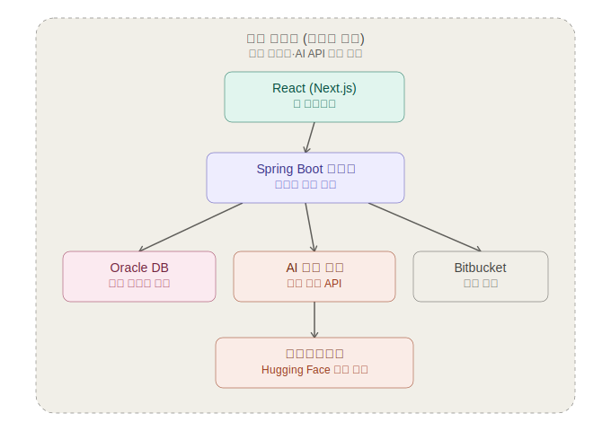

# 고객 요구사항 명세서 자동화 시스템 — 초기 설계서

## 1. 배경 및 목적

SEMES는 반도체 장비 회사로, 고객사(삼성전자)로부터 고객 요구사항 명세서(docx/텍스트)를 전달받아 개발을 진행한다. 이 과정에서 다음 두 가지 문제가 반복적으로 발생한다.

1. 명세서에 모호하거나 다의적인 표현이 많아, 부서(설계/품질/영업 등)마다 다르게 해석하는 경우가 빈번하다.
2. 요구사항으로부터 실제 개발해야 할 기능을 도출하고, 그 개발 진행 상태(완료/미완료)를 관리하는 과정이 수작업이라 누락·지연이 발생하기 쉽다.

이 시스템은 위 두 문제를 자동화하여, **요구사항 → 기능 명세 → 개발 완료 여부**로 이어지는 흐름을 하나의 웹 서비스에서 추적 가능하게 만드는 것을 목표로 한다.

## 2. 운영 환경 및 제약

- **폐쇄망(에어갭) 환경**: 외부 인터넷/외부 AI API 사용 불가. 모든 구성요소는 사내망 안에서 동작해야 함.
- AI 모델은 사내 공용 워크스테이션(AI 전용 서버 아님, GPU 사양 미확인)에서 Hugging Face 오픈소스 모델을 다운로드하여 로컬 서빙.
- Bitbucket 연동 방식(웹훅 vs 폴링)은 사내 Bitbucket이 Server/Data Center(온프레미스)인지 Cloud인지에 따라 결정 — **확인 필요 (오픈 이슈)**.

## 3. 시스템 아키텍처

전체 구성요소는 사내 폐쇄망 안에서만 동작한다. React 프론트엔드가 Spring Boot 백엔드에 REST로 연결되고, 백엔드는 Oracle DB(요구사항/기능/이력 저장), Python(FastAPI) AI 추론 서버(문서 파싱 + LLM 추론 + JSON 구조화 출력), Bitbucket(커밋 폴링) 세 곳과 연동된다. AI 추론 서버는 워크스테이션에 서빙되는 Hugging Face 로컬 모델을 호출한다.

- 메인 애플리케이션(Spring)과 AI 추론(Python)을 분리해 AI 쪽 모델/자원 변경이 메인 서비스에 영향을 주지 않도록 함.
- AI 서버는 무상태(stateless) API로 유지 (입력 문서 → 구조화 JSON 출력만 담당, 상태 저장은 Spring/DB가 전담).

## 4. 데이터 모델 / ID 체계

| ID | 설명 |
|---|---|
| `REQ-{연도}-{번호}` | 고객 요구사항 명세서의 개별 조항 |
| `FEAT-{연도}-{번호}` | 기능 단위. `source` 필드로 출처 구분 |

`FEAT`의 `source` 값:
- `CUSTOMER`: 고객 요구사항(`REQ-ID`)에서 도출된 기능 — REQ-ID와 양방향으로 연결됨(4번 기능)
- `INTERNAL`: 고객 요구사항과 무관하게 사내에서 발의한 기능 (아래 6번 기능 참고) — REQ-ID 연결 없음, 대신 제안자/제안사유를 가짐

두 종류 모두 이후 파이프라인(Bitbucket 연동 개발 완료 판별, 진행률 리포트)은 동일하게 적용된다.

## 5. 기능 목록

### 5.1 핵심 모듈 (Must-have)

| # | 기능 | 설명 |
|---|---|---|
| A | 요구사항 모호성 검출기 | docx/텍스트 요구사항에서 모호한 표현을 문장 단위로 하이라이트. 상세는 5.1.1 참고 |
| B | 기능 명세서 자동 추출 | 요구사항 원문을 기능 단위로 분해하여 `FEAT-ID` 부여, `REQ-ID`와 매핑. 상세는 5.1.2 참고 |
| C | Bitbucket 연동 개발 완료 자동 판별 | 커밋/PR의 `FEAT-ID` 태그를 감지해 해당 기능 상태를 자동 갱신. 상세는 5.1.3 참고 |

#### 5.1.1 상세 — A. 요구사항 모호성 검출기

"모호함"을 사람이 아니라 AI가 일관되게 판단하려면 기준이 되는 유형 분류가 필요하다. 확인이 필요한 대표 상황은 다음과 같다.

| 유형 | 설명 | 예시 문장 |
|---|---|---|
| 정량 기준 부재 | 수치·기준값 없이 정성적으로만 표현 | "장비는 충분한 내구성을 가져야 한다" |
| 모호한 정도부사 | 사람마다 기준이 다르게 해석되는 부사 | "적절히 조정한다", "가능한 한 빠르게 처리한다" |
| 주어/주체 불명확 | 누가 수행하는지 명시되지 않음 | "관련 부서와 협의하여 처리한다" |
| 조건 발생 시점 불명확 | "필요 시" 등 트리거 조건이 정의되지 않음 | "필요한 경우 개선한다" |
| 예외/경계 조건 누락 | 정상 상황만 정의, 예외 케이스 없음 | "정상 동작해야 한다" |
| 접속사 범위 모호 | and/or 처리 범위가 불명확 | "A 및/또는 B를 지원한다" |
| 시간·일정 모호 | 구체적 기한 없이 표현 | "빠른 시일 내 대응한다", "적시에 통보한다" |

- 입력: docx/텍스트 요구사항을 조항(`REQ-ID`) 단위로 파싱.
- 각 조항을 AI에 전달해 모호 여부를 판정하고, 모호하면 위 표의 유형(enum)과 근거 문장을 함께 출력 (예: `{ "req_id": "REQ-2026-013", "ambiguous": true, "type": "정량 기준 부재", "reason": "..." }`).
- "모호함"이라고만 표시하지 않고 어떤 유형인지까지 함께 출력해 담당자가 빠르게 맥락을 파악하게 한다.
- 모호로 판정된 조항은 1번(이해관계자 합의 워크플로우)으로 자동 전달되어 코멘트 대상이 된다.

#### 5.1.2 상세 — B. 기능 명세서 자동 추출

- 모호성이 해소된(또는 애초에 모호하지 않은) 조항을 대상으로, AI가 요구사항 문장을 실제 개발 단위인 "기능"으로 분해한다.
- 분해된 기능마다 `FEAT-ID`를 부여하고 근원이 된 `REQ-ID`와 연결한다 (4번 기능과 직결).
- REQ 하나가 여러 FEAT로 나뉘거나 여러 REQ가 하나의 FEAT로 합쳐지는 다대다 관계를 허용한다.
- AI가 자동 추출한 목록을 그대로 확정하지 않고, 담당자가 검토·수정할 수 있는 화면을 제공한다 (AI 결과는 초안이라는 원칙).

#### 5.1.3 상세 — C. Bitbucket 연동 개발 완료 자동 판별

- 커밋 메시지, PR 설명, 코드 주석에 `[FEAT-xxx]` 형태로 태그를 다는 컨벤션을 정의한다.
- Bitbucket 형태(오픈 이슈, 7번 참고) 확인 전까지는 기본적으로 Spring 백엔드가 주기적으로 Bitbucket REST API를 폴링해 신규 커밋/PR을 조회한다.
- 태그가 감지되면 단순히 "완료"로 표시하는 게 아니라, 5번 대시보드의 SCCB 단계 중 `코드 리뷰` 단계로 자동 전이시킨다.
- 이후 Bitbucket이 웹훅을 지원하는 형태로 확인되면 폴링 대신 실시간 이벤트 수신으로 전환할 수 있다.

### 5.2 확장 기능

| # | 기능 | 설명 |
|---|---|---|
| 1 | 이해관계자 합의/코멘트 워크플로우 | AI가 찾은 모호 항목에 담당자들이 해석을 코멘트로 남기고 최종 해석을 확정. 상세는 5.2.1 참고 |
| 2 | 요구사항 개정판 비교(diff) | 새 버전 명세서를 이전 버전과 조항 단위로 비교해 변경/추가/삭제를 자동 탐지. 상세는 5.2.2 참고 |
| 3 | 모호성 해결 이력(감사 추적) | 모호 항목 + 확정된 해석을 영구 이력으로 보관. 상세는 5.2.3 참고 |
| 4 | 요구사항 ↔ 기능 연결 | `FEAT-ID`와 `REQ-ID`를 양방향으로 연결(link). 상세는 5.2.4 참고 |
| 5 | 진행 현황 대시보드 | 기능 상태를 SCCB 프로세스 단계별로 집계해 시각화. 상세는 5.2.5 참고 |
| **6** | **내부 발의 기능 관리** | 고객 요구사항과 무관하게 사내 담당자가 직접 등록하는 기능. 상세는 5.2.6 참고 |

#### 5.2.1 상세 — 1번. 이해관계자 합의/코멘트 워크플로우

- AI가 찾은 모호 조항(`REQ-ID`)마다 코멘트 스레드가 생성된다.
- 설계/품질/영업 등 관련 담당자가 각자 해석을 코멘트로 병렬 등록할 수 있다.
- 지정된 최종 확정자(예: PM 또는 담당 리더)가 여러 해석 중 하나를 "확정"으로 지정한다.
- 확정되면 해당 조항은 잠금(lock) 처리되고, 확정된 해석은 3번(모호성 해결 이력)에 자동 기록된다.
- 미확정 상태의 모호 조항은 5번 대시보드에서 "미해결"로 별도 표시되어 방치되지 않도록 추적한다.
- 원래 문제(부서별로 다른 해석)를 직접 해결하는 핵심 기능이다.

#### 5.2.2 상세 — 2번. 요구사항 개정판 비교(diff)

- **구조화 파싱**: docx의 번호매기기/제목 스타일을 읽어 옛 버전과 새 버전을 각각 (조항번호, 제목, 본문) 리스트로 구조화한다.
- **조항 매칭**: 1차로 조항 번호(예: 3.2.1)로 매칭한다. 번호가 바뀌거나 조항이 이동한 경우, 문장 임베딩 유사도로 옛 조항이 새 버전 어디로 옮겨갔는지 보완 탐색한다.
- **변경 판정**: 매칭된 조항 쌍은 단어 단위 diff로 정확한 변경 지점을 하이라이트하고, AI로 "오탈자 수정" 같은 사소한 변경과 "30초 이내 → 20초 이내" 같은 실질적 기준 변경을 구분해 중요도를 표시한다.
- 매칭 안 된 옛 조항은 "삭제됨", 매칭 안 된 새 조항은 "신규 추가"로 표시한다.
- 참고: 고객이 Word "변경내용 추적"을 켠 채로 문서를 보내면 `<w:ins>`/`<w:del>` 태그를 그대로 읽어 비교 로직 없이 처리할 수 있다.
- 변경된 조항과 연결된(4번) 기능은 "재검토 필요"로 자동 플래그되어 5번 대시보드에 노출된다.

#### 5.2.3 상세 — 3번. 모호성 해결 이력(감사 추적)

- 1번 워크플로우에서 확정된 해석 + 확정 시점 + 확정자 + AI가 원래 제시했던 모호 사유를 함께 영구 보관한다.
- 이후 요구사항이 개정되어(2번) 같은 조항이 다시 모호해지면, 기존 이력을 덮어쓰지 않고 새 이력 항목으로 누적한다.
- 추후 고객사와의 분쟁·감사 대응 시 "언제, 누가, 어떤 근거로 이렇게 해석했는지"를 그대로 조회할 수 있는 근거 자료가 된다.

#### 5.2.4 상세 — 4번. 요구사항 ↔ 기능 연결

- 원문을 그대로 복사해서 "보관"하는 것이 아니라, `FEAT-ID`와 `REQ-ID`를 잇는 연결 테이블(관계 매핑)을 유지하는 것이 핵심이다.
- REQ 조항 화면에서는 연결된 FEAT 목록을, FEAT 화면에서는 근거가 된 REQ 조항(문서 내 위치 포함)을 서로 조회할 수 있다.
- `INTERNAL` 기능은 REQ 연결이 없는 대신, 6번의 제안 사유가 그 자리를 대체한다.

#### 5.2.5 상세 — 5번. 진행 현황 대시보드 (SCCB 프로세스 연계)

사내에는 이미 **설계 리뷰(Design Review) → 코드 리뷰(Code Review) → 사전 SCCB → SCCB(SQA 품질 검토)** 로 이어지는 변경관리 프로세스가 있다. 기능(`FEAT`)의 상태를 단순 "완료/미완료" 이분법이 아니라, 이 프로세스 단계를 그대로 반영해 관리한다.

- `FEAT` 상태(status)는 다음 중 하나: `설계 리뷰` → `코드 리뷰` → `사전 SCCB` → `SCCB(SQA 품질)` → `완료`
- 각 `FEAT-ID`가 현재 어느 단계에 있는지 담당자가 직접 설정(수동 갱신)할 수 있다.
- 일부 단계는 자동화 가능 — 예: Bitbucket 연동(C번)에서 커밋/PR 병합이 감지되면 `코드 리뷰` 단계로 자동 전이.
- 대시보드는 전체 기능 중 각 단계에 있는 기능의 비율을 퍼센티지로 시각화한다 (예: 막대/퍼널 차트로 "설계 리뷰 20% · 코드 리뷰 35% · 사전 SCCB 15% · SCCB 10% · 완료 20%").
- 고객 기반(`CUSTOMER`)과 내부 발의(`INTERNAL`) 기능을 구분한 통계도 함께 제공한다.
- 특정 단계에 오래 머물러 있거나 마감이 임박한 기능은 지연 위험으로 별도 하이라이트한다.

#### 5.2.6 상세 — 6번. 내부 발의 기능 관리

- 등록 시 필드: 제안자, 제안일, 카테고리(성능개선·유지보수 편의·운영효율화 등), 제안 사유, 우선순위.
- 검토 상태는 `검토중` → `승인`/`반려`로 관리한다.
- 승인되면 `REQ-ID` 없이 `FEAT-ID`(`source=INTERNAL`)가 부여되고, 1번(합의 워크플로우 재사용 가능)~C번(Bitbucket 완료 판별)·5번(SCCB 대시보드)까지 고객 기반 기능과 동일한 파이프라인을 탄다.
- 반려된 제안도 이력으로 남겨 추후 유사한 제안이 올라왔을 때 참고할 수 있게 한다.

## 6. 비기능 요구사항

- 폐쇄망 환경에서 전 구성요소 동작 (외부 패키지/모델은 사전 다운로드 후 반입)
- 문서(docx) 파싱은 표/이미지가 포함된 실제 명세서 포맷을 고려해 견고하게 설계
- AI 서버는 GPU 자원이 부족한 상황(공용 워크스테이션)에서도 동작 가능하도록 경량/양자화 모델을 기본 옵션으로 고려

## 7. 오픈 이슈 (확인 필요)

- [ ] 워크스테이션 GPU 사양 (VRAM, 전용/공용 여부) → AI 모델 크기 결정에 직결
- [ ] 사내 Bitbucket 형태 (Server/Data Center vs Cloud) → 연동 방식(웹훅 vs 폴링) 결정
- [ ] 사내 패키지/모델 반입 절차 (인터넷 미러 여부)

## 8. 향후 진행 순서 (제안)

1. 오픈 이슈(GPU 사양, Bitbucket 형태) 확인
2. AI 모듈(A, B) 프로토타입 — 소규모 모델 + 프롬프트로 실제 명세서 샘플 테스트
3. 데이터 모델/ID 체계 확정 및 Spring 백엔드 스키마 설계
4. 프론트엔드(React) 와이어프레임
5. Bitbucket 연동(C) 설계 확정
6. 확장 기능(1~6) 순차 적용
