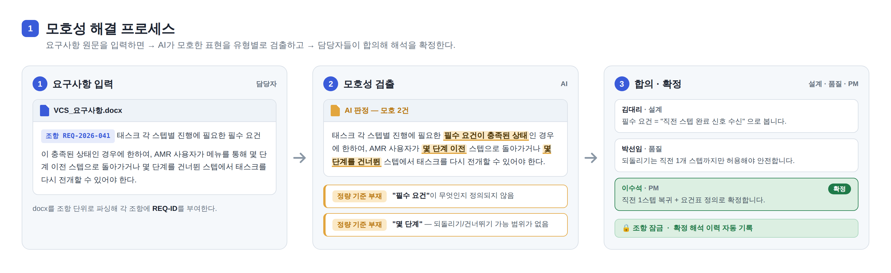
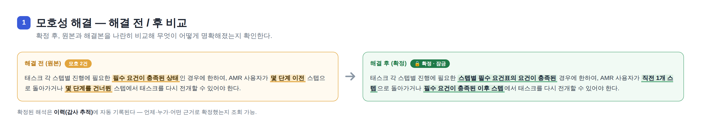
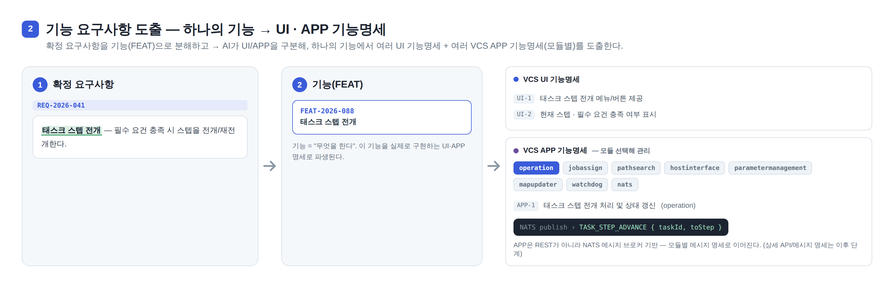
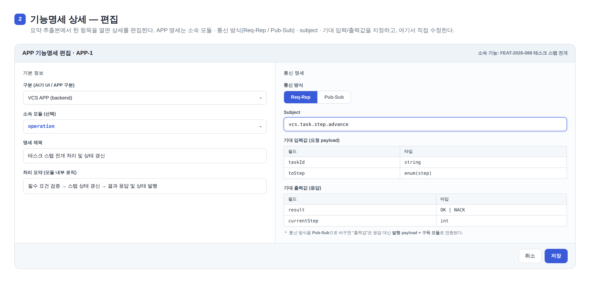
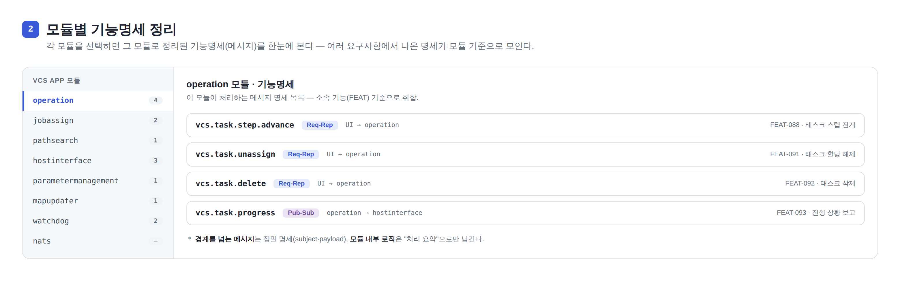
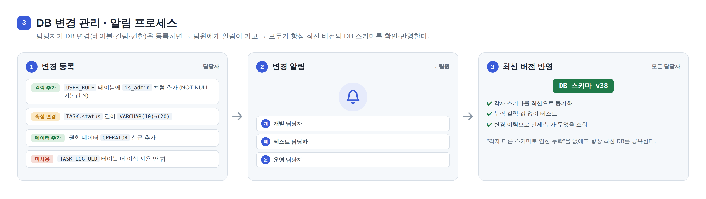

# 고객 요구사항 명세서 자동화 시스템 — 설계서

## 1. 개요

SEMES는 고객사(삼성전자)로부터 요구사항 명세서(docx/텍스트)를 받아 개발을 진행한다. 이때 **명세서에 모호·다의적 표현이 많아 사람마다 다르게 해석하는 문제**와, **요구사항으로부터 개발할 기능을 도출·추적하는 수작업 문제**가 반복된다. 여기에 더해 **여러 담당자가 각자 스키마로 테스트하다 보니 DB 변경이 공유되지 않아 누락이 생기는 문제**도 있다.

이 시스템은 다음 세 가지 핵심 기능으로 이 문제들을 자동화한다.

**핵심 기능 1. 모호성 해결** → **핵심 기능 2. 기능 요구사항 도출** → **핵심 기능 3. DB 변경 관리·알림**

- 흐름: `요구사항 원문(docx)` → `[1] 모호성 해결` → `[2] 기능 도출` → (추후) 기능 추적·대시보드
- `[3] DB 변경 관리`는 개발·테스트 전 과정에서 최신 DB 스키마를 공유하도록 받쳐준다.

### 1.1 전제 — 데이터 모델 / ID 체계

이 시스템의 뼈대는 **요구사항(`REQ-ID`)과 기능(`FEAT-ID`), 그리고 둘의 연결**이다. 모든 기능이 이 ID를 참조하므로 데이터 모델은 별도 "추가기능"이 아니라 당연한 전제다. 세부 테이블 설계(컬럼/제약)는 세 핵심 기능의 상세가 굳는 대로 구현과 함께 확정한다.

### 1.2 운영 환경 및 제약

- **폐쇄망 환경**: 외부 인터넷/외부 AI API 사용 불가. 전 구성요소가 사내망 안에서 동작.
- AI 모델은 사내 워크스테이션(**Quadro P4000 8GB · Xeon Gold 5122 8코어 · RAM 32GB**)에서 Hugging Face 오픈소스 모델을 로컬 서빙. VRAM 8GB 제약상 **최신 7~8B instruct 모델을 4bit 양자화(GGUF, Ollama/llama.cpp)** 로 돌리는 것이 상한선이다 (스파이크의 `qwen2.5:7b`가 이 범위). 13B 이상은 CPU 오프로딩이 필요해 느려지고, 32B+는 사실상 불가.
- docx 파싱은 표·이미지가 포함된 실제 명세서 포맷을 견고하게 처리해야 함.

### 1.3 아키텍처 (요약)

React 프론트엔드 ─REST─ Spring Boot 백엔드 ─REST─ Python(FastAPI) AI 추론 서버 ─ Hugging Face 로컬 LLM. 백엔드는 Oracle DB에 상태를 저장하고, AI 서버는 무상태(입력 → 구조화 JSON 출력)로 유지한다.

---

## 2. 핵심 기능 1 — 모호성 해결

모호한 조항을 **① 찾아내고(검출) → ② 해결할지 결정하고, 해결한다면 해석을 입력(해결) → ③ 확정 이력을 보관** 하는 것까지가 이 기능의 범위다. 원래 문제인 "부서마다 다른 해석"을 직접 푸는 핵심 기능.

### 2.1 모호성 유형 분류 (taxonomy)

"모호함"을 사람이 아니라 AI가 일관되게 판정하려면 기준이 되는 유형 분류가 필요하다.

| 유형 | 설명 | 예시 문장 |
|---|---|---|
| 정량 기준 부재 | 수치·기준값 없이 정성적으로만 표현 | "장비는 충분한 내구성을 가져야 한다" |
| 모호한 정도부사 | 사람마다 기준이 다르게 해석되는 부사 | "적절히 조정한다", "가능한 한 빠르게 처리한다" |
| 주어/주체 불명확 | 누가 수행하는지 명시되지 않음 | "관련 부서와 협의하여 처리한다" |
| 조건 발생 시점 불명확 | 트리거 조건이 정의되지 않음 | "필요한 경우 개선한다" |
| 예외/경계 조건 누락 | 정상 상황만 정의, 예외 케이스 없음 | "정상 동작해야 한다" |
| 접속사 범위 모호 | and/or 처리 범위가 불명확 | "A 및/또는 B를 지원한다" |
| 시간·일정 모호 | 구체적 기한 없이 표현 | "빠른 시일 내 대응한다", "적시에 통보한다" |

### 2.2 검출

- 입력: docx/텍스트 요구사항을 조항 단위로 파싱해 각 조항에 `REQ-ID`를 부여.
- 각 조항을 AI에 전달해 모호 여부를 판정하고, 모호하면 위 유형(enum)과 근거 문장을 함께 출력한다.
- "모호함"이라고만 표시하지 않고 **어떤 유형인지까지** 출력해 담당자가 빠르게 맥락을 파악하게 한다.
- 근거가 없으면(판정 불가) 지어내지 않고 그대로 "판정 불가"로 남긴다.

### 2.3 해결 (해결 여부 결정 · 입력)

검출된 모호 항목마다 **해결할지 / 넘어갈지** 를 먼저 결정한다.



- **해결하기**: 해석 입력 Dialog가 열린다. 원문(모호 표현)을 보면서 확정 해석을 입력하고 "확정"한다.
  - 설계/품질/영업 등 담당자가 해석을 코멘트로 병렬 등록하고, 최종 확정자(PM/리더)가 하나를 확정하는 협의 흐름으로도 확장한다.
  - 확정되면 해당 조항은 잠금(lock) 처리된다.
- **해결 불필요 · 넘어가기**: 문맥상 모호하지 않다고 판단되면 해결 없이 다음 조항으로 넘어간다. (넘어간 항목도 기록에는 남는다.)
- 미확정으로 남은 모호 조항은 "미해결"로 별도 추적한다.

**해결 전 / 후 비교** — 확정 후 원본과 해결본을 나란히 비교해 무엇이 어떻게 명확해졌는지 확인한다.



### 2.4 모호성 해결 이력 (감사 추적)

- 확정된 해석 + 확정 시점 + 확정자 + AI가 원래 제시했던 모호 사유를 함께 영구 보관한다.
- 같은 조항이 나중에 다시 모호해지면 기존 이력을 덮어쓰지 않고 새 항목으로 누적한다.
- 추후 고객사와의 분쟁·감사 대응 시 "언제, 누가, 어떤 근거로 이렇게 해석했는지"를 그대로 조회할 수 있다.

### 2.5 입출력 예시

위 그림은 실제 요구사항([PROJECT.md](PROJECT.md) 7.1 "태스크 전개와 전환")을 통과시킨 예다. AI 검출 출력은 다음 형식을 따른다.

```json
{
  "req_id": "REQ-2026-041",
  "ambiguous": true,
  "findings": [
    { "span": "필수 요건이 충족된 상태", "type": "정량 기준 부재", "reason": "'필수 요건'이 정의되지 않음" },
    { "span": "몇 단계 이전 / 몇 단계를 건너뛴", "type": "정량 기준 부재", "reason": "가능 범위가 없음" }
  ]
}
```

> _(모호성 유형별 "명확화 가이드" — 어떤 유형이면 무엇을 물어 채워야 하는지 — 는 사용자가 추가로 제공하는 예시로 계속 보강한다.)_

---

## 3. 핵심 기능 2 — 기능 요구사항 도출

모호성이 해소된 조항을 AI가 실제 개발 단위인 **"기능(FEAT)"** 으로 분해하고, 각 기능을 다시 **UI · APP 기능명세**로 파생시킨다.



### 3.1 분해

- 요구사항 문장을 개발 가능한 기능 단위로 분해하고 각 기능에 `FEAT-ID`를 부여한다.
- 요구사항 1개가 여러 기능으로 나뉘거나, 여러 요구사항이 하나의 기능으로 합쳐지는 다대다 관계를 허용한다.

### 3.2 UI · APP 기능명세로 파생

"기능(FEAT)"은 *무엇을 한다*까지고, 이를 실제로 구현하는 단위는 그 아래 **기능명세**다. **하나의 기능에서 여러 개의 UI 기능명세 + 여러 개의 VCS APP 기능명세가 나온다.**

- AI가 **VCS UI**와 **VCS APP(backend)**를 구분한다.
- **VCS APP**은 8개 모듈([PROJECT.md](PROJECT.md) 5번: pathsearch / operation / jobassign / parametermanagement / hostinterface / mapupdater / watchdog / nats)로 나뉘므로, 사용자가 **모듈을 선택해 모듈별로 따로 관리**할 수 있게 한다.
- 예) "태스크 스텝 전개" 기능 →
  - **VCS UI 기능명세**: 스텝 전개 메뉴/버튼, 현재 스텝·요건 충족 여부 표시
  - **VCS APP 기능명세**: `operation` 모듈의 스텝 전개 처리·상태 갱신
- 위 그림은 **추출 요약본**이다. 각 항목을 열면 아래처럼 상세를 편집한다.

#### 3.2.1 기능명세 상세 (편집)

APP 기능명세는 **소속 모듈**, **통신 방식(Req-Rep / Pub-Sub)**, **subject**, **기대 입력/출력값**을 지정하고, 이 화면에서 직접 수정한다.



- **통신 방식에 따라 입출력이 달라진다.** (MSA/NATS 특성)
  - **Req-Rep**: REST처럼 `subject`(=URL 자리) + 요청 payload → 응답 payload.
  - **Pub-Sub**: 응답이 없으므로 `subject` + 발행 payload + 트리거 + 구독 모듈을 명세.
- **명세 범위 원칙**: 모듈 경계를 넘나드는 메시지는 정밀 명세(subject·payload), 모듈 내부 계산 로직은 "처리 요약" 한두 줄로만 남긴다. (전부 필드 단위로 적지 않음)

#### 3.2.2 모듈별 기능명세 정리

여러 요구사항에서 나온 APP 기능명세를 **모듈 기준으로 모아** 본다.



### 3.3 요구사항 ↔ 기능 연결

- 원문을 복사해 보관하는 게 아니라, `REQ-ID`와 `FEAT-ID`를 잇는 연결(link)을 유지한다.
- REQ 화면에서는 연결된 FEAT 목록을, FEAT 화면에서는 근거가 된 REQ 조항(문서 내 위치 포함)을 서로 조회할 수 있다.

### 3.4 검토·편집 (초안 원칙)

- AI가 모든 걸 정확히 뽑을 수 없으므로, 담당자가 기능·기능명세를 직접 **편집·추가·삭제**할 수 있는 화면을 제공한다.
- **AI 결과는 항상 초안**이라는 원칙 (모호성 검출·해결과 동일).

---

## 4. 핵심 기능 3 — DB 변경 관리 · 알림

DB 테이블이 많고, 테스트 과정에서 담당자마다 각자 스키마를 쓰다 보니 **테이블이 바뀌어도 다른 사람이 모르고, 누락된 컬럼·값이 쌓이는 문제**가 있다. 이 기능은 DB 변경을 등록하면 다른 담당자에게 알림이 가고, **모두가 항상 최신 버전의 DB 스키마를 공유·반영**하도록 관리한다.



### 4.1 변경 뷰어 · 등록

- 왼쪽 탭에 테이블 메뉴(`TASK`, `USERS`, `UR_USERGROUP_RESOURCE`, `VEHICLE`, `NODE`, `STATION`, `CHARGESTATION`, `ALARM_CODE` …)가 있고, **변경이 생긴 테이블에는 알림 배지**가 뜬다. 클릭하면 무엇이 어떻게 바뀌었는지 상세를 보여준다.
- 담당자가 등록하는 변경 유형: 테이블 미사용(deprecated) / 테이블명 변경 / 컬럼 추가·변경 / 속성 변경(NOT NULL·기본값·타입) / 데이터(권한 등) 추가.

**예시 1 — 행(ROW) 추가** (`UR_USERGROUP_RESOURCE`):

| ID | POLICY_ID | RESOURCE_AVAILABLE | RESOURCE_ID |
|---|---|---|---|
| **111** | **NRemoteAdmin** | **TRUE** | **nremote.action.views.vcsorder.add** | ← 추가됨

**예시 2 — 테이블명 변경 + 컬럼 추가** (`ALARM`):
- 테이블명 변경: `ALARM` → `ALARM_CODE`
- 컬럼 추가: `IS_REPORTED` (보고 여부 플래그)

### 4.2 변경 알림

- 등록된 변경은 관련 담당자(개발·테스트·운영)에게 알림으로 통지되고, 해당 테이블 메뉴에 배지로 표시된다.
- 담당자는 알림을 받고 자신의 스키마를 즉시 최신으로 맞출 수 있다.

### 4.3 최신 버전 관리 · 이력

- 변경이 누적되면 DB 스키마에 버전이 매겨져(예: `v38`) 모두가 같은 최신 버전을 본다.
- 각 변경은 "언제·누가·무엇을 바꿨는지" 이력으로 남아 추적 가능하다.
- 효과: "각자 다른 스키마로 인한 누락"을 없애고 항상 최신 DB를 공유한다.

> _(변경 승인 절차 필요 여부, 실제 DB 반영 자동화 범위(안내만 vs DDL 생성) 등 상세는 여기에 이어서 채운다.)_

---

## 5. 추후 개발 추가기능 (상세 설계는 이후 단계)

세 핵심 기능이 자리 잡은 뒤 순차적으로 붙인다. 지금은 목록만 유지한다.

| 기능 | 한 줄 설명 |
|---|---|
| 요구사항 개정판 비교(diff) | 새 버전 명세서를 이전 버전과 조항 단위로 비교해 변경/추가/삭제 자동 탐지 |
| Bitbucket 연동 개발완료 판별 | 커밋/PR의 `FEAT-ID` 태그를 감지해 개발 진행 상태 자동 갱신 |
| 진행 현황 대시보드 (SCCB) | 기능 상태를 SCCB 프로세스 단계별로 집계·시각화 |
| 내부 발의 기능 관리 | 고객 요구사항과 무관하게 사내에서 발의하는 기능 등록·관리 |

---

## 6. 기술 스택 (요약)

| 계층 | 언어 | 프레임워크/주요 라이브러리 |
|---|---|---|
| DB | - | Oracle Database |
| 프론트엔드 | TypeScript | React + Next.js, Tailwind CSS, TanStack Query |
| 백엔드 | Java 21 | Spring Boot (Web, Data JPA/MyBatis, Security, Scheduler) |
| AI 추론 서버 | Python 3.11+ | FastAPI, python-docx, Pydantic, LLM 서빙(Ollama/llama.cpp) |

---

## 7. 오픈 이슈 (확인 필요)

- [ ] 사내 패키지/모델 반입 절차 (인터넷 미러 여부)
- [ ] 워크스테이션 공용 사용 시 동시 점유로 인한 VRAM/속도 변동 (전용 확보 가능 여부)
- [ ] docx 파싱: 실제 명세서에서 조항 단위 분리가 안정적으로 되는지 (핵심 기능 1·2의 공통 입력 리스크)

---

*진행 기록: AI 모듈(모호성 검출) 프로토타입은 검증 완료 — [docs/spike-ambiguity-detector.md](docs/spike-ambiguity-detector.md).*
