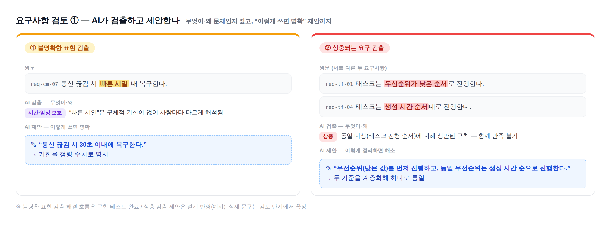
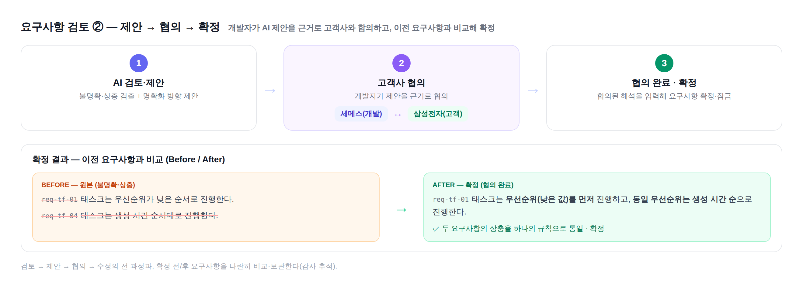
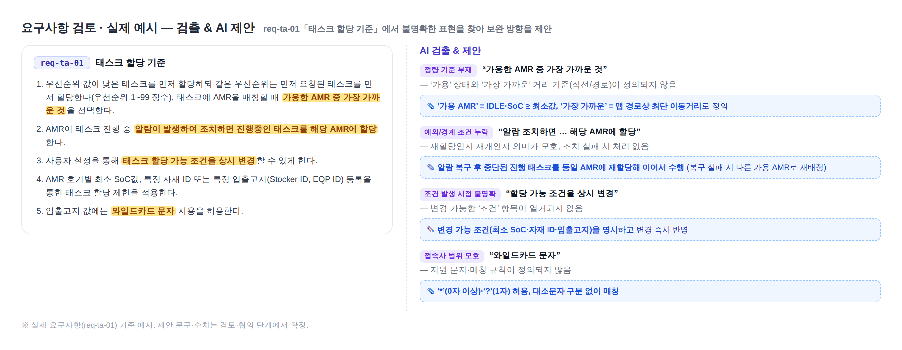
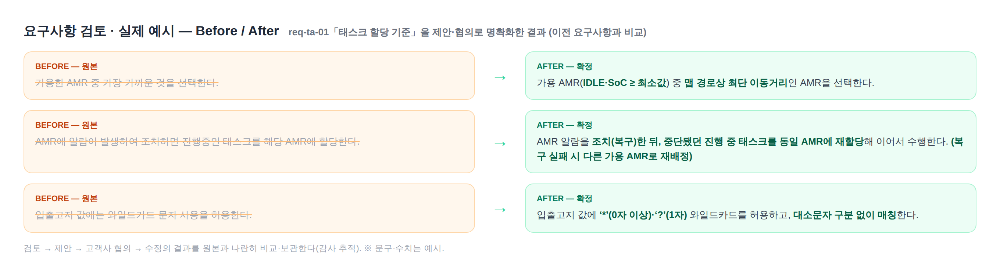
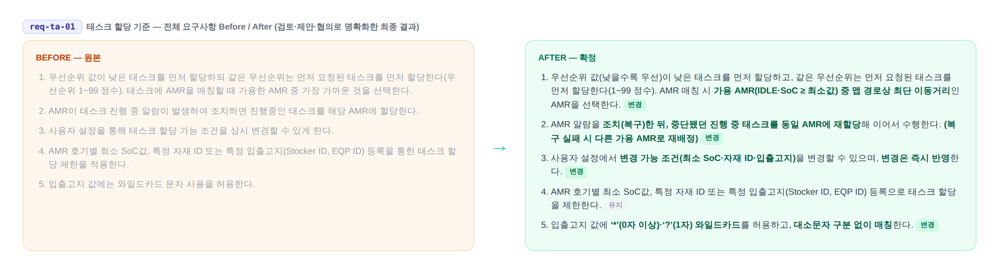
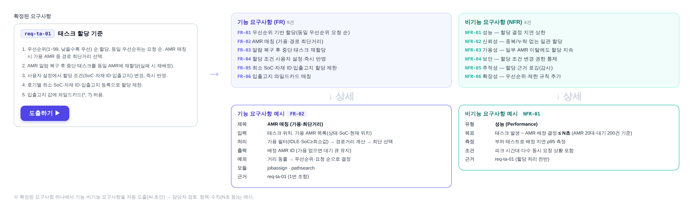
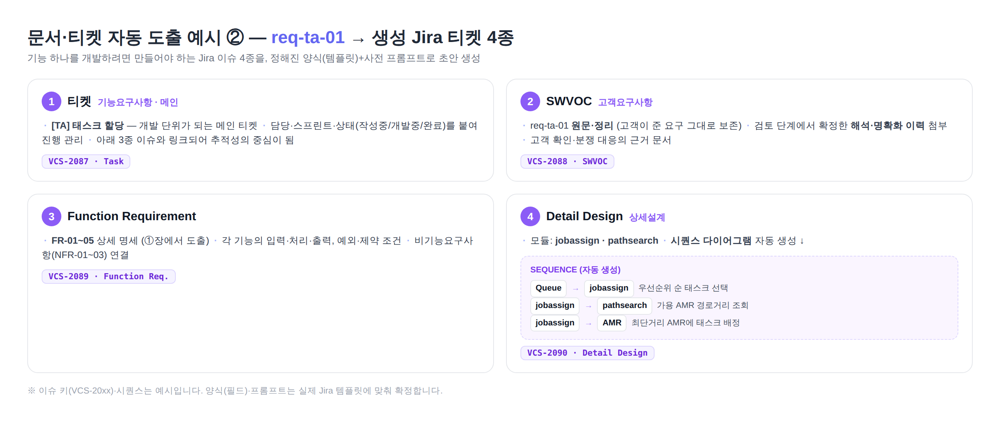

# 고객 요구사항 문서화 자동화 시스템 — 설계서

## 1. 개요

SEMES는 고객사(삼성전자)로부터 요구사항을 받아 개발한다. 이때 **요구사항을 검토하고, 그 요구사항을 우리 프로젝트에 맞는 문서·티켓(Jira 이슈)으로 옮겨 적는 작업이 반복적이고 양이 많다.** 기능 하나를 개발하려면 고객 요구사항(SWVOC)부터 기능/비기능 요구사항, 상세설계까지 여러 문서를 일일이 작성해야 하고, 요구사항이 바뀌면 연결된 문서들을 찾아 함께 고쳐야 한다.

이 시스템은 **고객 요구사항을 기반으로 이 문서화 작업을 자동화·보조**한다. 사람을 대체하는 게 아니라, **틀(템플릿)과 초안을 만들어 주어 방대한 문서 작성을 돕는 것**이 목표다.

**핵심 기능 1. 요구사항 검토** → **핵심 기능 2. 문서·티켓 자동 생성** → **핵심 기능 3. 문서 추적성**

- 흐름: `고객 요구사항(docx)` → `[1] 검토(불명확·상충 정리)` → `[2] 문서·티켓 초안 생성` → `[3] 추적성(연결·영향·진행상황)`

이 흐름은 개발 현장의 **세 가지 문제**를 그대로 겨눈다.

| 문제(배경) | 대응 핵심 기능 |
|---|---|
| ① **고객 요구사항의 불명확한 표현** — 명세서에 고객사와 세메스가 다르게 해석하거나 추가 정의가 필요한 문장이 많음 | [1] 요구사항 검토 |
| ② **문서 작업량 과다** — 요구사항마다 기능·비기능 요구사항과 Jira 이슈를 개발자가 일일이 작성 → 공수가 크게 듦 | [2] 문서·티켓 자동 생성 |
| ③ **변경 추적 어려움** — 요구사항이 변경될 때마다 영향받는 기능·문서를 일일이 찾아 확인·수정 | [3] 문서 추적성 |

### 1.1 전제 — 데이터 / 추적 뼈대

이 시스템의 뼈대는 **요구사항(`REQ-ID`)과, 거기서 파생된 산출물(기능/비기능 요구사항·티켓)의 ID, 그리고 이들 사이의 연결(link)**이다. 핵심 기능 3(추적성)이 이 연결 위에서 동작하므로, ID 체계와 링크는 별도 기능이 아니라 시스템의 당연한 전제다. 세부 스키마는 구현과 함께 확정한다.

### 1.2 운영 환경 및 제약

- **네트워크 — 반입 O / 반출 X**: 모델 다운로드·`git pull` 같은 인바운드는 되지만, **데이터를 밖으로 내보내는 아웃바운드는 차단**된다. 따라서 요청에 요구사항이 실려 나가는 **외부 AI API(Claude·GPT 등)는 사용 불가** — 사내에서 오픈소스 모델을 로컬 서빙하거나, 사내 LLM API를 쓴다.
- **판정 엔진 2가지 (비교 대상)**
  - **로컬 Qwen3-8B**: 사내 워크스테이션(**Quadro P4000 8GB**)에서 GGUF 양자화(`Q5_K_M` ≈ 5.85GB)로 직접 서빙(Ollama). 오프라인 자립·한국어 강점.
  - **사내 GPT-OSS-120B API**: 사내 LLM API 서비스(OpenAI 호환). 더 큰 모델로 정확도 유리, 공용 서버 의존.
  - 두 엔진은 같은 입력에 응답 시간이 비슷(3~5초)해, **정확도·자립성으로 선택**한다. 동일 요구사항 세트로 실측 후 확정.
- docx 파싱은 표·이미지가 포함된 실제 명세서 포맷을 견고하게 처리해야 함. **요구사항은 docx 표의 한 행(ID·분류·내용·비고) = 1건**으로 다룬다.

### 1.3 아키텍처 (요약)

**프론트엔드 ─ 백엔드 ─ AI 추론 서버 ─ 사내 LLM**의 3계층이다. 이때 강조점은 특정 프레임워크가 아니라 **역할**이다.

- **프론트엔드**: 입력·검토·문서 초안 확인 화면
- **백엔드**: 요구사항·산출물·연결(추적성)을 관리하고, AI 판정/생성을 중개·취합
- **AI 추론 서버**: 무상태. 요구사항을 받아 구조화된 결과(불명확·상충 검출, 문서 초안)를 낸다. 로컬 Qwen3-8B / 사내 GPT-OSS-120B 중 선택해 호출.

> 구현 기술(Next.js·Spring 등)은 세부 사항일 뿐이며, 설계상 중요한 것은 위 세 역할의 분리다.

---

## 2. 핵심 기능 1 — 요구사항 검토

고객 요구사항을 그대로 문서로 옮기기 전에, **불명확한 표현**(해석이 갈리거나 추가 정의가 필요한 문장)과 **서로 어긋나는 요구(상충)**를 먼저 찾아 정리한다. 원래 문제인 "부서마다 다른 해석"과 "요구사항끼리의 모순"을 앞단에서 잡는 기능.

동작 흐름은 **LLM이 검출·제안 → 개발자가 고객사와 협의 → 확정 해석을 입력해 관리**다. AI는 문제를 찾아 올바른 방향을 제안할 뿐이고, 실제 확정은 담당자가 고객사와 합의해 내린다.

### 2.1 불명확한 표현 검출

수치·기준·주체·조건이 빠져 **해석이 갈리거나 정의가 더 필요한 표현**을 찾아, 유형과 근거를 함께 제시한다.

| 유형 | 설명 | 예시 |
|---|---|---|
| 정량 기준 부재 | 수치·기준값 없이 정성적으로만 표현 | "장비는 충분한 내구성을 가져야 한다" |
| 모호한 정도부사 | 사람마다 기준이 다른 부사 | "적절히 조정한다", "가능한 한 빠르게" |
| 주어/주체 불명확 | 누가 수행하는지 명시 안 됨 | "관련 부서와 협의하여 처리한다" |
| 조건 발생 시점 불명확 | 트리거 조건이 정의되지 않음 | "필요한 경우 개선한다" |
| 예외/경계 조건 누락 | 정상만 정의, 예외 없음 | "확인된 것으로 간주한다" |
| 접속사 범위 모호 | and/or·"등"의 범위가 불명확 | "A 및/또는 B", "… 등 상세 조건" |
| 시간·일정 모호 | 구체적 기한 없음 | "빠른 시일 내 대응한다" |

- 각 조항을 AI에 넘겨 불명확 여부·유형·근거를 받는다. 근거가 없으면 지어내지 않고 "판정 불가"로 둔다.
- 표기는 "정의되지 않음"처럼 단정하기보다 **"해석이 갈릴 수 있음 / 기준이 필요함"** 톤으로 제시한다(고객 문서를 존중).



### 2.2 상충되는 요구 검출 (NEW)

**여러 요구사항을 함께 보고 서로 모순되는지**를 찾아 알려준다. 불명확이 "한 문장 안"의 문제라면, 상충은 "요구사항들 사이"의 문제다.

- 예: `req1` "태스크는 우선순위가 낮은 순서로 진행" ↔ `req4` "태스크는 시간 순서대로 진행" → **동일 대상(태스크 진행 순서)에 대한 상반된 규칙** 검출.
- 출력: 충돌하는 요구사항 쌍 + 무엇이 어떻게 어긋나는지 + **해소 제안**(어느 것을 기준으로 삼을지, 조건을 나눌지 등).
- 이때 REQ-ID로 서로를 참조해, 나중에 어느 요구사항을 고쳐야 하는지 추적성(기능 3)과 연결된다.

### 2.3 명확화 (해석 확정)

검출된 불명확·상충 항목마다 **해결(해석 확정) / 넘어가기**를 결정한다.

- **해결하기**: 확정 해석을 입력하고 확정하면 해당 항목이 잠금(lock)된다. 상충 항목은 "무엇을 기준으로 통일했는지"를 함께 기록.
- **넘어가기**: 문맥상 문제없다고 판단하면 넘어간다(기록에는 남음).
- 미확정 항목은 "미해결"로 별도 추적.

**해결 전 / 후 비교** — 확정 후 원본과 확정 해석을 나란히 보여 무엇이 명확해졌는지 확인한다.



**실제 요구사항 예시** — `req-ta-01`「태스크 할당 기준」을 통과시킨 결과.







### 2.4 검토 이력 (감사 추적)

- 확정 해석 + 시점 + 확정자 + AI가 제시한 원래 근거를 함께 영구 보관한다.
- 같은 항목이 다시 문제되면 덮어쓰지 않고 새 항목으로 누적한다.
- 고객사와의 분쟁·감사 시 "언제·누가·어떤 근거로 이렇게 정리했는지"를 그대로 조회한다.

### 2.5 검출 출력 예시

```json
{
  "req_id": "req-tf-01",
  "ambiguous": true,
  "findings": [
    { "span": "허용 여부 등 상세 제약 조건", "type": "접속사 범위 모호", "reason": "'등'이 가리키는 범위가 정해지지 않아 해석이 갈림" },
    { "span": "확인된 것으로 간주한다", "type": "예외/경계 조건 누락", "reason": "확인 실패 시 동작이 정의되지 않음" }
  ],
  "conflicts": [
    { "with": "req-tf-04", "reason": "태스크 진행 순서를 req1은 우선순위, req4는 시간 기준으로 규정 — 상반됨" }
  ]
}
```

---

## 3. 핵심 기능 2 — 문서·티켓 자동 생성

검토가 끝난 요구사항을, **우리 프로젝트에서 실제로 만들어야 하는 문서·티켓(Jira 이슈)의 초안**으로 옮겨 준다. 방대한 문서 작성을 **틀 + 초안**으로 돕는 것이 핵심.

### 3.1 산출물 구조 — 기능 하나 = Jira 이슈 4종 (+ 비기능)

우리 프로세스에서 **기능 하나를 개발하려면 아래 4종의 Jira 이슈**를 만들어야 한다. 이 시스템은 고객 요구사항에서 이 4종의 **초안을 자동 생성**한다.

| # | 산출물(Jira 이슈) | 내용 |
|---|---|---|
| 1 | **티켓 (기능요구사항)** | 개발 단위가 되는 메인 티켓 |
| 2 | **SWVOC (고객요구사항)** | 고객 요구사항 원문·정리 |
| 3 | **Function Requirement** | 기능 요구사항 상세 |
| 4 | **Detail Design** | 상세설계 — **시퀀스 다이어그램** 등 포함 |

- 위 **기능요구사항**뿐 아니라 **비기능요구사항**(성능·안전·규격 등)도 함께 도출한다.
- 각 산출물에는 ID를 부여하고, 근거가 된 `REQ-ID`와 연결(link)한다 → 기능 3(추적성)의 기반.

**도출 예시** — 확정된 요구사항 `req-ta-01`(태스크 할당 기준) 하나에서 기능·비기능 요구사항(및 각 상세)과 Jira 티켓 4종이 아래처럼 나온다.





### 3.2 정해진 양식(템플릿) + 사전 프롬프트

산출물마다 **양식이 정해져 있으므로**, 유형별로 **프롬프트를 미리 짜 둔다.**

- **템플릿 고정**: 각 이슈 종류(SWVOC / Function Requirement / Detail Design …)의 필드·구조를 템플릿으로 고정.
- **유형별 프롬프트**: "이 요구사항으로 Detail Design을 채워라 — 시퀀스 다이어그램 포함" 처럼, 산출물별 프롬프트를 미리 정의해 AI에 적용.
- 예) **Detail Design → 시퀀스 다이어그램 자동 생성**(모듈 간 메시지 흐름). Function Requirement → 입출력·처리 요약. 등.

### 3.3 "틀 제공 + 작성 보조" 원칙

- AI가 모든 걸 정확히 쓸 수는 없으므로, **AI 결과는 항상 초안**이다. 담당자가 채워진 틀 위에서 **편집·추가·삭제**한다.
- 가치 제안은 "수작업을 없앤다"가 아니라 **"작성할 게 너무 많은 문서를, 틀과 초안으로 크게 덜어 준다"** 이다.

### 3.4 기능/비기능 분해와 모듈 구분

- 요구사항 1개가 여러 기능으로, 여러 요구사항이 한 기능으로 묶이는 다대다를 허용.
- **VCS APP**은 8개 모듈([PROJECT.md](PROJECT.md) 5번: pathsearch / operation / jobassign / parametermanagement / hostinterface / mapupdater / watchdog / nats)로 나뉘므로, 산출물을 **모듈별로 정리·관리**할 수 있게 한다.

---

## 4. 핵심 기능 3 — 문서 추적성 (Traceability)

요구사항과 거기서 나온 산출물들이 **어떻게 연결돼 있는지**를 관리하고, **요구사항이 바뀌면 무엇이 영향받는지**를 알려준다. (기존 "DB 변경관리"를 대체하는 핵심 기능)

### 4.1 연결 조회 (요구사항 ↔ 산출물)

- 요구사항 1건에 대해 **연결된 기능요구사항 · 비기능요구사항 · 티켓(4종)**이 무엇인지 한눈에 본다.
- 반대로 산출물에서 근거가 된 요구사항(문서 내 위치 포함)도 역으로 조회한다.
- 연결은 원문을 복사·보관하는 게 아니라 `REQ-ID ↔ 산출물 ID`의 **링크**로 유지한다.

### 4.2 변경 영향 분석

- 어떤 **요구사항이 수정·업데이트되면**, 그와 연결된 **어떤 문서·티켓이 영향을 받는지** 자동으로 표시한다.
- "req-tf-01이 바뀌었다 → 영향: SWVOC-…, FR-…, Detail Design-…, 티켓-…" 식으로 **영향 범위**를 즉시 보여줘 누락을 막는다.

### 4.3 진행상황 / 개발완료 여부

- 각 요구사항·산출물·티켓의 **상태(작성중 / 검토 / 개발중 / 완료)**를 추적한다.
- 요구사항별·모듈별 **진행률(개발완료 여부)**을 한눈에 볼 수 있게 해, 전체 진행 상황을 바로 파악한다.

---

## 5. 추후 개발 (상세 설계는 이후 단계)

세 핵심 기능이 자리 잡은 뒤 순차적으로 붙인다. 목록만 유지한다.

| 기능 | 한 줄 설명 |
|---|---|
| 요구사항 개정판 비교(diff) | 새 버전 명세서를 이전 버전과 조항 단위로 비교해 변경/추가/삭제 자동 탐지 |
| Bitbucket 연동 개발완료 판별 | 커밋/PR의 티켓 ID를 감지해 개발 진행 상태 자동 갱신 |
| 진행 현황 대시보드 | 산출물·티켓 상태를 프로세스 단계별로 집계·시각화 |

> _(기존 "DB 변경 관리" 기능은 이 시스템의 컨셉(고객 요구사항 기반 문서화)과 맞지 않아 **제외**했다.)_

---

## 6. 기술 스택 (요약)

| 계층 | 역할 | 참고 구현 |
|---|---|---|
| 프론트엔드 | 입력·검토·문서 초안 화면 | React(Next.js) 등 |
| 백엔드 | 요구사항·산출물·추적성 관리, AI 중개 | Java 기반 백엔드 등 |
| AI 추론 서버 | 무상태 검출·생성 | Python(FastAPI) + 로컬/사내 LLM |

> 표에서 중요한 것은 **계층의 역할**이다. 특정 프레임워크는 교체 가능한 세부 사항.

---

## 7. 기대 효과 (정량)

수작업 문서화 공수를 크게 줄이는 것이 목표다. (아래는 목표/예시 수치 — 실측으로 확정)

| 항목 | 수작업 | 시스템 | 효과 |
|---|---|---|---|
| 요구사항 1건 → 문서·티켓 초안 작성 | 약 1~2시간 | AI 초안 약 10초 + 검토 | 대폭 단축 |
| 요구사항 변경 시 영향 문서 찾기 | 수동 확인(누락 위험) | 영향 범위 자동 표시 | 누락 방지 |
| 불명확·상충 발견 시점 | 개발 중/후 발견 | 착수 전 검토에서 발견 | 재작업 감소 |

---

## 8. 오픈 이슈 (확인 필요)

- [ ] 판정 엔진(로컬 Qwen3-8B vs 사내 GPT-OSS-120B)의 **한국어 검출 정확도 실측** 후 기본값 확정
- [ ] 산출물 4종(SWVOC/FR/Detail Design/티켓)의 **정확한 양식·필드** 확정 → 템플릿·프롬프트화
- [ ] Detail Design 시퀀스 다이어그램 표현 방식(표기법·범위) 확정
- [ ] docx 표에서 요구사항(행) 단위 파싱이 안정적인지 (핵심 기능 공통 입력 리스크)
- [ ] Jira 연동 방식(반출 제약 하에서 이슈 생성/링크를 어디까지 자동화할지)

---

*진행 기록: 핵심 기능 1(요구사항 검토)의 불명확 표현 검출 프로토타입 검증 완료 — [docs/spike-ambiguity-detector.md](docs/spike-ambiguity-detector.md).*
