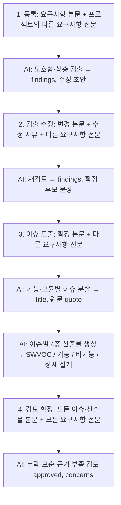

# 1~4단계 AI 프롬프트 흐름

각 AI 요청에는 현재 대상 요구사항 전문이 들어갑니다. 다른 프로젝트 요구사항도 전부 `reqKey`와 전문을 함께 전달합니다. 2단계에서는 변경 부분을 분석 대상으로 지정하지만, 원문과 다른 요구사항도 API에 전달합니다. 3단계 산출물은 이슈별로 서로 다른 system 프롬프트를 사용합니다. 4단계 AI가 승인하지 않거나 응답하지 않으면 전체 확정은 중단됩니다.

고객 합의 기록은 실제 고객 합의 내용을 저장합니다. AI 검토 결과를 고객의 합의로 위조하지 않습니다. 확정 버튼의 서버 검증도 데이터 무결성을 위해 실행됩니다.

사내 OpenAI 호환 API: `http://23.43.51.216:6100/v1` (`AI_PROVIDER=internal`, 모델은 `/models`의 첫 번째 모델을 자동 선택). API 인증 키는 환경 변수 `LLM_API_KEY`로 설정하며 저장소에 넣지 않습니다.
