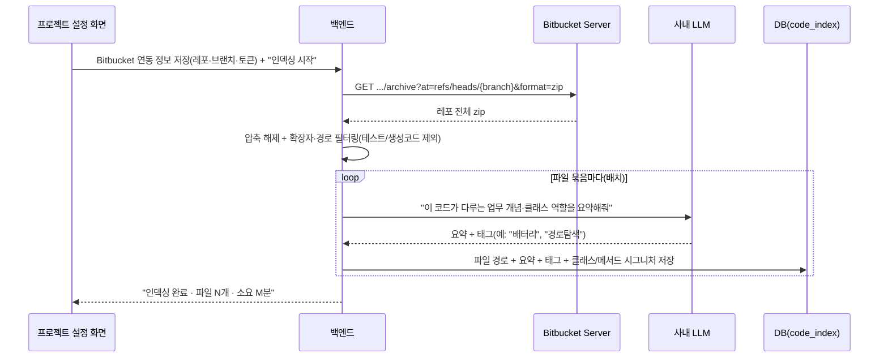
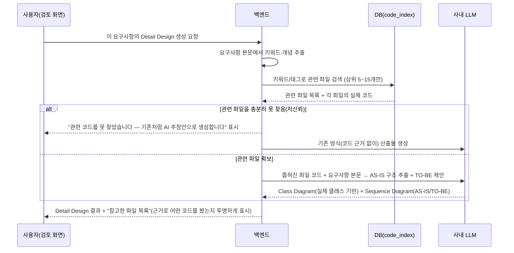
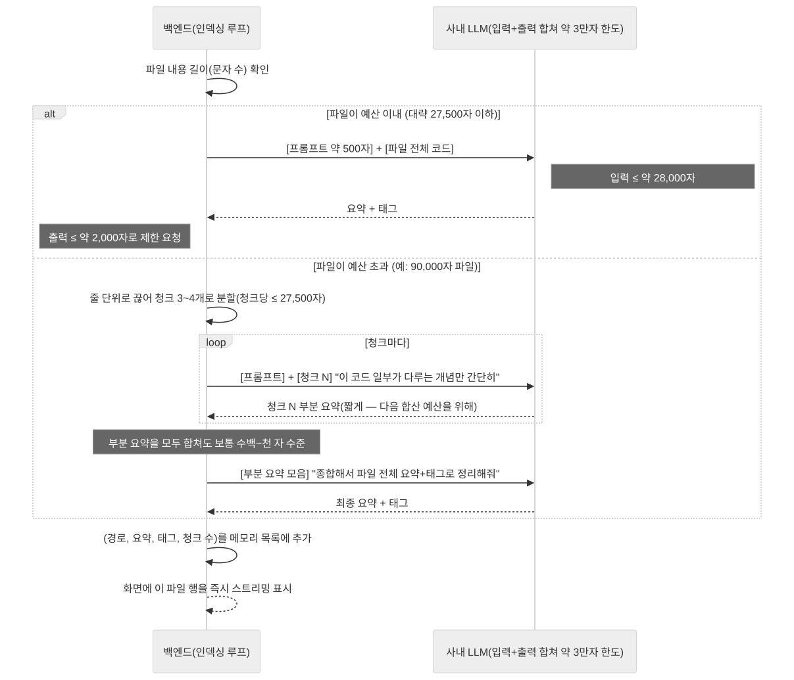
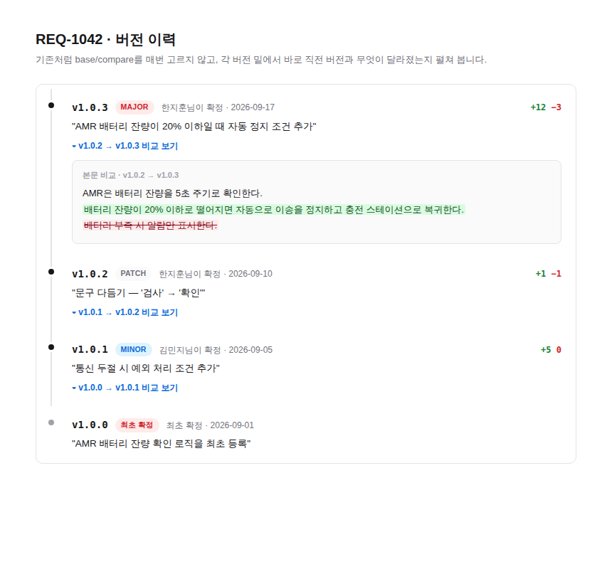

# Bitbucket Server 연동으로 도메인 지식 추출하기 — 가능성 검토 및 구현안

> 요청 배경: `bit-stms.semes.com:17990`(Bitbucket Server/Data Center)에서 관리 중인 레포의
> 브랜치·코드를 API로 가져와서, AI가 그 코드를 읽고 "도메인 지식"(VCS/AMR 반도체 장비
> 소프트웨어의 실제 구조·컨벤션·용어)을 추출해 프롬프트에 반영하고, 나중에 요구사항 검토·
> 산출물 도출 시 실제 코드를 참고해서 더 정확하게 분석하게 만들고 싶다는 아이디어.
>
> **연결 테스트 완료** — `tools/bitbucket-domain-knowledge-test/`의 테스트 도구로 사내망에서
> 실제 브랜치 목록·파일 조회가 된다는 걸 확인했습니다. 아래 REST API·인증 방식은 그 테스트로
> 검증된 내용입니다. 이제 남은 질문은 "된다/안 된다"가 아니라 **"실제 프로젝트 규모의 코드에
> 이걸 어떻게 적용해야 실용적으로 동작하는가"** — 이 문서 뒷부분(3번)에서 다룹니다.

## 1. Bitbucket Server REST API

Base: `http://bit-stms.semes.com:17990/rest/api/1.0`

| 목적 | 엔드포인트 | 비고 |
|---|---|---|
| 프로젝트의 레포 목록 | `GET /projects/{projectKey}/repos` | |
| 브랜치 목록 | `GET /projects/{projectKey}/repos/{repoSlug}/branches` | 페이지네이션(`start`/`limit`) 있음 |
| 파일/디렉터리 목록(트리 탐색) | `GET /projects/{projectKey}/repos/{repoSlug}/browse/{path}?at=refs/heads/{branch}` | `path` 생략하면 루트 |
| 파일 원문 | `GET /projects/{projectKey}/repos/{repoSlug}/raw/{path}?at=refs/heads/{branch}` | UTF-8로 직접 디코드해야 함(테스트 중 한글 깨짐 확인 — 아래 참고) |
| 브랜치 전체를 zip/tar로 | `GET /projects/{projectKey}/repos/{repoSlug}/archive?at=refs/heads/{branch}&format=zip` | 파일 하나하나 부르지 않고 한 번에 받을 때 |
| 커밋 이력 | `GET /projects/{projectKey}/repos/{repoSlug}/commits?until=refs/heads/{branch}` | 커밋 메시지·작성자 |
| 커밋별 변경 파일(diff) | `GET /projects/{projectKey}/repos/{repoSlug}/commits/{commitId}/diff` | |

인증: `Authorization: Bearer <Personal Access Token>` 헤더. 토큰은 Bitbucket 웹 UI의
"개인 설정 → HTTP access tokens"에서 레포 읽기 권한만으로 발급.

**실제 겪은 문제**: `raw` 엔드포인트 응답에 `charset`이 없으면 HTTP 클라이언트가 기본값
(ISO-8859-1)으로 잘못 디코딩해서 한글 주석이 깨집니다 — raw bytes를 직접 UTF-8로 디코드
해야 합니다(`tools/bitbucket-domain-knowledge-test/server.py` 참고).

## 2. 도메인 지식 추출 — 기본 구현 방안

```
[Bitbucket Server] → (archive로 브랜치 전체 획득) → [필터링: 확장자·경로 화이트리스트]
    → [사내 LLM: 파일별/모듈별 요약] → [map-reduce로 종합] → [DB: domain_knowledge]
    → [기존 프롬프트에 "참고 도메인 지식" 섹션으로 주입]
```

- 프로젝트 설정 화면에 Bitbucket 연동(프로젝트 키·레포 슬러그·브랜치·토큰) 추가, 토큰은
  암호화 저장.
- 레포 전체를 한 번에 파악하는 건 3번에서 다루듯 비현실적이라, 이 1차 구현은 "프로젝트 전체
  도메인 지식 요약"(용어집·핵심 컴포넌트·제약조건 수준) 정도의 **가벼운** 배경지식 추출에
  한정합니다. "이 요구사항에 딱 맞는 코드를 찾아서 Detail Design까지 만드는" 것은 별도
  기능(3번)입니다.
- 갱신은 처음엔 수동 "다시 추출" 버튼으로, 나중에 스케줄러/웹훅으로 자동화.

## 3. 대규모·다양한 코드베이스에서 Detail Design까지 실제로 가능한가?

### 3.1 문제 정의

실제 우려: "프로젝트 코드량이 엄청 많고 다양할 텐데, 이걸로 Detail Design(Class Diagram·
Sequence Diagram)까지 실제로 만들 수 있을까? 안 되거나 너무 오래 걸리지 않을까?"

이 우려는 정확합니다 — **레포 전체를 매번 LLM에 통째로 넣는 방식은 실제로 안 됩니다.**
사내 LLM도 컨텍스트 길이 제한이 있고, 설령 억지로 넣는다 해도 정확도가 떨어지고(관련 없는
코드에 묻혀 정말 중요한 부분을 놓침) 응답 시간이 요구사항 검토처럼 "몇 초~몇십 초" 안에
끝나야 하는 화면에는 절대 맞지 않습니다.

### 3.2 핵심 아이디어 — "전체"가 아니라 "좁혀진 몇 개 파일"만 LLM에 준다

사람 개발자도 새 요구사항이 오면 레포 전체를 처음부터 다 읽지 않습니다. "이거 아마 이
모듈이겠다" 하고 관련 파일 몇 개만 찾아서 봅니다. 이 과정을 흉내냅니다 — **검색(좁히기)과
생성(LLM)을 분리**합니다.

- **1단계 — 인덱싱(사전, 배치, 오래 걸려도 됨)**: 레포 전체를 한 번(이후 증분) 훑어서,
  파일/클래스 단위로 "이 코드가 어떤 업무 개념을 다루는지" 가벼운 태그를 붙여 검색 가능한
  형태로 저장해 둡니다. 이건 사용자가 화면에서 기다리는 작업이 아니라 백그라운드 배치라,
  느려도(레포가 크면 몇 시간이 걸려도) 문제가 없습니다.
- **2단계 — 요청 시점(사용자가 기다림, 빨라야 함)**: 요구사항 본문에서 키워드/개념을 뽑아
  인덱스에서 검색 → 관련도 높은 파일 **5~15개 정도**로 좁힘 → 그 파일들의 실제 코드
  (클래스 시그니처·메서드·호출 관계)만 LLM에 넣어서 AS-IS Class/Sequence Diagram과
  TO-BE 초안을 생성. 이 단계는 "레포 크기"가 아니라 "좁혀진 파일 개수"에 비례하기 때문에,
  레포가 아무리 커도 응답 시간이 크게 늘지 않습니다.

이게 이 아이디어가 실용적으로 가능한 이유입니다 — **"전체를 다 이해시킨다"가 아니라
"관련된 작은 부분만 정확하게 보여준다"**로 목표를 바꾸는 것.

### 3.3 좁히는(검색) 방법 — 인프라 제약(폐쇄망) 고려

| 방법 | 설명 | 장단점 |
|---|---|---|
| 키워드/전문 검색 | 요구사항 문장에서 명사 추출 → 파일명·클래스명·주석·1단계에서 붙인 태그와 매칭 | 구현 쉬움, 인프라 추가 없음. 동의어·문맥은 못 잡음 |
| 임베딩 기반 유사도 검색 | 코드 조각·요구사항을 벡터로 바꿔 의미 기반 검색 | 정확도 높음. 사내 LLM 스택에 임베딩 API가 있는지 확인 필요 — 있으면 이게 정답, 없으면 도입 비용 발생 |
| 의존성 그래프 확장 | 키워드로 찾은 1~2개 파일에서 시작해, 그 파일이 import/호출하는 파일로 한두 단계만 넓힘 | "사람이 코드 보는 방식"과 가장 비슷. import 파싱이 필요(언어별로 다름) |
| 도메인 지식 태그 활용 | 2번에서 만든 "이 클래스는 배터리/경로탐색/충전스테이션 담당" 같은 태그로 1차 필터 | 2번 기능이 선행돼야 함. 가장 저비용으로 정확도를 크게 올려줌 |

**권장**: 처음엔 키워드 검색 + 도메인 지식 태그만으로 시작(추가 인프라 없이 바로 가능),
정확도가 부족하면 임베딩 검색을 추가하는 순서로 단계적으로 올립니다.

### 3.4 예상 처리 시퀀스

**(A) 인덱싱 — 최초 1회 + 이후 증분(배치, 사용자는 기다리지 않음)**



**(B) 요구사항 검토 시점 — 사용자가 실시간으로 기다림(빨라야 함)**



이 두 번째 시퀀스가 핵심입니다 — 사용자가 기다리는 구간은 "인덱스 검색(빠름) + 좁혀진
5~15개 파일만 LLM에 전달"이라, 레포 전체 크기와 무관하게 대체로 **수 초~수십 초** 대의
응답을 기대할 수 있습니다(지금 산출물 생성 흐름과 비슷한 수준). 느린 건 사전 인덱싱
단계뿐이고, 그건 배치라 사용자를 막지 않습니다.

### 3.4-1 파일 하나를 실제로 어떻게 나눠 보내는지 (입력+출력 합계 약 3만자 한도)

사내 LLM이 한 질의응답(입력+출력 합계)에 처리할 수 있는 게 약 3만 토큰(≈3만 자)이라고
합니다. 파일 하나가 이 예산 안에 들어오면 통째로 한 번에 보내면 되지만, 큰 파일은
그렇지 않습니다 — 아래는 `tools/bitbucket-domain-knowledge-test`가 실제로 구현한 방식이고,
그 도구를 실행하면 화면에서도 이 다이어그램을 그대로 볼 수 있습니다.



- 예산(약 3만자)에서 출력(요약+태그)용으로 2,000자, 프롬프트 지시문용으로 약 500자를
  먼저 빼두고, 남는 약 27,500자를 "코드를 넣을 수 있는 글자 수"로 씁니다.
- 파일이 그 이하면 한 번에 끝(map만, reduce 없음).
- 파일이 크면 줄 단위로 끊어(코드 한 줄이 중간에 잘리지 않게) 여러 조각으로 나누고,
  조각마다 **짧게** 요약만 받습니다(map) — 각 조각 호출의 출력을 짧게 강제해야, 조각
  수가 많아져도 마지막에 그 부분 요약들을 다시 합치는 호출(reduce)이 예산을 넘지 않습니다.
- 실제 테스트 도구에서 라인 3천 개짜리 더미 파일(약 20만 자)을 넣었을 때 8개 조각으로
  나뉘어 map 8번 + reduce 1번, 총 9번의 LLM 호출로 처리됐습니다.

### 3.5 "참고한 파일 목록을 보여준다"가 중요한 이유

AI가 실제 코드를 참고했는지 사용자가 검증할 수 없으면 신뢰할 수 없습니다. 결과 화면에
"이 Detail Design은 다음 파일들을 참고해서 만들었습니다"를 항상 같이 보여주면, (1) 사람이
"진짜 맞는 파일을 봤는지" 바로 확인할 수 있고, (2) 검색이 엉뚱한 파일을 골랐을 때 바로
드러나서 신뢰도 문제를 조기에 발견할 수 있습니다.

### 3.6 실패/저신뢰 시 대응 — 기존 철학 재사용

이 프로젝트는 이미 "사내 LLM이 꺼져 있으면 규칙 기반으로 대체"하는 graceful-degradation
패턴을 쓰고 있습니다(분할 기능 등). 코드 검색도 같은 철학으로: 관련 파일을 충분히 못 찾으면
차단하지 않고 **기존처럼(코드 근거 없는 AI 추정)** 생성하되, 화면에 "실제 코드 미참고"
배지를 띄워서 사람이 더 꼼꼼히 검토하게 유도합니다.

### 3.7 단계적 도입 순서

| 순서 | 내용 | 필요 사전조건 |
|---|---|---|
| 1 | 인덱싱 배치 구현(키워드/태그만, 임베딩 없이) | 2번(도메인 지식 추출) 완료 |
| 2 | 요구사항 → 관련 파일 검색 → "참고 파일 목록"만 화면에 표시(생성은 아직 안 함) | 1 |
| 3 | 좁혀진 파일로 실제 Detail Design 생성 연결 | 2, 검색 정확도 사람이 눈으로 확인 후 |
| 4 | (선택) 임베딩 검색 추가 | 사내 LLM 스택의 임베딩 API 여부 확인 |
| 5 | 증분 인덱싱(변경분만 재처리) | 1~3 안정화 후 |

2번 단계("검색 결과만 먼저 보여주기")를 꼭 먼저 넣는 걸 권장합니다 — 실제 생성으로 넘어가기
전에 "검색이 맞는 파일을 찾아내는지"부터 사람이 눈으로 검증할 수 있어야, 4번(임베딩 도입
여부)도 근거를 가지고 판단할 수 있습니다.

## 4. 리스크 / 확인해야 할 것

| 리스크 | 완화 방법 |
|---|---|
| 토큰 유출 | DB 암호화 컬럼 또는 Vault류 사용, 절대 `git`에 커밋 금지 |
| 레포가 너무 커서 인덱싱(1회) 시간 폭증 | 배치라 사용자를 막지 않지만, 확장자·경로 화이트리스트로 먼저 줄이는 게 필수 |
| 검색이 엉뚱한 파일을 고름 | 3.5의 "참고 파일 목록 노출" + 3.7의 2단계 도입으로 조기 검증 |
| 코드가 바뀌었는데 인덱스가 낡음 | 인덱싱 시각을 화면에 노출, 수동 재인덱싱 버튼 필수 제공 |
| 사내 코드를 LLM 입력으로 쓰는 것 자체의 정책 문제 | 구현 전에 반드시 확인 — 기술 문제가 아니라 승인 문제 |

## 5. 추가 아이디어 확장

- **요구사항 ↔ 코드 추적성 연결**: 커밋 메시지·브랜치명에 `REQ-1042` 같은 요구사항 키를
  적는 컨벤션이 있다면, 커밋 이력 API로 검색해서 "이 요구사항이 실제로 어떤 커밋/파일
  변경으로 이어졌는지" 자동 연결 가능. 사이드바에 이미 자리만 있는 **"추적성"** 메뉴가
  이 용도로 쓰기 좋습니다.
- **모듈-요구사항 카테고리 매핑**: 인덱싱 시 "이 클래스/모듈은 어떤 업무 영역을 다루는지"
  태깅해두면(3.3의 "도메인 지식 태그"), 비슷한 요구사항이 들어왔을 때 "영향 범위"를 AI가
  먼저 추천해줄 수 있습니다.
- **실제 클래스 존재 여부 검증**: Detail Design의 Class Diagram이 실제로 존재하는
  클래스인지(3.4의 인덱스로) 가볍게 검증해서, 존재하지 않는 이름이면 경고 표시.

---

# 요구사항 버전 이력 — 통합 타임라인 와이어프레임

> (이전 버전 이 문서에는 "개발 이슈"의 버전별 변경 이력 아이디어가 있었는데, 요청하신
> 건 이슈가 아니라 **요구사항 자체**의 버전 이력이었어서 이 부분을 다시 그렸습니다. 산출물/
> 개발 이슈 쪽 화면은 지금 상태(이번 리팩토링에서 만든 것)로 유지합니다.)

## 지금 화면의 아쉬운 점

`versions/page.tsx`는 이미 버전마다 `title`(확정 시 입력한 변경 사유)·`kind`(MAJOR/MINOR/
PATCH)·확정자·날짜를 갖고 있고, 두 버전을 골라 diff를 보는 기능도 있습니다. 다만:

- "커밋 목록"(아래)과 "비교"(위, base/compare 드롭다운)가 화면에서 분리돼 있어서, 특정
  버전이 뭘 바꿨는지 보려면 드롭다운을 두 번 조작해야 합니다.
- 한 번에 하나의 비교만 볼 수 있어서, "쭉 훑어보면서 어디서 뭐가 바뀌었는지" 한눈에 보기
  어렵습니다.

## 와이어프레임

각 버전 아래 바로 diff를 펼쳐볼 수 있는 통합 타임라인으로 바꿉니다. 기본은 "직전 버전과의
비교"라 따로 base를 고를 필요가 없고(필요하면 임의의 두 버전을 고르는 기존 비교 기능은
타임라인 위에 보조 기능으로 남겨둘 수 있습니다), `+N −N` 통계만 봐도 이 버전에서 얼마나
바뀌었는지 감이 옵니다.



- 점(●)을 클릭하지 않아도 각 버전의 변경 사유(`title`)·종류(MAJOR/MINOR/PATCH)·확정자·
  통계가 항상 보입니다.
- "▾ 비교 보기"를 눌러야 실제 본문 diff(형광펜)가 펼쳐집니다 — 기존 `DiffHighlight`
  컴포넌트를 그대로 재사용합니다.
- **백엔드 변경이 필요 없습니다** — `RequirementDetail.versions[]`(title/kind/confirmedByName/
  createdAt)와 기존 `compareVersions` API만으로 만들 수 있어서, 산출물의 "이슈 버전 이력"과
  달리 바로 구현에 들어갈 수 있는 항목입니다.
