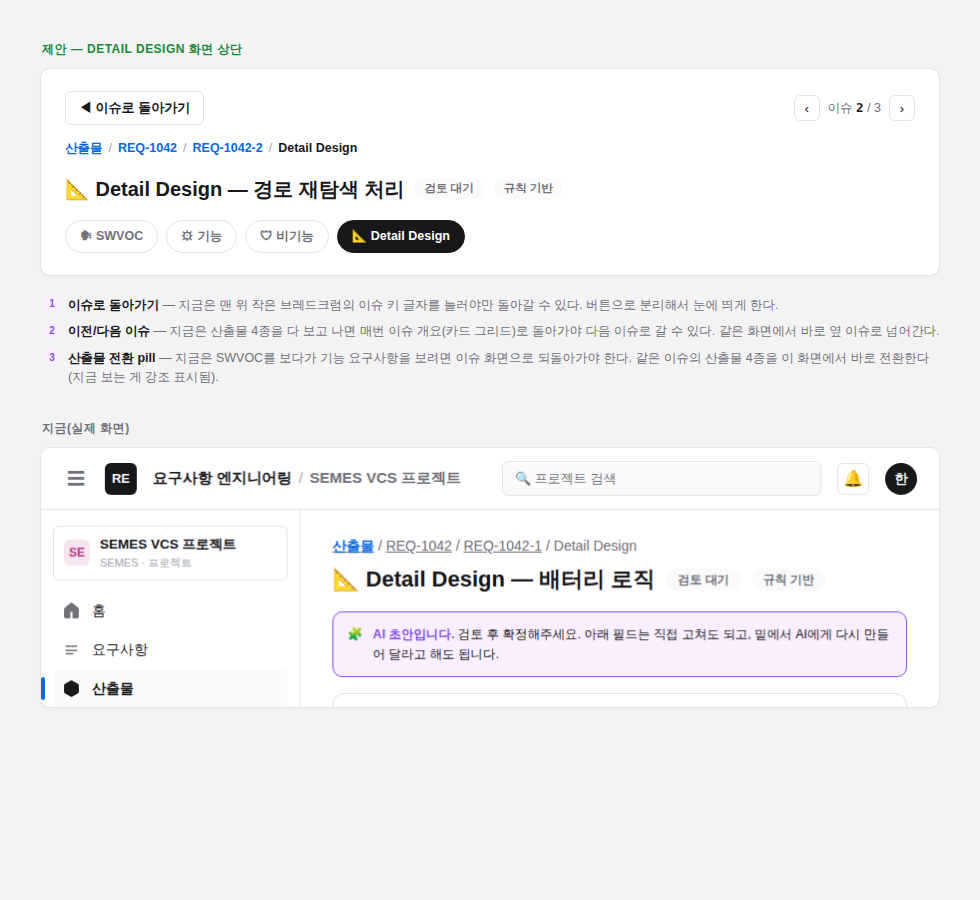

# 산출물 상세 화면의 네비게이션 — 아이디어 (미구현)

> 지적: Detail Design 같은 산출물 상세 화면에 들어오면 "뒤로"(이 산출물이 연결된 이슈로
> 돌아가기)가 잘 안 느껴진다. 이 화면만의 문제가 아니라 전체적으로 조금 부족하다는 느낌.
> 아직 코드로 옮기지 않은 디자인 아이디어이고, 이 문서 + 목업 이미지만 커밋한다.

## 실제로 확인한 문제

`artifacts/[reqId]/issues/[issueKey]/[artifactType]/page.tsx`에는 이미 브레드크럼이 있다
(`산출물 / REQ-1042 / REQ-1042-1 / Detail Design`, 각 조각이 링크). 그런데:

1. **"뒤로"가 브레드크럼의 이슈 키 글자 하나에만 걸려 있다** — 작고 눈에 안 띄어서
   "돌아가는 길이 없다"고 느껴지기 쉽다.
2. **산출물 4종(SWVOC·기능·비기능·Detail Design) 사이를 이 화면에서 못 옮겨 다닌다** —
   SWVOC를 보다가 기능 요구사항을 보려면 반드시 이슈 화면(카드 그리드)으로 돌아가야 한다.
3. **이슈가 여러 개일 때 다음 이슈로 바로 못 넘어간다** — 산출물 4종을 다 보고 나면 매번
   이슈 개요로 돌아가서 다른 이슈 카드를 다시 클릭해야 한다.

이 세 가지가 합쳐져서 "여기 어떻게 왔는지, 어디로 나갈 수 있는지"가 잘 안 보인다.

## 제안

1. **"◀ 이슈로 돌아가기" 버튼** — 브레드크럼과 별개로, 눈에 띄는 버튼 하나를 화면 맨 위에 둔다.
2. **이전/다음 이슈 페이저** — 같은 요구사항의 다른 이슈로, 개요 화면을 거치지 않고 바로 이동.
3. **산출물 전환 pill** — 지금 보고 있는 산출물이 강조된 채로, 같은 이슈의 다른 3종을
   한 클릭으로 전환(이슈 상세 화면의 `ArtifactPills`와 같은 스타일, 여기서도 재사용 가능).

## 다른 화면에도 같은 패턴 적용

이번에 지적받은 건 Detail Design(산출물 상세) 화면이지만, 구조적으로 같은 문제가 있는 곳:

- **이슈 상세 화면**(`issues/[issueKey]/page.tsx`) — 여기서도 "요구사항 상세(본문/버전
  이력)"로 가는 링크가 전혀 없다. 요구사항 쪽으로 가려면 사이드바로 나가야 한다. 여기에도
  "◀ 산출물 개요로" 버튼 + "요구사항 상세 보기" 링크를 추가하면 좋다.
- 요구사항 쪽(본문/버전이력/산출물)은 이미 이번 리팩토링에서 탭 3개로 서로 오갈 수 있게
  해놔서 상대적으로 괜찮다 — 산출물 쪽(개요 → 이슈 → 산출물 유형)이 그 tabs 패턴 없이
  브레드크럼 하나에만 기대고 있는 게 격차.

## 구현 범위 참고

- 이전/다음 이슈, 산출물 전환 pill 모두 지금 화면이 이미 불러오는 데이터
  (`listDevIssues`, `ArtifactPills`)로 만들 수 있어서 **백엔드 변경이 필요 없다.**
- 이슈 상세 화면에 "요구사항 상세 보기" 링크를 추가하는 것도 이미 가진 `requirementId`로
  바로 되는 단순 링크 추가.
