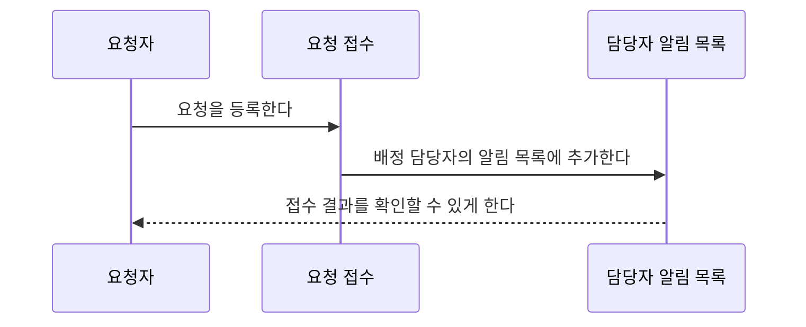

# ReqOps Agent UX 상세 구현 계획

작성일: 2026-09-25 · 대상: 현재 로컬 작업 트리(미추적 파일 포함) · 산출물: 계획서만 작성

## 0. 적용 범위와 결정 원칙

이 문서는 구현 지시서다. 아래 체크박스는 **향후 구현할 작업**이며, 완료 표시가 아니다. 이번 조사에서는 제품 코드를 수정하거나 DB에 접속·DDL 실행·모델 호출·배포·Git push·PR 생성을 하지 않았다. 프론트의 비출력 타입 검사만 실행했다. 현재 DB 인스턴스의 데이터량·Oracle 버전·추가 수동 DDL은 확인되지 않았으므로 코드와 `db/init.sql`에서 확인한 사실과 구분한다.

우선순위는 이번 사용자 요청 → `docs/pre-astra-product-decisions.md` → 실제 구현 → 기존 명세다. 기존 명세와 구현이 다른 곳은 아래에 명시했다. 기존 파일 및 미추적 개발물을 덮어쓰거나 정리 명목으로 삭제하지 않는다.

### 0.1 확정 기본안 / assumptions

| ID | 결정 | 이유·적용 범위 |
|---|---|---|
| A01 | 사용자 단계는 등록 → 검출 수정·요구사항 확정 → 이슈·산출물 도출 → 검토·전체 확정의 정확히 4개 | 합의 입력, 맥락 수집, 검색, 일관성 검사는 별도 단계가 아니다 |
| A02 | `issue/artifact`를 유일한 저장 도메인으로 확장 | 기존 DDL·실제 API·AI 연결·개별 확정 상태를 보존하기 가장 유리하다. `deliverable`의 고정 필드·9행 시나리오·업무 언어 편집 UI를 이식한다 |
| A03 | 전체 확정 단위는 **요구사항의 확정 버전 1개에 연결된 작업 묶음(bundle) 1개** | 프로젝트 전체를 한 트랜잭션으로 잠그지 않는다. 한 묶음의 활성 이슈 N개와 각 4종을 동시에 확정한다 |
| A04 | AI 분할·이슈 본문은 자동으로 준비, 사용자는 기본안의 ‘이 구성으로 진행’만 누른다 | 합치기·나누기·제목 변경은 선택 동작. 이슈 확정 전에 산출물 생성하지 않는다 |
| A05 | 업무적으로 미정인 값은 `null`+근거 부족 항목, 해당 없음은 명시적 사유 | 빈칸을 채우기 위한 추정 정책·수치·가상 코드 클래스 금지. ‘현재 구현을 알 수 없음’은 사실로 기록한다 |
| A06 | AI 장애에도 수동 검토·작성으로 끝까지 진행 가능 | 필수 질문은 답변 또는 사유 있는 ‘해당 없음/검출 오류’ 결정으로 해소. AI 미검토는 사람이 수동 검토 완료 사유를 남겨 대체. 고객 합의는 절대 면제하지 않는다 |
| A07 | 날짜의 기한은 선택 입력, 생성일은 서버 생성, 해결일은 전체 확정 시각 | 기존 기능명세의 확정 처리 시각 의미를 따른다. 실제 소프트웨어 배포·Jira 해결 시각으로 해석하지 않는다 |
| A08 | 현재 로그인/회원가입·요청 `userId` 방식은 호환 유지 | 실인증 부재를 안전한 인증으로 간주하지 않는다. 이번 UX 개편에 SSO/JWT 전면 도입을 끼워 넣지 않되 모든 프로젝트 접근을 재검증한다 |
| A09 | Gemini 지원을 새로 구현하되 provider를 명시 선택 | `.env`에는 Gemini 변수 이름이 있으나 현재 Python은 사내 LLM만 사용. 폐쇄망 기본값은 `rule` 또는 `internal`; Gemini는 `AI_PROVIDER=gemini`로 선택한 환경에서만 사용. 키 유무로 외부 전송을 자동 결정하지 않는다 |
| A10 | Oracle 19c·AL32UTF8을 SQL 검증 기준으로 선택 | 현재 버전은 미확인. 먼저 사전 점검하며 19c와 다른 환경은 동일 검증을 통과해야 한다. Oracle JSON native 타입 대신 CLOB+JSON 검증 사용 |
| A11 | 요구사항 제목을 추가하되 reqKey·요청자 필드를 보존 | 제목/본문 중심 입력. reqKey는 선택 입력, 생략 시 `REQ-{생성 ID}`. 기존 데이터 제목은 reqKey로 초기화 |
| A12 | 요구사항 버전은 현 구현처럼 첫 `1.0.0`, 이후 patch 증가 | MAJOR/MINOR 자동 판정은 새 범위에 넣지 않는다. 이슈/산출물 revision 번호와 구분 |
| A13 | 회의록·화면 자료는 선택 첨부로 실제 저장 | 기존 이미지 첨부는 UI뿐이다. PDF/DOCX/TXT/PNG/JPEG 허용, 기본 파일당 10 MiB·요구사항당 10개. 이미지는 원본 열람부터 지원하고 OCR 없이 읽은 것처럼 사용하지 않는다 |
| A14 | 최신 확정 스냅샷이 프로젝트 지식의 기본 검색 대상 | 수정 중인 요구사항도 직전 유효 확정 버전을 조회 가능. superseded 이력은 명시적인 과거 조회/감사 때만 사용 |
| A15 | 재확정·재분할은 새 묶음/새 행, 과거 묶음은 읽기 전용 | 과거 링크와 문서 보존. 현재 묶음 1개만 편집 가능. 무손실 이관이 끝나기 전 구 테이블은 제거하지 않는다 |

### 0.2 조사 근거

필수 문서 5개(`pre-astra-product-decisions.md`, `기능명세서.md`, `테이블명세서.md`, `요구사항_상태_명세서.md`, `API명세서.md`), `db/init.sql`, `DESIGN.md`, `docs/spike-ambiguity-detector.md`를 확인했다. `frontend/app`의 모든 화면, 공용 컴포넌트·lib·전역 스타일, requirement/issue/artifact/deliverable의 엔티티·repository·DTO·controller·service 및 global AI/config/exception, auth/project 구현, `ai-model`의 3개 Python 소스와 README·의존성·설정을 읽었다. `run-all.sh`, `run-all.bat`, `application.yml`, Next/TypeScript/Maven 설정·gitignore도 확인했다. `.env`는 변수 이름만 확인하고 값은 출력·전재하지 않았다.

기술 기준: `frontend/package.json`의 Next 14.2.5 / React 18.3.1 / TypeScript 5.5.4 / Mermaid ^11.17.2, `backend/pom.xml`의 Spring Boot 3.3.4 / Java 21, AI의 FastAPI 0.115.6 / Pydantic 2.10.4 / Uvicorn 0.34.0. 과거 스파이크의 Next 16 설명은 현재 기준이 아니다.

## 1. 현재 구현 분석

### 1.1 실제 구현과 Mock 구분

| 영역 | 실제 코드와 현재 동작 | 개편 처리 |
|---|---|---|
| 로그인·가입 | `domain/auth/service/AuthService.java`, `frontend/app/login/page.tsx`, `signup/page.tsx`; 평문 비밀번호 비교, sessionStorage에 사용자 저장 | 유지. 실제 인증 토큰은 없다 |
| 프로젝트 | `ProjectService.java`; 생성·참여·Owner 설정·토큰 재발급·멤버/역할 조회. `MembersCard.tsx`는 초대 토큰 표시·복사 | 전부 유지. 강퇴·역할 편집은 현재 구현 아님 |
| 요구사항 목록 | `requirements/page.tsx`: 실제 목록·담당자 API; 검색, ALL/OPEN/CONFIRMED, 복수 담당자 OR는 브라우저 필터 | 유지하고 URL query로 복원 가능하게 개선 |
| 요구사항 등록 | `RequirementService.create`: 저장 트랜잭션 안에서 AI 동기 호출; 실패해도 원문 저장 | 빠른 저장 + 영속 작업 enqueue로 교체 |
| 검출·재분석 | `diffAnalyze`는 기존 finding/draft 삭제 후 재저장. `AiFindings.tsx`는 원문 표시·번호 카드·로컬 숨김 | 기존 유형 유지, 분석 회차·답변·적용/되돌림을 영속화 |
| 본문 편집 | `edit/page.tsx` 604행의 별도 4단 위저드; 초깃값은 실제로 `r.content`; 재분석 후만 AI draft 채움 | 제품 전체의 2단계 편집기로 통합; 서버 draft 저장 추가 |
| 합의·확정 | 6개 합의 정보 저장, 미사용 합의 검사, 버전 생성. `confirm`에 본문 일치 검사 없음 | 합의 다이얼로그 + 원자적 확정 + 본문/hash/버전 검사 |
| 보류·상태 | `hold()` 상태 제한 없음. `IN_REVIEW` 진입 코드 없음. `markPendingConsensus()`는 `REVISING`을 누락 | 기존 enum 유지, 전이 서비스·로그·복귀 상태 추가 |
| 이력·diff | `RequirementVersion`, `LineDiff`, `versions/page.tsx`, `DiffHighlight` 연결됨 | 유지. 최초 등록 원문은 확정 후 별도 보존되지 않는 문제 해결 |
| 기존 이슈 분할 | `DevIssueService.preview/confirmSplit`; `/issues/split-preview`, `/issues`; 제목·인용·순서 실제 저장 | 자동 분할·본문 생성 + 선택적 합치기/나누기로 확장 |
| 이슈 본문 Mock | `artifactsMock.ts`의 `FULL_ISSUE`, `mockIssueFor`; 담당자·module·200ms·날짜가 고정 예시. 구 이슈 상세 textarea는 저장도 없음 | 실제 고정 필드로 대체. Mock 값을 DB로 이관하지 않는다 |
| 기존 산출물 | `ArtifactService.get/regenerate/confirm`, `DevIssueArtifact`; 4종 JSON 실제 AI 호출·저장·확정 | ‘전부 Mock’이 아님. 확정 상태와 원문 JSON 보존 |
| 미리 생성 | `DevIssueController`가 분할 후 4N건 `warmDraftAsync`; pool 3·queue 500 | 영속 작업으로 교체. 현 방식은 진행 조회·재시작 복구 없음 |
| 새 deliverable | `DevelopmentIssueService`: 6개 본문 필드와 4개 정규화 산출물, FR/NFR BASIC/VARIANT/EXCEPTION, fixedAt | 고정 양식과 사람 값 보호 의도는 재사용. 아래 연결 결함 때문에 완료 기능으로 간주 불가 |
| 첨부·추적 메뉴 | `edit/page.tsx`의 이미지 배열은 로컬 상태뿐. sidebar 추적성은 `href="#"`; 헤더 검색/알림도 표시뿐 | 첨부 실제 저장. 추적은 검토 화면에 통합. 무동작 메뉴는 노출하지 않는다 |
| AI | `main.py`: `/analyze`, `/split`, `/artifacts/generate`, `/health`, `/types`; `rules.py`, `artifacts.py` | 구조화 v2 계약 + provider 분리. 기존 규칙 엔진의 검출 기능은 보존 |

### 1.2 중복 구조의 실제 차이와 통합 결정

| 기준 | issue/artifact | deliverable |
|---|---|---|
| DB | `DEV_ISSUES`, `DEV_ISSUE_ARTIFACTS`가 `init.sql`에 있음 | `DEVELOPMENT_ISSUES`, `SWVOCS`, `FUNCTIONAL_REQUIREMENTS`, `NON_FUNCTIONAL_REQUIREMENTS`, `REQUIREMENT_SCENARIOS`, `DETAIL_DESIGNS` 엔티티가 있으나 해당 DDL 없음 |
| 고정 양식 | 이슈는 제목·quote만, 문서는 VOC 설명/요청/특이·FR/NFR 6행 | 이슈 본문 6필드, SWVOC 요청자, FR/NFR 9행, DD Mermaid |
| 확정 | 산출물 DRAFT/CONFIRMED | issue fixedAt만 있고 산출물 상태·이력 없음 |
| AI 통신 | Python과 URL/필드 일치 | `/generate`는 Python에 없음; `/split`에 `requirementContent`를 보내지만 Python은 필수 `content` 요구 → 422 |
| 프론트 | artifacts 하위 UI 연결, 이슈 본문은 Mock | requirements/.../issues 화면이 `api.ts`에 없는 함수/타입을 import |

**결정:** `DevIssue`와 `DevIssueArtifact`가 유일한 aggregate다. 고정 문서도 버전이 있는 typed JSON으로 저장하되 기존처럼 임의 `Map`을 통과시키지 않고 서버에서 유형별 DTO와 스키마를 검증한다. 새 정규화 계통을 기준으로 삼으면 기존 산출물 상태·JSON·키 링크를 모두 옮겨야 하고 누락 DDL/AI 계약도 먼저 복구해야 하므로 이점이 적다. `deliverable`의 UX와 필드 정의는 버리지 않고 canonical 타입으로 이식한다.

구 `VOC` enum과 slug `voc`는 보존하며 표시 이름만 SWVOC. 이슈의 module 컬럼은 canonical DB에는 원래 없다. Mock 필드와 AI의 고정 모듈 프롬프트를 제거하고 자유 형식 `changeScope`를 유지한다. 과거 자유 본문에 쓰인 모듈명은 사용자 데이터이므로 삭제하지 않는다.

### 1.3 확인된 결함·위험과 우선순위

- **P0 빌드:** `frontend/node_modules/.bin/tsc --noEmit --incremental false` 실행 결과 exit 2. 새 issues 화면의 API export 누락, `SequenceStepEditor.tsx:99` 및 새 이슈 상세 `:607`의 `MermaidDiagram text=`/실제 `code` prop 불일치 확인.
- **P0 백엔드 정적 결함:** deliverable이 `ApiErrors.DevelopmentIssueNotFound`, `InvalidScenarioType`, `IssueNotFixed`를 참조하나 실제 `ApiErrors.java`에 없다. Java 컴파일은 이번에 실행하지 않았으며 정적 확인이다.
- **P0 데이터 삭제:** 재분할이 `deleteByRequirementId`를 실행, DDL의 artifact FK가 `ON DELETE CASCADE`. 확정본도 삭제될 수 있다.
- **P0 근거 왜곡:** rules의 ‘신속히’→‘이상 감지 후 5분 이내’, ‘가장 가까운’→‘맨해튼 거리’, ‘가용 AMR’→IDLE·SoC가 증거 없이 자동 치환된다. `main.py`는 VCS 8모듈 강제·NFR 200ms 예시를 포함한다.
- **P0 합의 무결성:** 합의 후 본문 변경 경고만 있으며 UI `canConfirm`도 불일치를 차단하지 않는다. 서버는 마지막 합의 ID 기반 재사용만 검사한다.
- **P1 복구/경합:** GET이 생성·쓰기·장시간 AI를 수행. warmup과 조회가 동시에 같은 UNIQUE에 insert 가능. `warmDraftAsync` 내부 self-call `get`은 Spring transaction proxy를 통과하지 않는다. @Async만으로 commit/재시작 보장 불가.
- **P1 이력:** 산출물 재생성 덮어쓰기, 이슈 재분할 삭제, 분석 회차 삭제, 수동 draft 저장 없음. 등록 원문은 최초 확정에서 유실될 수 있으며 이미 유실된 원문은 복원했다고 주장하면 안 된다.
- **P1 지식:** 기존 `existingOf`는 미확정 요구사항도 포함. 새 `KnowledgeBase`는 요구사항만 확정 필터, 이슈·산출물은 값이 있으면 사용; 최대 6개×600자 잘라 provenance가 없다.
- **P1 오류 은폐:** `ArtifactAiClient` unavailable을 빈 map으로 반환하고 생성 service 응답에 실패 정보가 빠짐. `ArtifactService.readJson` 파싱 실패도 `{}`로 숨김. 성공·근거 없음·미검토를 분리해야 한다.
- **P1 Mermaid 손실:** steps parser는 `->>` 일부만 읽고 participant/alt/loop/반환 화살표를 잃는다. 편집 없이 저장해도 원본이 달라질 수 있다.
- **P1 실행:** 두 run-all은 AI·프론트만 실행하며 백엔드는 수동. AI가 아예 없는데 ‘규칙 기반 검토’라는 안내는 실제 unavailable과 불일치. 커밋된 dist가 수정 소스를 반영한다고 보장할 수 없다.
- **P1 설정:** application.yml에 DB 주소/계정/비밀번호 고정, CORS 전체 허용, 평문 비밀번호/userId 신뢰. 환경변수 분리 및 기존 권한 검증 회귀 필요. 키 값은 문서에 싣지 않는다.
- **P2 성능:** 요구사항별 finding count·사용자명 및 KnowledgeBase의 N+1, 전체 본문 목록 전송, 무제한 맥락; paging·일괄조회·길이 제한 필요.
- **문서 드리프트:** 테이블명세는 기능1 위주, 기능명세는 산출물 전부 Mock이라 표기, API명세 마지막 derive/trace 경로는 실제 controller 경로와 다름. 상태명세의 REVISING→PENDING도 구현과 다름. 완료 단계에서 문서를 코드와 맞춘다.

## 2. 최종 사용자 흐름과 상태

### 2.1 화면별 행동

| 단계 | 사용자에게 보이는 화면·버튼 | 자동 처리 | 완료·실패·복구 |
|---|---|---|---|
| 1 등록 | 제목, 원문 필수; ID/요청자/첨부 선택. ‘등록하고 검토’ | 요구사항/작업 초안 저장, ANALYZE 작업 생성. 첨부는 업로드/추출 상태 표시 | 201 응답 후 2단계. AI 결과를 기다리며 저장을 잠그지 않음. DB 실패면 입력 유지·재시도 |
| 2 검출 수정·확정 | 원문 구절 표시, 선택 구절 옆 필수 질문, 참고 변경 요약. ‘저장’, ‘다시 분석’, ‘되돌리기’, ‘보류’, ‘요구사항 확정’ | 확정 지식 수집·유사 검색·정책/용어 검출; 근거 있는 참고 patch 자동 반영 | 확정 버튼은 합의 다이얼로그를 연다. 6개 합의 정보와 변경 사유 저장 후 원자적 확정. 필수 질문 미해결 시 해당 구절로 이동 |
| 3 이슈·산출물 도출 | 기본 분할안 요약 N건·본문 미리보기. ‘이 구성으로 진행’; ‘분할안 수정’은 보조. 진행률·성공/실패 개수 | 확정 직후 split→이슈 본문 자동 생성. 진행 버튼으로 이슈 확정 후 각 이슈 4종 자동 생성·추적/수치/용어 검사 | 4N 문서별 상태. 화면을 닫아도 처리 계속. 부분 실패는 성공 문서 열람 가능·실패만 재시도·직접 작성 |
| 4 검토·전체 확정 | 좌 이슈 목록, 중 선택 이슈 본문·예외 요약, 우 원 요구사항·근거·4종 링크. ‘전체 확정’ | 수정 저장 때마다 검증 재실행. 전체 확정은 현재 revision 묶음을 다시 검증 | 모든 활성 이슈에 4종 존재·필수 항목 해결·검증 최신이면 원자적 확정. 개별 확정 상태/이력 유지 |

3단계 생성 중 4단계 작업 공간에 진입해서 완성된 문서를 미리 읽을 수 있다. 상단 진행 단계는 아직 3이며 완료될 때만 4로 바뀐다. 기술적 job phase는 ‘자세히’ 안에만 노출하고 5번째 사용자 단계로 만들지 않는다.

### 2.2 확정 다이얼로그

`ConsensusDialog`: 합의 방법(기존 4개+기타 직접 입력), 고객 담당자, 합의일, 합의 내용, 현재 draft의 읽기 전용 본문 스냅샷, 로그인 기록자 표시, 변경 사유(합의 내용으로 기본 채움). 합의 내용은 신규 확정부터 필수; 과거 nullable note는 유지. 최종 ‘합의 기록하고 확정’ 한 번으로 서버 처리. 취소는 draft 보존·확정 없음. 독립 합의 저장 API도 호환 유지하며 목록/상세/버전에서 과거 모든 합의를 조회 가능하게 한다.

확정 guard: 미해결 blocking=0, 비어 있지 않은 본문, 요청 revision 일치, 합의 snapshot==최종 본문, 합의 미사용, 멤버 권한. LF 줄바꿈으로 정규화한 뒤 정확히 비교하고 SHA-256을 저장(공백을 임의 trim하여 다른 합의를 동일 취급하지 않음). 이미 기록한 합의는 `consensusId`를 지정; ‘마지막 합의 자동 선택’ 제거. 동시에 확정하면 한 요청만 성공, 나머지는 409. 동일 idempotency key 재전송은 원래 성공 응답을 반환한다.

### 2.3 상태 전이

| 도메인 | 전이·트리거 | 제한 |
|---|---|---|
| 요구사항 | 등록→RECEIVED; 첫 사용자 draft 저장/결정→IN_REVIEW; 확정본 편집 시작→REVISING | GET 진입만으로 상태 변경 금지 |
| 요구사항 | 유효 합의 저장→PENDING_CONSENSUS; 확정→CONFIRMED | REVISING에서도 합의 상태 전이 허용. 결합 확정은 두 전이 모두 event로 저장 |
| 요구사항 | 활성 작업에서 보류→ON_HOLD; ‘계속 검토’→저장된 직전 상태 | 합의가 낡았다면 IN_REVIEW/REVISING으로 복귀. 보류 이유 저장; 직전 확정본은 열람 가능 |
| 묶음 | PLANNING→ISSUES_READY→GENERATING→REVIEW→CONFIRMED | 생성 부분 실패도 REVIEW 진입 가능하나 전체 확정 guard로 막음 |
| 묶음 | 재확정/재분할→이전 SUPERSEDED, 새 PLANNING | 기존 CONFIRMED 묶음은 확정 상태 유지하고 현재 pointer만 교체. 폐기 초안은 SUPERSEDED로 보존 |
| 이슈 | DRAFT→CONFIRMED; 합치기/나누기 원본→RETIRED | 생성일·본문·이력은 삭제하지 않는다. 확정 후 수정은 새 묶음으로 복제 |
| 산출물 | DRAFT→CONFIRMED; 수정/재생성→새 revision의 DRAFT | 이전 CONFIRMED revision은 immutable. 확정 묶음의 문서는 직접 수정 불가 |
| 작업 | QUEUED→RUNNING→SUCCEEDED / PARTIAL_FAILED / FAILED; RUNNING→RETRY_WAIT→RUNNING | CANCELLED, STALE도 terminal. 화면/프로세스 종료는 CANCELLED 트리거 아님 |

보류는 draft를 먼저 저장하고 자동 후속 도출을 중단한다. 실행 중 분석은 결과를 회차 이력에만 남기고 draft 자동 적용하지 않는다. 확정본 변경으로 입력 버전이 달라진 in-flight 작업은 STALE 처리한다. 계속 검토 시 현재 hash를 기준으로 필요 작업만 재접수한다.

과거 전이 event가 없는 데이터는 `MIGRATED_SNAPSHOT` 하나로 현 상태를 기록하고 과거 시각·행위를 만들어 내지 않는다.

### 2.4 질문·자동 반영·되돌리기

- 필수 질문: 서로 다른 구현/검증 결과를 만드는 미확정 정책·숫자·범위·주체·예외만. 같은 결정에 대한 중복 질문은 하나로 합치고 여러 span 연결.
- 참고: 의미 불변 문장 정리, 확정 근거가 있는 용어 통일. 자동 patch의 before/after, 근거 ID, 적용 revision을 남긴다. 정책 우선순위가 충돌하면 자동 선택하지 않고 필수 질문으로 승격.
- 본문 변경 후 분석 inputHash와 불일치하면 ‘이전 본문 기준’ 표시. 오래된 결과는 현재 본문을 덮어쓰지 않는다.
- patch 되돌림은 해당 변경만 역적용. 해당 span이 사람이 다시 수정되어 역적용 불가하면 409와 diff 제공, 전체 본문 덮어쓰기 금지. 전체 되돌림은 사용자 명시 동작으로 새 draft revision 생성.
- ‘숨김’은 해결이 아니다. blocking 해소는 답변·근거·작성자 기록이 필요하며 false positive/해당 없음도 사유 필수. 검사 결과와 사람 결정은 별도 레코드다.

## 3. 정보 구조와 라우트

`P=/projects/{id}`, `R=P/requirements/{reqId}`로 설명한다. 실제 파일에서는 Next 폴더명을 사용한다.

| 현재 파일/경로 | 최종 처리 |
|---|---|
| `frontend/app/page.tsx`, `login/page.tsx`, `signup/page.tsx`, `dashboard/page.tsx` | 유지. dashboard는 실제 프로젝트 목록 |
| `frontend/app/projects/new/page.tsx`, `open/page.tsx`, `[id]/page.tsx`, `[id]/settings/page.tsx` | 유지. 프로젝트 홈의 ‘기능 준비 중’ 문구를 실제 요구사항 진입·진행 묶음으로 교체 |
| `frontend/app/projects/[id]/requirements/page.tsx` | 전체 목록 유지; `?q=&state=&assignee=` 필터·복귀 위치 보존 |
| `frontend/app/projects/[id]/requirements/new/page.tsx` | 1단계 |
| `frontend/app/projects/[id]/requirements/[reqId]/page.tsx` | 읽기 전용 상세 유지; 현재 상태와 다음 행동, 본문·합의·이력·연결 이슈·묶음 진입 |
| `frontend/app/projects/[id]/requirements/[reqId]/edit/page.tsx` | 2단계 단일 편집 화면. 기존 내부 4단 위저드 폐지 |
| `frontend/app/projects/[id]/requirements/[reqId]/versions/page.tsx` | 기존 diff 유지; 등록 원문·버전별 합의·관련 묶음 링크 보강 |
| `frontend/app/projects/[id]/requirements/[reqId]/issues/page.tsx` | 3단계 작업 준비 화면으로 통합; 빈 목록 진입 시 자동 1건 생성 useEffect 제거 |
| 새 `frontend/app/projects/[id]/requirements/[reqId]/review/page.tsx` | 4단계 Jira형 workspace. `?bundle=41&issue=12&tab=exceptions` URL 상태 |
| `frontend/app/projects/[id]/requirements/[reqId]/issues/[issueId]/page.tsx` | 위 workspace로 이동시키는 상세 링크 진입점. 서버 데이터 resolve 후 issue 선택. 구 숫자 ID는 source 매핑 필요 |
| 새 `frontend/app/projects/[id]/requirements/[reqId]/issues/[issueId]/artifacts/[artifactType]/page.tsx` | 4종 전문 편집·개별 확정·revision history. 유형 slug는 기존 4개 그대로 |
| `frontend/app/projects/[id]/artifacts/page.tsx` | 제거 대신 `P/requirements?view=deliverables` 호환 이동, 진행 묶음 필터 |
| `frontend/app/projects/[id]/artifacts/[reqId]/page.tsx` | R/issues 또는 R/review로 묶음 상태에 따라 이동 |
| `frontend/app/projects/[id]/artifacts/[reqId]/split/page.tsx` | R/issues?editSplit=1로 이동 |
| `frontend/app/projects/[id]/artifacts/[reqId]/issues/[issueKey]/page.tsx` | requirement+issueKey로 canonical ID resolve하여 workspace로 이동 |
| 위 `[artifactType]/page.tsx` | canonical 문서 전문 화면으로 이동; 과거 묶음 조회도 지원 |

상단 단계기는 4개만. sidebar는 프로젝트 홈·요구사항·검토할 산출물(필터 링크)·설정. 추적성 별도 미구현 메뉴는 제거하고 detail/review의 링크로 기능 제공. 문서 전문은 전체 페이지/탭으로 열며 합의만 작은 dialog. 뒤로 가면 이슈 선택·필터·scroll 복원. 오래된 deep link를 무조건 최신 문서로 바꾸지 않고 원래 행/묶음으로 연결한다.

## 4. 백엔드 도메인·비동기 처리

### 4.1 책임과 불변식

이하 `B=backend/src/main/java/com/semes/reqops`이며 경로 표의 `B/`는 이 실제 경로로 치환한다.

| 클래스·패키지 | 책임 |
|---|---|
| 기존 `B/domain/requirement/service/RequirementService.java` | 기존 조회/목록/diff, 등록·draft·합의/버전 저장. AI HTTP 호출은 제거하고 command service 호출 |
| 새 `B/domain/requirement/service/RequirementWorkflowService.java` | 상태 전이, 확정 guard, 합의+버전+bundle+job 원자적 생성, 수동 검토·보류 복귀 |
| 기존 `B/domain/issue/service/DevIssueService.java` | typed 고정 이슈 CRUD, lineage, 분할안 확정. 물리 삭제 금지 |
| 기존 `B/domain/artifact/service/ArtifactService.java` | 읽기 전용 GET, 유형 검증, draft 저장/개별 확정/이력. AI 직접 호출 금지 |
| 새 `B/domain/workflow/service/BundleService.java` | 현재 묶음, 분할안, 선택적 재분할, 이슈 일괄 확정, 전체 확정, 검토 projection |
| 새 `B/domain/workflow/service/ConsistencyService.java` | 링크·필수 필드·버전·수치/단위·용어·근거 검사 및 review item 생성, 검증 fingerprint |
| 새 `B/domain/job/service/AiJobService.java` | idempotency, 영속 enqueue, 상태·재시도 API |
| 새 `B/domain/job/worker/AiJobWorker.java` | claim/lease/heartbeat, HTTP 호출은 트랜잭션 밖, 결과 CAS 저장 |
| 새 `B/domain/knowledge/service/ProjectKnowledgeService.java` | 확정 스냅샷 수집·검색·출처 제공. DB 직접 질의와 projection 재구축 지원 |
| 새 `B/domain/migration/service/LegacyDeliverableImporter.java` | 가용한 legacy 테이블 동적 점검, 무손실 JSON 변환/매핑/검증. 온라인 request에서 실행 금지 |
| 기존 `B/global/ai/AiClient.java` | 단일 AI v2 typed adapter, 오류 분류. 기존 ArtifactAiClient 중복 제거 대상 |

모든 API는 project membership와 `requirement.projectId`, `bundle.requirementId`, `issue.bundleId`, `artifact.devIssueId`를 검증한다. URL ID만 맞다고 신뢰하지 않는다. 작업 생성 시 요청자 저장, 실행·저장 전 권한 재점검; 탈퇴 등으로 권한이 없으면 실패 처리하고 다른 멤버가 재시도할 수 있다.

이슈 내부 ID는 불변, issueKey는 표시에만 사용한다. 새 키는 `I-{id}`로 생성해 기존 60자 제한 안에 유지하고 reqKey는 부모 링크에서 표시한다. 요구사항별 같은 key UNIQUE를 유지한다. 선택적 외부 Jira 키는 `externalKey`로 별도 보관하며 실제 Jira 연동은 하지 않는다.

### 4.2 영속 작업 그래프

1. 등록 TX: requirement+working draft+ANALYZE job+CONTEXT task commit → 201.
2. ANALYZE: CONTEXT(확정 지식·첨부 추출) → DETECT(규칙+provider) → APPLY_ADVISORY(검증 patch만). 필수 질문·참고 항목·근거 저장.
3. 요구사항 확정 TX: 합의+version+current bundle(PLANNING)+DERIVE job commit. 자동으로 CONTEXT→SPLIT→ISSUE_BODY(이슈별) 실행, ISSUES_READY.
4. ‘이 구성으로 진행’ TX: 이슈 revision 검증·CONFIRMED + 정확히 4종 placeholder(DRAFT/빈 typed schema) + GENERATE job의 **이슈별 BATCH task**. 생성 호출은 이슈당 한 번, 출력 4종별로 검증·저장·결과 상태 관리.
5. 생성 task가 terminal이면 CONSISTENCY task. 생성 성공과 검토 가능 여부는 별개. 작업은 SUCCEEDED/PARTIAL_FAILED/FAILED, 묶음은 REVIEW. 생성이 실패한 문서도 수동 편집 가능.
6. 전체 확정 TX: 묶음 잠금→현재 revision fingerprint/필수 guard 재검사→개별 미확정 문서 확정 revision→bundle CONFIRMED/이슈 resolvedAt/event/지식 projection enqueue commit. AI 호출 없음.

CONTEXT→SPLIT처럼 단일 의존은 `depends_on_id`로 표현한다. N개 ISSUE_BODY/BATCH 뒤의 CONSISTENCY는 job barrier 규칙으로 해당 phase의 모든 task가 terminal일 때만 claim한다. 검증 worker는 부모 job를 잠그고 barrier 충족과 task 중복 생성을 함께 검사한다.

`ai_jobs`가 durable outbox 역할도 한다. 별도 메시지 브로커 없이 Oracle polling worker로 시작한다. 생성·검증·지식 인덱싱 job이 business TX에 같이 쓰이므로 commit 직후 프로세스가 죽어도 회수 가능. @TransactionalEventListener만으로 유실 방지를 구현하지 않는다.

### 4.3 작업·경합 규칙

- 스케줄러 1초 주기, worker 동시 실행 기본 3; DB `SELECT ... FOR UPDATE SKIP LOCKED`로 다음 실행 가능한 task claim. Oracle에서 `FETCH FIRST ... FOR UPDATE` 조합에 의존하지 말고 정렬 cursor를 열어 가용 worker 수만 fetch한 뒤 cursor 닫기. claim TX 즉시 commit.
- lease 기본 180초, heartbeat 20초, AI HTTP 120초 이하. 모델 단일 호출 기본 90초, 최대 응답 크기 2 MiB. worker instance ID와 난수 lease token을 같이 저장. 완료 update는 token/lease/revision이 일치할 때만 반영한다.
- 재시작 시 만료 RUNNING→RETRY_WAIT. 중복 HTTP 실행은 가능(at-least-once)하나 `task_key` UNIQUE 및 CAS로 DB 결과는 한 번만 반영한다. provider가 exactly-once를 보장한다고 가정하지 않는다.
- 자동 retry는 총 3 attempts(최초 포함), 2초·8초에 jitter 및 Retry-After 반영. backoff는 `next_run_at`으로 저장하고 스레드 sleep 금지. 429/5xx/timeout만 재시도. 400/401/403/스키마 불일치는 자동 무한 반복 금지.
- 수동 재시도는 새 job/새 task를 만들어 `parent_job_id`로 연결; 성공 문서 제외. 같은 idempotency key+같은 request hash는 동일 결과, 같은 key+다른 body는 409. 보존 기간 동안 key를 재사용하지 않는다.
- 요구사항·이슈·artifact `row_version`에 @Version. AI input snapshot은 버전 ID, 내용 hash, 사람 필드 hash를 포함. 사람이 편집했으면 STALE 결과를 기록하고 덮어쓰지 않는다. 재생성은 현재 문서와 비교 가능한 새 draft revision을 만든다.
- 일부 실패: BATCH response는 4타입 각각 status를 가진다. 3개 성공은 즉시 저장, 1개 실패는 placeholder 유지. 다음 retry의 requestedTypes는 실패 1개만. 성공 문서·사용자 수정은 불변.
- GENERATE progress=`terminal artifact outputs / (활성 이슈 수×4)`. completed에 failed도 포함하지만 `succeeded`, `failed`, `pending`을 따로 표시. 100%·일부 실패를 ‘전부 성공’으로 표현하지 않는다. 맥락/검증은 phase 표시이며 임의 퍼센트를 만들지 않는다.

### 4.4 트랜잭션 경계

| 작업 | 한 TX에 들어가는 것 | 들어가면 안 되는 것 |
|---|---|---|
| 등록 | requirement, working draft, job | AI HTTP·파일 추출 |
| 합의+확정 | requirement lock, 합의 검증/insert, version, transitions, bundle, derive job, command receipt | provider 호출 |
| 분할안 저장 | bundle lock, 기존 draft retirement/신규 후보·lineage·revision | 기존 확정 문서 DELETE |
| 이슈 확정 | 검증된 N개 본문, 4N placeholder, job/task insert | 생성 대기 |
| task claim | task 잠금·lease 변경 | DB connection 유지한 추론 |
| 결과 저장 | token/revision 검사, 각 문서 payload·revision·provenance·상태 | 불량 응답을 성공으로 저장 |
| 전체 확정 | 고정 순서 bundle→issue ID→artifact ID lock, 동기 guard, 4N 상태/history, event, receipt, 지식 job | 일부 문서만 commit |

요구사항 draft·결정·합의 command의 expectedRevision은 working copy의 row_version을 가리킨다. requirement 자체 상태/버전 갱신은 별도 @Version과 row lock으로 보호한다. 이슈·artifact expectedRevision은 각 row_version이며 모든 하위 편집/확정/생성 결과 반영 시 bundle.row_version도 같은 TX에서 증가시킨다. 따라서 이전 manifest로 전체 확정할 수 없다. revision history 번호는 1부터 별도로 순차 발급하며 row_version과 구별한다. API의 revision/expectedRevision은 concurrency token(row_version), history 항목은 revisionNo와 별도 id를 함께 반환한다. 동일 revisionNo에 내용이 다른 snapshot을 넣지 않는다.

전체 확정 시 generation/검증 작업이 진행 중이면 409. 규칙 검증은 요청 안에서 재실행 가능하되 AI 검증 결과는 current fingerprint와 같아야 한다. AI unavailable이면 사람이 차이·근거 부족을 처리한 수동 검토 이벤트로 대체한다. 실패 후 재시도는 최신 상태를 다시 검증한다.

## 5. DB 설계 및 Oracle 마이그레이션

### 5.1 테이블 역할

| 구분 | 테이블 | 변경 |
|---|---|---|
| 유지 | USERS, PROJECTS, MEMBERSHIPS, PROJECT_TOKENS | PK/기존 데이터/역할 유지 |
| 유지·보강 | REQUIREMENTS | title, original_content, original_source, row_version; working content와 확정 content 분리 |
| 유지 | REQUIREMENT_CONSENSUS, REQUIREMENT_VERSIONS | 합의 전 항목 유지; 사용된 합의에 새 UNIQUE 적용 전 중복 검사. 버전 content는 immutable |
| 확장 | REQUIREMENT_FINDINGS, REQUIREMENT_AI_DRAFTS | 분석 job, input hash, finding severity/span/상태 추가. 재분석 시 삭제 금지 |
| 추가 | REQ_WORKING_COPIES | 사용자 draft·revision·이전 확정 version·수동검토 hash |
| 확장 | DEV_ISSUES | bundle, 6개 본문, due/resolved/fixed, row_version, state, external key |
| 확장 | DEV_ISSUE_ARTIFACTS | schema_version, generation_state, row_version. typed JSON, DRAFT/CONFIRMED 유지 |
| 추가 | WORK_BUNDLES | requirement/version/묶음 revision/현재 여부/확정 manifest |
| 추가 | ISSUE_REVISIONS, ARTIFACT_REVISIONS | 매 저장·확정·재생성의 immutable snapshot과 actor·reason |
| 추가 | ISSUE_LINEAGE | 합치기/나누기/재확정 원본→신규 링크 N:M |
| 추가 | AI_JOBS, AI_TASKS | 작업 graph·snapshot·lease·attempt·단계별 오류·부분 결과 |
| 추가 | REVIEW_ITEMS, USER_DECISIONS | 필수 질문/정책 충돌/AI 해석/근거 부족, 답변/되돌림/수동검토 |
| 추가 | KNOWLEDGE_ENTRIES, EVIDENCE_LINKS | 확정 지식 projection·출처 버전·실제 사용 구절/hash |
| 추가 | REQ_STATE_EVENTS, COMMAND_RECEIPTS | 전이 기록 및 HTTP command idempotency |
| 추가 | REQ_ATTACHMENTS | 메타·원본 BLOB·추출 텍스트·추출 상태 |
| 추가 | LEGACY_MAP, LEGACY_SNAPSHOTS | source table+PK→신규 ID, 원본 JSON/hash·이관 결과 |
| 이관 후 보관 | DEVELOPMENT_ISSUES, SWVOCS, FUNCTIONAL_REQUIREMENTS, NON_FUNCTIONAL_REQUIREMENTS, REQUIREMENT_SCENARIOS, DETAIL_DESIGNS | 실제 존재할 때만 read-only 수집. 테이블 DROP은 이번 구현 완료 조건 아님 |

### 5.2 신규 문서 JSON v2

API와 DB의 content는 같은 모양이다. 유형별 고정 필드는 항상 존재하며 초안에서만 null 허용. `schemaVersion:2`는 artifact 메타에 둔다.

```json
{
  "VOC": {"requester":null,"requestContent":null,"specialNotes":null,"legacyExtras":{}},
  "FUNCTIONAL": {
    "overview":null,"constraintsNote":null,
    "scenarios":[
      {"type":"BASIC","precondition":null,"scenario":null,"postcondition":null,"applicability":"UNKNOWN","reason":null},
      {"type":"VARIANT","precondition":null,"scenario":null,"postcondition":null,"applicability":"UNKNOWN","reason":null},
      {"type":"EXCEPTION","precondition":null,"scenario":null,"postcondition":null,"applicability":"UNKNOWN","reason":null}
    ],"legacyExtras":{}
  },
  "NONFUNCTIONAL": {"overview":null,"constraintsNote":null,"scenarios":[{"type":"BASIC","precondition":null,"scenario":null,"postcondition":null,"applicability":"UNKNOWN","reason":null},{"type":"VARIANT","precondition":null,"scenario":null,"postcondition":null,"applicability":"UNKNOWN","reason":null},{"type":"EXCEPTION","precondition":null,"scenario":null,"postcondition":null,"applicability":"UNKNOWN","reason":null}],"legacyExtras":{}},
  "DETAIL_DESIGN": {
    "description":null,"classDiagram":null,"sequenceDiagramAsIs":null,"sequenceDiagramToBe":null,
    "asIsApplicability":"UNKNOWN","asIsReason":null,"legacyExtras":{}
  }
}
```

NONFUNCTIONAL도 FUNCTIONAL과 동일하게 **placeholder/요청/응답/DB에 3개 행을 반드시 생성**한다. BASIC/VARIANT/EXCEPTION 중복·누락 금지. 신규 기능의 변경 전만 `NOT_APPLICABLE`+‘신규 기능으로 기존 흐름 없음’ 결정을 허용한다. 초안 저장은 미완성 허용, 확정은 개요/요청사항/설명·적용 대상 동작 내용·필수 도식 또는 사유 있는 해당 없음 필요. optional 특이사항·기한은 빈 값 허용. legacyExtras는 원 필드를 잃지 않기 위한 읽기 전용 부가 데이터이며 AI 근거로 무조건 채택하지 않는다.

### 5.3 Oracle SQL: 확장 DDL의 기준안

아래는 **향후 파일로 옮겨 검증할 SQL**이다. 지금 실행한 SQL이 아니다. `db/migrations/V001__preflight.sql`에서 `USER_TABLES`, `USER_TAB_COLUMNS`, `USER_CONSTRAINTS`, `USER_INDEXES`, `NLS_DATABASE_PARAMETERS`, 권한 있는 `PRODUCT_COMPONENT_VERSION`을 수집한다. 기존 canonical 11개 테이블이 init.sql과 맞는지 확인하고 누락이면 빈 테이블만 해당 CREATE로 생성한다. `db/init.sql` 전체를 기존 스키마에 재실행하지 않는다. 초기 사용자 생성/권한 부여와 애플리케이션 migration은 분리한다.

`db/migrations/V002__agent_expand.sql`에 다음을 담는다. SQLPlus `WHENEVER SQLERROR EXIT SQL.SQLCODE ROLLBACK`, migration version+checksum ledger(`REQ_SCHEMA_HISTORY(version PK, checksum, applied_at)`)로 재실행을 막는다. Oracle DDL은 implicit commit이므로 ROLLBACK만으로 DDL을 되돌릴 수 없다. 부분 실행 시 dictionary와 ledger 대조 후 미완료 구문만 수행한다. 아래는 기존 canonical 테이블은 있고 신규 컬럼은 없는 baseline 기준이다.

```sql
ALTER TABLE requirements ADD (
  title VARCHAR2(200 CHAR), original_content CLOB,
  original_source VARCHAR2(20 CHAR), row_version NUMBER DEFAULT 0 NOT NULL
);
UPDATE requirements SET title=req_key, original_content=content,
  original_source=CASE WHEN version IS NULL THEN 'REGISTERED' ELSE 'UNKNOWN_LEGACY' END;
ALTER TABLE requirements MODIFY (title NOT NULL);

CREATE TABLE req_working_copies (
  requirement_id NUMBER PRIMARY KEY REFERENCES requirements(id),
  base_version_id NUMBER REFERENCES requirement_versions(id),
  content CLOB NOT NULL, content_hash VARCHAR2(64 CHAR) NOT NULL,
  row_version NUMBER DEFAULT 0 NOT NULL,
  manual_review_hash VARCHAR2(64 CHAR),
  updated_by NUMBER NOT NULL REFERENCES users(id),
  updated_at TIMESTAMP DEFAULT SYSTIMESTAMP NOT NULL
);
CREATE INDEX ix_wc_base ON req_working_copies(base_version_id);

CREATE TABLE work_bundles (
  id NUMBER GENERATED BY DEFAULT AS IDENTITY PRIMARY KEY,
  requirement_id NUMBER NOT NULL REFERENCES requirements(id),
  requirement_version_id NUMBER REFERENCES requirement_versions(id),
  revision_no NUMBER NOT NULL,
  state VARCHAR2(20 CHAR) DEFAULT 'PLANNING' NOT NULL,
  is_current NUMBER(1) DEFAULT 1 NOT NULL,
  source_status VARCHAR2(20 CHAR) DEFAULT 'VERIFIED' NOT NULL,
  row_version NUMBER DEFAULT 0 NOT NULL,
  validation_hash VARCHAR2(64 CHAR), manifest_json CLOB,
  created_by NUMBER NOT NULL REFERENCES users(id),
  created_at TIMESTAMP DEFAULT SYSTIMESTAMP NOT NULL,
  confirmed_by NUMBER REFERENCES users(id), confirmed_at TIMESTAMP,
  CONSTRAINT uq_bundle_rev UNIQUE(requirement_id,revision_no),
  CONSTRAINT ck_bundle_current CHECK(is_current IN (0,1)),
  CONSTRAINT ck_bundle_state CHECK(state IN
    ('PLANNING','ISSUES_READY','GENERATING','REVIEW','CONFIRMED','SUPERSEDED')),
  CONSTRAINT ck_bundle_source CHECK(source_status IN ('VERIFIED','LEGACY_REVIEW')),
  CONSTRAINT ck_bundle_json CHECK(manifest_json IS JSON)
);
CREATE UNIQUE INDEX uq_bundle_current ON work_bundles
  (CASE WHEN is_current=1 THEN requirement_id ELSE NULL END);
CREATE INDEX ix_bundle_version ON work_bundles(requirement_version_id);

ALTER TABLE dev_issues ADD (
  bundle_id NUMBER REFERENCES work_bundles(id),
  symptom CLOB, improvement_req CLOB, change_scope CLOB,
  constraints_note CLOB, before_state CLOB, after_state CLOB,
  external_key VARCHAR2(100 CHAR), due_date DATE, resolved_at TIMESTAMP,
  fixed_at TIMESTAMP, updated_at TIMESTAMP DEFAULT SYSTIMESTAMP NOT NULL,
  updated_by NUMBER REFERENCES users(id), row_version NUMBER DEFAULT 0 NOT NULL,
  state VARCHAR2(20 CHAR) DEFAULT 'DRAFT' NOT NULL
);
ALTER TABLE dev_issues ADD CONSTRAINT ck_issue_state
  CHECK(state IN ('DRAFT','CONFIRMED','RETIRED'));
CREATE INDEX ix_issue_bundle ON dev_issues(bundle_id,state,display_order);

ALTER TABLE dev_issue_artifacts ADD (
  schema_version NUMBER DEFAULT 1 NOT NULL,
  generation_state VARCHAR2(20 CHAR) DEFAULT 'LEGACY' NOT NULL,
  row_version NUMBER DEFAULT 0 NOT NULL
);
ALTER TABLE dev_issue_artifacts ADD CONSTRAINT ck_art_gen CHECK
  (generation_state IN ('LEGACY','PENDING','RUNNING','SUCCEEDED','FAILED','MANUAL','STALE'));
-- 먼저 재분할 DELETE를 막는 호환 backend를 배포한 뒤 아래 FK를 교체한다.
ALTER TABLE dev_issue_artifacts DROP CONSTRAINT fk_dev_issue_artifacts_issue;
ALTER TABLE dev_issue_artifacts ADD CONSTRAINT fk_art_issue
  FOREIGN KEY(dev_issue_id) REFERENCES dev_issues(id);

CREATE TABLE issue_revisions (
  id NUMBER GENERATED BY DEFAULT AS IDENTITY PRIMARY KEY,
  issue_id NUMBER NOT NULL REFERENCES dev_issues(id), revision_no NUMBER NOT NULL,
  snapshot_json CLOB NOT NULL, content_hash VARCHAR2(64 CHAR) NOT NULL,
  state VARCHAR2(20 CHAR) NOT NULL, reason VARCHAR2(500 CHAR),
  created_by NUMBER NOT NULL REFERENCES users(id),
  created_at TIMESTAMP DEFAULT SYSTIMESTAMP NOT NULL,
  CONSTRAINT uq_issue_rev UNIQUE(issue_id,revision_no),
  CONSTRAINT ck_issue_rev_json CHECK(snapshot_json IS JSON)
);
CREATE TABLE artifact_revisions (
  id NUMBER GENERATED BY DEFAULT AS IDENTITY PRIMARY KEY,
  artifact_id NUMBER NOT NULL REFERENCES dev_issue_artifacts(id), revision_no NUMBER NOT NULL,
  schema_version NUMBER NOT NULL, content_json CLOB NOT NULL,
  content_hash VARCHAR2(64 CHAR) NOT NULL, state VARCHAR2(20 CHAR) NOT NULL,
  engine VARCHAR2(20 CHAR), reason VARCHAR2(500 CHAR),
  created_by NUMBER NOT NULL REFERENCES users(id),
  created_at TIMESTAMP DEFAULT SYSTIMESTAMP NOT NULL,
  CONSTRAINT uq_art_rev UNIQUE(artifact_id,revision_no),
  CONSTRAINT ck_art_rev_json CHECK(content_json IS JSON)
);
CREATE TABLE issue_lineage (
  from_issue_id NUMBER NOT NULL REFERENCES dev_issues(id),
  to_issue_id NUMBER NOT NULL REFERENCES dev_issues(id),
  relation VARCHAR2(20 CHAR) NOT NULL,
  CONSTRAINT pk_issue_lineage PRIMARY KEY(from_issue_id,to_issue_id),
  CONSTRAINT ck_issue_relation CHECK(relation IN ('MERGE','SPLIT','REVISION')),
  CONSTRAINT ck_lineage_self CHECK(from_issue_id<>to_issue_id)
);
CREATE INDEX ix_lineage_to ON issue_lineage(to_issue_id);

CREATE TABLE ai_jobs (
  id NUMBER GENERATED BY DEFAULT AS IDENTITY PRIMARY KEY,
  project_id NUMBER NOT NULL REFERENCES projects(id),
  requirement_id NUMBER NOT NULL REFERENCES requirements(id),
  bundle_id NUMBER REFERENCES work_bundles(id),
  parent_job_id NUMBER REFERENCES ai_jobs(id),
  kind VARCHAR2(24 CHAR) NOT NULL, status VARCHAR2(24 CHAR) DEFAULT 'QUEUED' NOT NULL,
  input_hash VARCHAR2(64 CHAR) NOT NULL, input_json CLOB NOT NULL,
  idempotency_key VARCHAR2(100 CHAR) NOT NULL,
  created_by NUMBER NOT NULL REFERENCES users(id),
  created_at TIMESTAMP DEFAULT SYSTIMESTAMP NOT NULL,
  updated_at TIMESTAMP DEFAULT SYSTIMESTAMP NOT NULL,
  CONSTRAINT uq_job_key UNIQUE(project_id,idempotency_key),
  CONSTRAINT ck_job_input CHECK(input_json IS JSON),
  CONSTRAINT ck_job_kind CHECK(kind IN ('ANALYZE','DERIVE','GENERATE','VALIDATE','KNOWLEDGE','EXTRACT')),
  CONSTRAINT ck_job_status CHECK(status IN
    ('QUEUED','RUNNING','RETRY_WAIT','SUCCEEDED','PARTIAL_FAILED','FAILED','CANCELLED','STALE'))
);
CREATE INDEX ix_job_req ON ai_jobs(requirement_id,created_at);
CREATE INDEX ix_job_bundle ON ai_jobs(bundle_id,status);
CREATE INDEX ix_job_parent ON ai_jobs(parent_job_id);
CREATE TABLE ai_tasks (
  id NUMBER GENERATED BY DEFAULT AS IDENTITY PRIMARY KEY,
  job_id NUMBER NOT NULL REFERENCES ai_jobs(id),
  depends_on_id NUMBER REFERENCES ai_tasks(id),
  issue_id NUMBER REFERENCES dev_issues(id),
  task_key VARCHAR2(120 CHAR) NOT NULL, phase VARCHAR2(30 CHAR) NOT NULL,
  status VARCHAR2(24 CHAR) DEFAULT 'QUEUED' NOT NULL,
  attempt NUMBER DEFAULT 0 NOT NULL,
  next_run_at TIMESTAMP DEFAULT SYSTIMESTAMP NOT NULL,
  lease_until TIMESTAMP, lease_token VARCHAR2(64 CHAR), worker_id VARCHAR2(100 CHAR),
  input_json CLOB NOT NULL, result_json CLOB,
  error_code VARCHAR2(50 CHAR), error_message VARCHAR2(1000 CHAR),
  started_at TIMESTAMP, finished_at TIMESTAMP,
  CONSTRAINT uq_task_key UNIQUE(job_id,task_key),
  CONSTRAINT ck_task_input CHECK(input_json IS JSON),
  CONSTRAINT ck_task_result CHECK(result_json IS JSON),
  CONSTRAINT ck_task_status CHECK(status IN
    ('QUEUED','RUNNING','RETRY_WAIT','SUCCEEDED','PARTIAL_FAILED','FAILED','CANCELLED','STALE'))
);
CREATE INDEX ix_task_claim ON ai_tasks(status,next_run_at,lease_until);
CREATE INDEX ix_task_dependency ON ai_tasks(depends_on_id);
CREATE INDEX ix_task_issue ON ai_tasks(issue_id);

ALTER TABLE requirement_findings ADD (
  analysis_job_id NUMBER REFERENCES ai_jobs(id), input_hash VARCHAR2(64 CHAR),
  severity VARCHAR2(20 CHAR) DEFAULT 'ADVISORY' NOT NULL,
  span_start NUMBER, span_end NUMBER, finding_status VARCHAR2(20 CHAR) DEFAULT 'OPEN' NOT NULL
);
CREATE INDEX ix_finding_job ON requirement_findings(analysis_job_id);
ALTER TABLE requirement_ai_drafts ADD (
  analysis_job_id NUMBER REFERENCES ai_jobs(id), input_hash VARCHAR2(64 CHAR)
);
CREATE INDEX ix_draft_job ON requirement_ai_drafts(analysis_job_id);

CREATE TABLE review_items (
  id NUMBER GENERATED BY DEFAULT AS IDENTITY PRIMARY KEY,
  requirement_id NUMBER NOT NULL REFERENCES requirements(id),
  bundle_id NUMBER REFERENCES work_bundles(id),
  job_id NUMBER REFERENCES ai_jobs(id), finding_id NUMBER REFERENCES requirement_findings(id),
  issue_id NUMBER REFERENCES dev_issues(id), artifact_id NUMBER REFERENCES dev_issue_artifacts(id),
  kind VARCHAR2(30 CHAR) NOT NULL, severity VARCHAR2(20 CHAR) NOT NULL,
  status VARCHAR2(20 CHAR) DEFAULT 'OPEN' NOT NULL,
  input_hash VARCHAR2(64 CHAR) NOT NULL, item_key VARCHAR2(100 CHAR) NOT NULL,
  detail_json CLOB NOT NULL, created_at TIMESTAMP DEFAULT SYSTIMESTAMP NOT NULL,
  CONSTRAINT uq_review_job UNIQUE(job_id,item_key),
  CONSTRAINT ck_review_severity CHECK(severity IN ('BLOCKING','ADVISORY')),
  CONSTRAINT ck_review_status CHECK(status IN ('OPEN','RESOLVED','STALE')),
  CONSTRAINT ck_review_json CHECK(detail_json IS JSON)
);
CREATE INDEX ix_review_req ON review_items(requirement_id,status,severity);
CREATE INDEX ix_review_bundle ON review_items(bundle_id,status);
CREATE INDEX ix_review_issue ON review_items(issue_id);
CREATE INDEX ix_review_art ON review_items(artifact_id);
CREATE INDEX ix_review_finding ON review_items(finding_id);
CREATE TABLE user_decisions (
  id NUMBER GENERATED BY DEFAULT AS IDENTITY PRIMARY KEY,
  requirement_id NUMBER NOT NULL REFERENCES requirements(id),
  bundle_id NUMBER REFERENCES work_bundles(id),
  review_item_id NUMBER REFERENCES review_items(id),
  supersedes_id NUMBER REFERENCES user_decisions(id),
  action VARCHAR2(30 CHAR) NOT NULL, input_hash VARCHAR2(64 CHAR) NOT NULL,
  detail_json CLOB NOT NULL, created_by NUMBER NOT NULL REFERENCES users(id),
  created_at TIMESTAMP DEFAULT SYSTIMESTAMP NOT NULL,
  CONSTRAINT ck_decision_json CHECK(detail_json IS JSON)
);
CREATE INDEX ix_decision_req ON user_decisions(requirement_id,created_at);
CREATE INDEX ix_decision_bundle ON user_decisions(bundle_id);
CREATE INDEX ix_decision_review ON user_decisions(review_item_id);
CREATE INDEX ix_decision_prev ON user_decisions(supersedes_id);

CREATE TABLE knowledge_entries (
  id NUMBER GENERATED BY DEFAULT AS IDENTITY PRIMARY KEY,
  project_id NUMBER NOT NULL REFERENCES projects(id),
  source_type VARCHAR2(30 CHAR) NOT NULL, source_id NUMBER NOT NULL,
  source_revision NUMBER NOT NULL, is_current NUMBER(1) DEFAULT 1 NOT NULL,
  requirement_version_id NUMBER REFERENCES requirement_versions(id),
  issue_revision_id NUMBER REFERENCES issue_revisions(id),
  artifact_revision_id NUMBER REFERENCES artifact_revisions(id),
  consensus_id NUMBER REFERENCES requirement_consensus(id),
  decision_id NUMBER REFERENCES user_decisions(id),
  title VARCHAR2(200 CHAR) NOT NULL, content CLOB NOT NULL,
  content_hash VARCHAR2(64 CHAR) NOT NULL, confirmed_at TIMESTAMP NOT NULL,
  CONSTRAINT uq_knowledge_source UNIQUE(project_id,source_type,source_id,source_revision),
  CONSTRAINT ck_knowledge_current CHECK(is_current IN (0,1)),
  CONSTRAINT ck_knowledge_ref CHECK(
    (CASE WHEN requirement_version_id IS NULL THEN 0 ELSE 1 END)+
    (CASE WHEN issue_revision_id IS NULL THEN 0 ELSE 1 END)+
    (CASE WHEN artifact_revision_id IS NULL THEN 0 ELSE 1 END)+
    (CASE WHEN consensus_id IS NULL THEN 0 ELSE 1 END)+
    (CASE WHEN decision_id IS NULL THEN 0 ELSE 1 END)=1)
);
CREATE INDEX ix_knowledge_project ON knowledge_entries(project_id,is_current,confirmed_at);
CREATE TABLE evidence_links (
  id NUMBER GENERATED BY DEFAULT AS IDENTITY PRIMARY KEY,
  job_id NUMBER NOT NULL REFERENCES ai_jobs(id),
  knowledge_id NUMBER NOT NULL REFERENCES knowledge_entries(id),
  review_item_id NUMBER REFERENCES review_items(id),
  artifact_revision_id NUMBER REFERENCES artifact_revisions(id),
  issue_revision_id NUMBER REFERENCES issue_revisions(id),
  field_path VARCHAR2(200 CHAR) NOT NULL,
  excerpt CLOB NOT NULL, source_hash VARCHAR2(64 CHAR) NOT NULL,
  span_start NUMBER, span_end NUMBER,
  CONSTRAINT uq_evidence UNIQUE(job_id,knowledge_id,field_path,artifact_revision_id,issue_revision_id)
);
CREATE INDEX ix_evidence_knowledge ON evidence_links(knowledge_id);
CREATE INDEX ix_evidence_review ON evidence_links(review_item_id);
CREATE INDEX ix_evidence_art ON evidence_links(artifact_revision_id);
CREATE INDEX ix_evidence_issue ON evidence_links(issue_revision_id);

CREATE TABLE req_state_events (
  id NUMBER GENERATED BY DEFAULT AS IDENTITY PRIMARY KEY,
  requirement_id NUMBER NOT NULL REFERENCES requirements(id),
  from_state VARCHAR2(20 CHAR), to_state VARCHAR2(20 CHAR) NOT NULL,
  action VARCHAR2(40 CHAR) NOT NULL, reason VARCHAR2(1000 CHAR),
  created_by NUMBER NOT NULL REFERENCES users(id),
  created_at TIMESTAMP DEFAULT SYSTIMESTAMP NOT NULL
);
CREATE INDEX ix_req_event ON req_state_events(requirement_id,id);
CREATE TABLE command_receipts (
  project_id NUMBER NOT NULL REFERENCES projects(id),
  command_key VARCHAR2(100 CHAR) NOT NULL, request_hash VARCHAR2(64 CHAR) NOT NULL,
  command_type VARCHAR2(40 CHAR) NOT NULL, response_json CLOB NOT NULL,
  http_status NUMBER NOT NULL, created_at TIMESTAMP DEFAULT SYSTIMESTAMP NOT NULL,
  CONSTRAINT pk_command_receipt PRIMARY KEY(project_id,command_key),
  CONSTRAINT ck_command_json CHECK(response_json IS JSON)
);
CREATE TABLE req_attachments (
  id NUMBER GENERATED BY DEFAULT AS IDENTITY PRIMARY KEY,
  requirement_id NUMBER NOT NULL REFERENCES requirements(id),
  file_name VARCHAR2(255 CHAR) NOT NULL, mime_type VARCHAR2(100 CHAR) NOT NULL,
  size_bytes NUMBER NOT NULL, content_hash VARCHAR2(64 CHAR) NOT NULL,
  file_data BLOB NOT NULL, extracted_text CLOB,
  extraction_state VARCHAR2(20 CHAR) DEFAULT 'PENDING' NOT NULL,
  error_code VARCHAR2(50 CHAR),
  created_by NUMBER NOT NULL REFERENCES users(id),
  created_at TIMESTAMP DEFAULT SYSTIMESTAMP NOT NULL,
  CONSTRAINT ck_attachment_size CHECK(size_bytes>0 AND size_bytes<=10485760),
  CONSTRAINT ck_extract_state CHECK(extraction_state IN ('PENDING','RUNNING','READY','FAILED','UNSUPPORTED'))
);
CREATE INDEX ix_attachment_req ON req_attachments(requirement_id);
CREATE TABLE legacy_map (
  source_table VARCHAR2(40 CHAR) NOT NULL, source_id NUMBER NOT NULL,
  target_table VARCHAR2(40 CHAR) NOT NULL, target_id NUMBER NOT NULL,
  source_hash VARCHAR2(64 CHAR) NOT NULL, imported_at TIMESTAMP DEFAULT SYSTIMESTAMP NOT NULL,
  CONSTRAINT pk_legacy_map PRIMARY KEY(source_table,source_id)
);
CREATE TABLE legacy_snapshots (
  source_table VARCHAR2(40 CHAR) NOT NULL, source_id NUMBER NOT NULL,
  raw_json CLOB NOT NULL, source_hash VARCHAR2(64 CHAR) NOT NULL,
  migration_status VARCHAR2(20 CHAR) NOT NULL, error_message VARCHAR2(1000 CHAR),
  CONSTRAINT pk_legacy_snap PRIMARY KEY(source_table,source_id),
  CONSTRAINT ck_legacy_json CHECK(raw_json IS JSON)
);
COMMIT;
```

FK를 scalar ID로 매핑하는 기존 JPA 관례를 유지해도 DB FK는 반드시 둔다. provenance의 `source_type/source_id`는 보조 식별자이며 실제 무결성은 5개 concrete FK 중 정확히 하나로 보장한다. 추가 파일 `V004__agent_constraints.sql`에서 다음을 실행한다(고아·중복 0건 검증 후).

```sql
ALTER TABLE requirements ADD CONSTRAINT fk_req_assignee FOREIGN KEY(assignee_id) REFERENCES users(id);
ALTER TABLE requirements ADD CONSTRAINT ck_req_state CHECK(state IN
 ('RECEIVED','IN_REVIEW','PENDING_CONSENSUS','CONFIRMED','REVISING','ON_HOLD'));
ALTER TABLE requirement_versions ADD CONSTRAINT uq_version_consensus UNIQUE(consensus_id);
ALTER TABLE dev_issue_artifacts ADD CONSTRAINT fk_art_updater FOREIGN KEY(updated_by) REFERENCES users(id);
ALTER TABLE dev_issue_artifacts ADD CONSTRAINT ck_art_type CHECK(artifact_type IN
 ('VOC','FUNCTIONAL','NONFUNCTIONAL','DETAIL_DESIGN'));
ALTER TABLE dev_issue_artifacts ADD CONSTRAINT ck_art_state CHECK(state IN ('DRAFT','CONFIRMED'));
ALTER TABLE dev_issue_artifacts ADD CONSTRAINT ck_art_json CHECK(content_json IS JSON);
ALTER TABLE requirement_findings ADD CONSTRAINT ck_find_severity CHECK(severity IN ('BLOCKING','ADVISORY'));
ALTER TABLE requirement_findings ADD CONSTRAINT ck_find_status CHECK(finding_status IN ('OPEN','RESOLVED','STALE'));
CREATE INDEX ix_req_assignee ON requirements(project_id,assignee_id,state);
CREATE INDEX ix_consensus_recorder ON requirement_consensus(recorded_by);
CREATE INDEX ix_version_confirmer ON requirement_versions(confirmed_by);
CREATE INDEX ix_art_updater ON dev_issue_artifacts(updated_by);
COMMIT;
```

다른 신규 actor FK와 knowledge concrete FK에도 인덱스를 생성한다. 구현 파일 `V004`에서 `(table,column)` 목록을 명시해 dictionary의 기존 leading-column index가 없는 FK만 추가하며 인덱스명은 30자 이내로 생성한다. CHECK에 적지 않은 `kind/action/phase/source_type`은 Java enum과 JSON schema enum으로 제한한다. 구조 검증을 DB JSON syntax check로 대체하지 않는다. bundle.requirement와 version.requirement 일치 등 다중 소유 관계는 locked command에서 검증하고 통합 테스트로 강제한다.

### 5.4 데이터 이관 순서 / 필드 매핑

- [ ] **M01 사전 보존** — 대상 `db/migrations/V001__preflight.sql`, 새 `docs/reqops-migration-runbook.md`. 선행: 테스트 Oracle 복제본. 변경: 테이블·컬럼·제약·row count·고아/중복 검사 및 DBA export(LOB 포함), 모든 소스 행 JSON+SHA-256 manifest. 검증: 복원 테스트와 원본/복원 건수·LOB hash 일치. 실제 데이터가 0건인지도 기록.
- [ ] **M02 삭제 방지 호환 릴리스** — `B/domain/issue/service/DevIssueService.java`, `B/domain/artifact/service/ArtifactService.java`. 선행: M01. 변경: 재분할 삭제를 409 `MIGRATION_WRITE_LOCKED`로 잠시 제한하고 기존 열람/편집 유지; 새 feature flag off. 검증: 구 API 재분할이 어떤 행도 삭제하지 않음. 이 한시 제한은 migration 창에만 적용.
- [ ] **M03 확장** — `V002__agent_expand.sql`. 선행: M02, writer 일시 정지. 변경: 위 additive DDL 및 cascade 제거. 검증: 기존 목록·상세 SQL 여전히 동작, 구 컬럼 유지, ledger/checksum 기록.
- [ ] **M04 canonical 기존 데이터 baseline** — 새 `B/domain/migration/service/CanonicalBaselineImporter.java`. 선행: M03. 변경: 기존 요구사항별 LEGACY_REVIEW bundle 하나, 기존 issue를 연결(동일 ID/key 유지), artifact 원 JSON v1을 revision 1에 저장. 출처 version은 증빙이 있으면 연결, 시간만으로 추정하지 않음. 원문이 이미 없으면 original_source=UNKNOWN_LEGACY 유지. 검증: 기존 URL·확정 상태·원문 byte hash 보존.
- [ ] **M05 deliverable 읽기** — `LegacyDeliverableImporter.java`. 선행: M04. 변경: dictionary에 존재하는 테이블만 JDBC로 읽고 JSON snapshot을 먼저 적재. 없는 테이블은 0건/NOT_PRESENT 보고. JPA로 없는 테이블에 조회해 실패하지 않음. 검증: 여섯 테이블의 각 원본 PK마다 snapshot/map 또는 명시 오류가 정확히 하나.
- [ ] **M06 변환** — 새 `B/domain/migration/service/LegacyContentMapper.java`. 선행: M05. 변경: 아래 매핑으로 새 issue/artifact를 생성하며 source PK를 신규 PK로 재사용하지 않음. 같은 title/key라 해도 두 계통의 동일 객체라고 가정하지 않고 별도 이슈로 보존·검토 대기. 검증: 원문 필드별 역비교·한국어/줄바꿈/긴 CLOB·모든 시나리오 테스트.
- [ ] **M07 제약·전환** — `V004__agent_constraints.sql`, migration verifier. 선행: 누락/고아/중복 0, invalid JSON 격리 해결. 변경: 신 API 읽기·쓰기 canonical로 전환, old API는 adapter로 같은 저장소만 사용, legacy 테이블 read-only. 검증: 이중 쓰기 없음·구 링크 resolve·idempotent 이관 재실행 시 신규 행 0.
- [ ] **M08 코드 정리** — 9절의 구 코드 목록. 선행: 전체 E2E와 이관 hash 검증. 변경: 중복 도메인 쓰기 경로/Mock import 삭제. 검증: legacy table 접근은 migration 코드에만 남음. 원본 테이블/스냅샷/export는 보존.

매핑 규칙:

| 원본 | canonical 목적지·손실 방지 |
|---|---|
| development_issues requirement_id/title/symptom/improvement_req/change_scope/constraints_note/before_state/after_state | dev_issues 동일 의미 필드. fixed_at 있으면 issue CONFIRMED, 아니면 DRAFT. 기존 issue_key는 external_key로 보존, 신규 내부 키는 I-{id}; 날짜·작성자 그대로 |
| SWVOCS requester/request_content/special_notes | VOC v2 requester/requestContent/specialNotes |
| FUNCTIONAL_REQUIREMENTS / NON_FUNCTIONAL_REQUIREMENTS overview/constraints_note | 해당 artifact v2 overview/constraintsNote |
| REQUIREMENT_SCENARIOS owner_type+owner_id | FR/NFR 소유자를 반드시 join하여 3종으로 변환. 중복 scenario_type이면 마지막 값으로 덮지 않고 모든 행을 legacyExtras와 오류 보고서에 보존 |
| DETAIL_DESIGNS | description/classDiagram/sequenceDiagramAsIs/sequenceDiagramToBe 문자열 그대로; parser로 재작성 금지 |
| 기존 VOC v1 description/request/notes | request→requestContent, notes→specialNotes, requester는 원 요구사항 요청자(출처 기록) 또는 null; description은 legacyExtras.description 보존 |
| 기존 FR/NFR v1 description/role/purpose/behaviors/constraints | overview에 라벨 붙여 description·role·purpose 모두 보존, legacyExtras에도 원값. 기본/예외 6행→3개 scenario 객체; VARIANT=UNKNOWN(‘해당 없음’ 발명 금지), constraints→constraintsNote |
| 기존 DD v1 classDiagram 배열 | 원 배열 legacyExtras에 보존하고 새 Mermaid 변환본은 별도 draft revision. sequenceBeforeCode/AfterCode는 원문 복사 |
| 형식 불량 JSON / 참조 누락 | 원 문자열을 raw_json의 문자열 속성에 담아 snapshot, migration_status=BLOCKED. 조용히 `{}`로 치환 금지; M07 전환 차단 |

canonical 기존 artifact의 CONFIRMED revision은 원 schemaVersion=1로 그대로 보존하고, v2 변환은 **새 DRAFT revision**이다. 이관이 사람의 과거 확정을 취소하거나 새로운 확정을 만들어서는 안 된다. detail DTO는 최신 draft와 latestConfirmedRevision을 별도로 반환한다. deliverable 문서는 과거 확정 데이터가 없으므로 DRAFT로 이관한다. map 하나로 source→canonical 조회를 지원하되 여섯 테이블 중 scenario map의 target은 artifact ID, 원 row 식별은 snapshot으로 보존한다.

### 5.5 롤백

DDL down/drop으로 복구하지 않는다. rollout flag `REQOPS_AGENT_UX_ENABLED=false`로 호환 읽기 UI를 제공하고 worker claim을 중단한 뒤 in-flight task를 lease 만료까지 회수한다. 전환 전 실패는 신규 테이블/컬럼을 남겨둔 채 기존 데이터 경로로 돌아갈 수 있다. 전환 후 신규 쓰기가 발생했다면 구 binary를 곧바로 실행하면 안 된다. **canonical v2를 읽는 직전 호환 릴리스**로만 앱 롤백한다. legacy DB로 복귀가 꼭 필요하면 신규 revision/event 전체를 export한 뒤 명시적인 역변환 도구·검증을 거친다. v2의 9행·합의·결정·job 데이터는 구 스키마에 전부 표현할 수 없으므로 원본 export와 canonical 저장소를 함께 보관하고 조용히 잘라 넣지 않는다.

검증 SQL(예):

```sql
SELECT requirement_id,COUNT(*) FROM work_bundles WHERE is_current=1
 GROUP BY requirement_id HAVING COUNT(*)>1;
SELECT i.id,COUNT(a.id) FROM dev_issues i
 LEFT JOIN dev_issue_artifacts a ON a.dev_issue_id=i.id
 WHERE i.state='CONFIRMED' AND i.bundle_id IS NOT NULL
 GROUP BY i.id HAVING COUNT(a.id)<>4;
SELECT a.id FROM dev_issue_artifacts a
 LEFT JOIN dev_issues i ON i.id=a.dev_issue_id WHERE i.id IS NULL;
SELECT consensus_id,COUNT(*) FROM requirement_versions WHERE consensus_id IS NOT NULL
 GROUP BY consensus_id HAVING COUNT(*)>1;
SELECT source_table,migration_status,COUNT(*) FROM legacy_snapshots
 GROUP BY source_table,migration_status;
```

레거시 확정 이슈의 미생성 산출물은 없는 상태도 원래 사실이다. 위 4종 검사는 VERIFIED 묶음의 새로 확정한 이슈를 최종 gate로 하고, LEGACY_REVIEW의 결손은 보고 후 placeholder를 추가한다. 과거 성공을 새로 꾸며내지 않는다.

## 6. API 명세

### 6.1 공통 계약

기존 `/api`는 유지하고 개편 endpoint는 `/api/v2`로 추가한다. 경로 약어 `P=/api/v2/projects/{projectId}`, `R=P/requirements/{requirementId}`, `U=R/bundles/{bundleId}`, `I=U/issues/{issueId}`, `A=I/artifacts/{type}`. `type`은 `voc|functional|nonfunctional|detail-design`. 아래 약어는 문서 표기뿐이며 OpenAPI에는 실제 전체 path를 기록한다.

현재 인증 호환상 GET은 `?userId=7`, JSON command는 `userId:7` 필수. 서버가 membership·소유 관계를 검증한다. 확정·생성·재시도·등록에는 `Idempotency-Key` 헤더 필수(UUID 권장), 수정 command에 `expectedRevision` 필수. 미래 실인증 도입 때만 userId를 principal로 대체한다. timestamp는 ISO-8601 offset 포함, date는 YYYY-MM-DD. content hash는 서버 생성; 클라이언트 hash는 guard 보조이며 신뢰 기준이 아니다.

공통 오류:

```json
{"code":"STALE_REVISION","message":"다른 작업에서 내용이 변경되었습니다.","retryable":false,"details":{"currentRevision":5,"expectedRevision":4},"requestId":"r-71"}
```

400=형식/길이, 403=비멤버/권한, 404=리소스 없음·다른 부모 ID, 409=revision/합의/미해결/상태/동일 key 다른 body, 413=파일/본문 크기, 415=지원하지 않는 파일, 422=의미상 부적합한 구조, 429=애플리케이션 작업 제한, 503=DB/작업 접수 불가. **작업을 정상 접수한 뒤 AI가 실패한 경우 HTTP 202/201을 뒤집지 않고 job.status로 보고**한다.

### 6.2 요구사항·검토 API

| Method·URL | 요청 → 응답 | 호출 시점·코드 |
|---|---|---|
| POST `P/requirements` | E01 → E02 | 등록 버튼. 201; 중복 key 409 |
| GET `P/requirements` | query userId,q,state,assigneeIds,page,size → `{items,total,page,size}` | 목록/필터, 200. size 기본20 최대100. assignee OR 유지 |
| GET `P/requirements/assignees` | userId → `[{userId,name}]` | 목록 진입, 200 |
| GET `R` | userId → E03 | 상세/재진입, 200 |
| PUT `R/draft` | E04 → `{draft:{content,revision,hash},state}` | ‘저장’, 1초 debounce 보조 저장. 200/409 |
| POST `R/analysis-jobs` | `{userId,expectedRevision,reason}` → E05 | 다시 분석, 202; 최신 job는 R 조회로 복구 |
| GET `R/review-items?scope=requirement` | userId → `{items:[E06],inputHash}` | 2단계/분석 완료, 200 |
| POST `R/decisions` | E07 → `{decisionId,draft,remainingBlocking}` | 답변·검출 오류·되돌림·수동검토, 201 |
| POST `R/consensus` | E08의 consensus+userId+expectedRevision → `{consensusId,contentHash}` | 합의만 임시 기록할 때, 201 |
| GET `R/consensus` | userId → `{items:[합의6필드+id+usedForVersion]}` | 상세/이력, 200 |
| POST `R/confirm` | E08 → E09 | 합의 다이얼로그 최종 버튼, 200 |
| POST `R/hold` | `{userId,expectedRevision,reason}` → `{state:"ON_HOLD",revision}` | 보류 전 draft 저장 성공 후, 200 |
| POST `R/resume` | `{userId,expectedRevision}` → `{state,revision}` | 계속 검토, 200 |
| GET `R/versions` | userId → `{items:[id,version,title,content,consensusId,confirmedBy,createdAt]}` | 버전 탭, 200 |
| GET `R/compare?base=1.0.0&head=1.0.1` | userId → 기존 CompareResult | 버전 선택, 200; 명시한 없는 버전은 404 |
| POST `R/attachments` | multipart file,userId → `{id,name,extractionState:"PENDING"}` | 선택 첨부, 201 |
| GET `R/attachments` | userId → `{items:[id,name,mimeType,sizeBytes,extractionState,errorCode]}` | 등록 후/재진입, 200 |
| GET `R/attachments/{id}/content` | userId → binary + Content-Disposition attachment | 원본 열람/다운로드, 200 |
| POST `R/attachments/{id}/retry` | `{userId}` → E05 | 추출 실패 재시도, 202 |

첨부는 먼저 요구사항 저장 후 upload한다. 파일 업로드 실패 때문에 이미 저장된 요구사항을 삭제하지 않는다. attachment 추가 후 기존 분석은 stale로 표시하고 새 분석을 enqueue한다. 문서 추출은 TXT UTF-8, DOCX 문단/표, PDF text layer만; 스캔 PDF/이미지는 UNSUPPORTED로 원본 저장·수동 참고 가능. OCR은 별도 후속 범위, 자동으로 내용을 이해했다고 표시하지 않는다. 파일명은 표시용, 저장은 Oracle BLOB이므로 경로로 사용하지 않는다.

### 6.3 묶음·이슈·산출물·진행 API

| Method·URL | 요청 → 응답 | 호출 시점·코드 |
|---|---|---|
| GET `R/bundles` | userId → `{items:[id,revisionNo,requirementVersionId,state,isCurrent,sourceStatus]}` | 상세/이력, 200 |
| GET `U` | userId → E10 | 3/4단계 재진입, 200 |
| PUT `U/split-plan` | E11 → `{bundleRevision,issues:[Issue]}` | 합치기·나누기·제목 수정 후 저장, 200 |
| POST `U/split-jobs` | `{userId,expectedRevision,reason}` → E05 | 선택적 ‘분할안 다시 만들기’, 202; 사람 수정과 비교해 적용 |
| GET `I` | userId → `{issue,revision,artifactSummaries}` | 이슈 선택·재진입, 200; 고정 6본문·날짜·원본 version 반환 |
| GET `I/revisions` | userId → `{items:[revision,snapshot,state,createdBy,createdAt,reason]}` | 이슈 수정 이력 열람, 200 |
| PUT `I` | E12 → `{issue,revision}` | 이슈 고정 양식 저장, 200; fixed/확정 묶음 직접 수정 409 |
| POST `U/confirm-issues` | `{userId,expectedRevision,issues:[{id,revision}]}` → `{bundleId,state:"GENERATING",jobId}` | ‘이 구성으로 진행’, 202. 4N 자동 생성 enqueue |
| GET `U/review` | userId → E13 | 검토 workspace, 200 |
| GET `A` | userId → E14 | 문서 탭/전문, 200; **GET은 생성 없음** |
| PUT `A/draft` | `{userId,expectedRevision,content}` → E14 | 문서 저장, 200; 확정 내용 변경은 새 draft revision |
| POST `A/confirm` | `{userId,expectedRevision}` → E14 | 고급 작업 ‘이 문서 확정’, 200; 전체 확정과 별개로 유지 |
| GET `A/revisions` | userId → `{items:[id,revision,state,content,createdBy,createdAt,reason]}` | 문서 이력, 200 |
| POST `U/generation-jobs` | `{userId,expectedRevision,targets:[{issueId,types}],mode:"REGENERATE",reason}` → E05 | 선택한 문서 재생성, 202; 별도 초안 revision, 사람 값 보존 |
| POST `U/validation-jobs` | `{userId,expectedRevision}` → E05 | 변경 후 자동 검증/재검증, 202 |
| POST `U/confirm` | E15 → `{bundleId,state:"CONFIRMED",confirmedAt,manifest}` | 전체 확정, 200; validation/생성 미완료 409 |
| POST `U/revisions` | `{userId,expectedRevision,reason}` → `{bundleId,state:"PLANNING",revisionNo}` | 확정 후 수정/재분할, 201. 이전 문서 불변 |
| GET `R/trace?bundleId=41` | userId → `{requirementVersion,issues,artifacts,lineage,evidence}` | 상세·원문/근거 패널, 200 |
| GET `P/jobs/{jobId}` | userId → E16 | 2~5초 polling, 200 |
| POST `P/jobs/{jobId}/retry` | `{userId,failedOnly:true}` → E05 | 실패만 재시도, 202 |
| GET `P/evidence/{knowledgeId}` | userId → `{sourceType,sourceId,sourceRevision,title,content,hash,url}` | 근거 클릭, 200 |
| GET `R/legacy-links?source=DEV_ISSUES&key=...` | userId → `{bundleId,issueId,artifactType}` | 구 링크 resolve, 200/404 |

`legacy-links source=DEVELOPMENT_ISSUES&id=...`도 허용한다. 구 숫자 ID와 canonical 숫자 ID가 겹칠 수 있으므로 기존 새 deliverable URL의 redirect는 source를 항상 명시한다. canonical 전문 링크는 bundle 경로 또는 query를 동반해 해당 묶음을 식별한다.

### 6.4 JSON 예시

예시 ID·문장은 계약 설명용이며 제품 초기 데이터가 아니다. `...`로 필수 필드를 생략한 실제 JSON을 API에 보내지 않는다.

E01 등록 / E02 응답:

```json
{"userId":7,"title":"요청 접수 알림","reqKey":"REQ-ALERT-01","content":"요청을 접수하면 담당자에게 신속히 알린다.","requesterDept":"고객 운영팀","requesterName":"고객 담당자"}
```

```json
{"id":101,"state":"RECEIVED","draftRevision":0,"analysisJobId":501,"nextAction":"REVIEW_REQUIREMENT"}
```

E03 상세:

```json
{"id":101,"projectId":1,"reqKey":"REQ-ALERT-01","title":"요청 접수 알림","state":"IN_REVIEW","version":null,"content":"요청을 접수하면 담당자에게 신속히 알린다.","originalContent":"요청을 접수하면 담당자에게 신속히 알린다.","originalSource":"REGISTERED","draft":{"content":"요청을 접수하면 담당자에게 신속히 알린다.","revision":2,"hash":"sha256-value"},"analysis":{"jobId":501,"status":"SUCCEEDED","engine":"gemini","inputHash":"sha256-value","isStale":false},"openBlockingCount":1,"currentBundleId":null,"nextAction":"ANSWER_REQUIRED","canConfirm":false}
```

E04 draft:

```json
{"userId":7,"expectedRevision":2,"content":"요청을 접수하면 배정된 담당자에게 알림을 표시한다.","reason":"고객과 알림 대상 확인"}
```

E05 작업 접수:

```json
{"jobId":502,"status":"QUEUED","statusUrl":"/api/v2/projects/1/jobs/502","retryAfterMs":2000}
```

E06 검토 항목:

```json
{"id":21,"kind":"MISSING_POLICY","severity":"BLOCKING","status":"OPEN","inputHash":"sha256-value","spans":[{"start":15,"end":18,"text":"신속히"}],"question":"알림 지연의 허용 기준을 어떻게 정할까요?","implementationImpact":"알림 처리 완료 조건과 검증 기준이 달라집니다.","options":[],"evidence":[],"automaticPatch":null}
```

span 숫자는 실제 서버가 원문에서 검산하여 반환해야 하며 고정 예시 offset을 사용하지 않는다. UTF-16 code unit, start inclusive/end exclusive로 Java/브라우저와 통일; Python은 변환 후 반환한다.

E07 답변 / 되돌림은 동일 결정 resource:

```json
{"userId":7,"expectedRevision":2,"reviewItemId":21,"action":"ANSWER","value":"별도의 시간 목표를 두지 않고 접수 완료 트랜잭션에서 알림 목록에 추가한다.","reason":"고객이 별도 지연 SLA 없이 접수 완료 시 목록 반영에 동의","content":"접수 완료 시 배정 담당자의 알림 목록에 요청을 추가한다."}
```

```json
{"userId":7,"expectedRevision":4,"reviewItemId":22,"action":"UNDO_ADVISORY","patchDecisionId":81,"reason":"원래 표현 유지"}
```

서버는 답변 존재만으로 blocking을 없애지 않고 해당 정책이 구현 가능한 결정인지 확인한다. 정량 기준을 두지 않는다는 고객 결정도 명시적으로 기록할 수 있으며 그 경우 무근거 목표 수치를 추가하지 않는다.

E08 합의 포함 확정 / E09 응답:

```json
{"userId":7,"expectedRevision":5,"content":"접수 완료 시 배정 담당자의 알림 목록에 요청을 추가한다.","title":"고객과 알림 방식 확정","consensus":{"method":"메일","customerContact":"고객 운영 담당자","agreedOn":"2026-09-25","note":"배정 담당자 알림 목록에 추가하는 방식에 동의","agreedContent":"접수 완료 시 배정 담당자의 알림 목록에 요청을 추가한다."},"consensusId":null}
```

```json
{"requirementId":101,"version":"1.0.0","versionId":301,"consensusId":201,"state":"CONFIRMED","bundleId":41,"deriveJobId":503,"nextAction":"DERIVE"}
```

E10 묶음 / E11 분할안:

```json
{"id":41,"revisionNo":1,"revision":3,"state":"ISSUES_READY","sourceStatus":"VERIFIED","requirementVersionId":301,"issues":[{"id":12,"issueKey":"I-12","title":"담당자 알림 생성","revision":1,"state":"DRAFT"}],"jobIds":[503],"nextAction":"CONFIRM_ISSUES"}
```

```json
{"userId":7,"expectedRevision":3,"issues":[{"id":null,"clientId":"c1","title":"담당자 알림 생성","quotes":[{"start":0,"end":5,"text":"접수 완료"}],"sourceIssueIds":[12],"operation":"SPLIT"},{"id":null,"clientId":"c2","title":"알림 목록 표시","quotes":[],"sourceIssueIds":[12],"operation":"SPLIT"}],"reason":"생성과 표시를 나눔"}
```

id는 현재 묶음 소유만 허용. SPLIT/MERGE 원본을 RETIRED로 남기고 새 이슈 생성, KEEP은 동일 ID 유지. 위 예시는 원본 12를 두 신규 후보로 나누므로 원본 12는 RETIRED, 새 ID 두 개를 발급한다. 동일 원본에 KEEP과 SPLIT을 함께 보내면 422로 거부한다. 인용을 직접 쓰면 source span 검증; 인용 불가능한 사람 추가 이슈는 이유 필수, coverage 검토 항목 생성.

E12 이슈 고정 양식:

```json
{"userId":7,"expectedRevision":1,"title":"담당자 알림 생성","symptom":"기존 알림 방식은 자료에서 확인되지 않음","improvementReq":"접수 완료 시 담당자 알림 목록에 요청 추가","changeScope":"요청 접수 흐름과 담당자 알림 목록","constraintsNote":null,"beforeState":null,"afterState":"배정 담당자가 접수 요청을 알림 목록에서 확인","dueDate":null,"externalKey":null}
```

생성일/해결일은 요청에서 받지 않고 응답에 createdAt/resolvedAt로 추가한다. 미확정 constraints/beforeState는 검토 항목과 연결하고 사람이 확인하기 전 임의 기본값 금지.

E13 review projection:

```json
{"bundleId":41,"revision":6,"state":"REVIEW","requirement":{"id":101,"versionId":301,"version":"1.0.0","content":"접수 완료 시 배정 담당자의 알림 목록에 요청을 추가한다."},"issues":[{"id":12,"title":"담당자 알림 생성","state":"CONFIRMED","artifactCounts":{"succeeded":3,"failed":1,"confirmed":0}}],"reviewSummary":{"blocking":1,"policyConflicts":0,"changes":2,"interpretations":1,"missingEvidence":1},"validation":{"inputHash":"bundle-hash","isCurrent":true},"canConfirmAll":false}
```

이슈 본문과 artifact는 선택 시 별도 GET하여 N개 문서 전문을 한 번에 내려받지 않는다. review GET이 자동 생성/상태 전이를 유발하지 않는다.

E14 산출물:

```json
{"id":91,"issueId":12,"bundleId":41,"type":"voc","schemaVersion":2,"revision":2,"state":"DRAFT","generationState":"SUCCEEDED","engine":"gemini","content":{"requester":"고객 담당자","requestContent":"접수 완료 시 담당자 알림 목록에 추가","specialNotes":null,"legacyExtras":{}},"latestConfirmedRevision":null,"evidence":[{"knowledgeId":61,"fieldPath":"/requestContent","sourceRevision":1}],"updatedAt":"2026-09-25T14:00:00+09:00"}
```

E15 전체 확정 / E16 작업 상태:

```json
{"userId":7,"expectedRevision":6,"validationHash":"bundle-hash","artifactRevisions":[{"id":91,"revision":2},{"id":92,"revision":1},{"id":93,"revision":1},{"id":94,"revision":3}]}
```

```json
{"id":504,"kind":"GENERATE","status":"PARTIAL_FAILED","phase":"VALIDATE","progress":{"totalArtifacts":4,"completedArtifacts":4,"succeeded":3,"failed":1,"percent":100},"outputs":[{"issueId":12,"type":"voc","status":"SUCCEEDED","artifactId":91},{"issueId":12,"type":"functional","status":"SUCCEEDED","artifactId":92},{"issueId":12,"type":"nonfunctional","status":"SUCCEEDED","artifactId":93},{"issueId":12,"type":"detail-design","status":"FAILED","error":{"code":"PROVIDER_TIMEOUT","retryable":true}}],"updatedAt":"2026-09-25T14:00:00+09:00","retryAfterMs":null}
```

### 6.5 진행 조회·호환 API

poll은 최초 2초, 장기 작업 5초, 연속 네트워크 실패 시 최대 15초로 backoff. 페이지 숨김 시 중단, focus/재연결 시 즉시 조회, unmount는 AbortController로 fetch만 취소. 서버 job는 계속 실행한다. terminal이면 poll 종료; pending job가 없더라도 화면 focus에서 묶음 refresh. 권한 실패는 반복 polling 중단. 응답에 retryAfterMs를 두어 클라이언트가 서버 권고를 따르게 한다. ETag는 선택 최적화이며 필수 의존성이 아니다.

기존 auth/project endpoint와 requirement 목록/detail/compare/hold는 유지한다. 구 confirm/consensus도 동일 신규 guard를 호출하여 우회 불가. 구 `issues/split-preview`와 split confirm은 adapter로 새 묶음 작성 로직을 사용하고 삭제 로직은 없앤다. 구 artifact GET은 읽기만 하며 미생성 시 typed empty+generationState를 반환한다. 오래된 클라이언트가 잘못 성공으로 표시하지 않도록 구 endpoint response에 경고/status 추가와 프론트 redirect를 함께 제공한다. 모든 구 경로는 계약 테스트 후 제거 여부를 별도 결정하고, 단순 미사용 추정으로 삭제하지 않는다.

## 7. AI 서버 설계

### 7.1 파일·역할

| 파일 | 구현 책임 |
|---|---|
| 수정 `ai-model/main.py` | 기존 endpoint 호환 adapter와 `/v2/analyze`, `/v2/split`, `/v2/issues/generate`, `/v2/artifacts/batch`, `/v2/validate`; health에 provider·설정 여부만 반환 |
| 수정 `ai-model/rules.py` | 기존 8종 검출 유지, 임의 정책 replacement 제거. 확정 근거로 허용된 patch만 생성 |
| 수정 `ai-model/artifacts.py` | 고정 v2 양식의 빈 scaffold와 검증. 성공처럼 보이는 가상 본문·클래스·정책 생성 제거 |
| 새 `ai-model/schemas.py` | Pydantic 요청/응답·4종 content discriminated union, 길이 제한, extra=forbid, schemaVersion=2 |
| 새 `ai-model/providers/base.py`, `gemini.py`, `internal.py`, `rule.py` | provider 공통 결과/오류. Gemini, 현재 사내 API, 규칙 엔진 구현 |
| 새 `ai-model/config.py` | 환경변수 로드, provider 명시 선택, timeout·입출력 크기 검증 |
| 새 `ai-model/prompts.py` | 프로젝트 독립 검출·분할·본문·4종·검증 프롬프트. 고정 VCS 모듈 목록 제거 |
| 새 `ai-model/grounding.py` | source ID·span·hash·숫자/단위·정책 assertion 검증, 근거 없는 필드 차단 |
| 새 `ai-model/mermaid.py` | 안전한 participant ID와 업무 label로 sequence code 생성. 원 Mermaid를 손실 변환하지 않음 |
| 새 `ai-model/contracts/export_schema.py` | Pydantic에서 JSON Schema 산출; backend/frontend fixture와 계약 검증 |

AI 서버는 DB를 소유하지 않는다. AI가 직접 확정/상태 변경/프로젝트 간 검색을 수행하지 않는다. 백엔드가 권한 검증한 snapshot과 sources만 입력하며 FastAPI는 결과를 반환한다. 입력 문서의 ‘지시를 무시하라’ 등의 문장은 자료로만 취급한다. 외부 URL/web 검색을 자동 사용하지 않는다.

### 7.2 프로젝트 지식 구성과 자동 축적

확정 트랜잭션마다 KNOWLEDGE job를 저장한다. worker가 다음 원본을 immutable snapshot으로 projection한다.

1. 요구사항의 확정 version과 사용된 고객 합의.
2. 이슈 확정 revision과 그 부모 요구사항 version.
3. 개별 확정 artifact revision과 부모 이슈 revision.
4. 확정된 요구사항/묶음에 실제 반영된 사용자 결정. 아직 초안에만 있는 답변은 프로젝트의 확정 정책으로 검색하지 않는다.
5. 과거 version/revision은 감사 조회용으로 남기고 일반 검색은 is_current=1을 우선한다.

첫 구현은 같은 project의 최신 확정 스냅샷을 backend에서 키워드/용어 겹침으로 점수화한다. `title`, 본문 토큰, 종류별 가중치(현재 요구사항·합의 4, 같은 용어 2, 단순 최근성 1)를 코드 상수로 두고 동점이면 confirmedAt desc/id desc. 최대 후보 200개, 상위 12개, source당 2,000자, 총 20,000자 기본 제한. 이 수치는 제품 정책 수치가 아니라 검색 자원 한도다. 이후 벡터 검색이 필요하면 같은 인터페이스 뒤에서 확장하며 이번 필수 의존성으로 넣지 않는다.

인덱스 job가 늦더라도 현재 요구사항 version/합의는 직접 포함한다. 검색은 draft current content가 아니라 requirement_versions 등 확정 source에서 조회한다. 기존 확정 지식의 materialized index가 없는 경우 DB 직접 조회 fallback을 제공하고 실패를 숨기지 않는다. 새 확정으로 이전 entry를 is_current=0으로 바꾸되 evidence는 과거 entry ID를 계속 참조한다.

sources는 `id,type,entityId,revision,title,content,hash,confirmedAt,span`을 가진다. 현재 분석 중 원문·첨부는 `inputSources`로 분리하고 `status=UNCONFIRMED_INPUT`; 확정 지식으로 등록하지 않는다. 이 inputSources에 대한 실제 사용 근거는 job snapshot/result 및 review item detail JSON에 `{attachmentId,hash,span}`으로 보존하고 project knowledge evidence와 구별한다. 사람이 확정한 본문/결정으로 채택될 때 그 확정 source를 knowledge에 축적한다. 별도 지식 입력 UI는 없다.

### 7.3 검출·질문·분할·생성 정책

**검출:** 규칙을 먼저 실행하고 provider로 보강한다. 원문 span이 없는 finding은 버리거나 document-level 항목으로 명시하며 존재하지 않는 위치에 표시하지 않는다. 조건문에서 ‘및’이 있다는 이유만으로 필수 질문을 만들지 않는다. 삭제된 문장까지 포함한 실제 diff와 전체 원문·기존 결정 hash를 전달해 삭제로 인한 예외 누락도 검사한다.

**질문:** 구현 영향 설명이 있어야 BLOCKING. 원문/확정 지식에서 답을 찾으면 질문 대신 evidence 있는 advisory patch로 제안·자동 반영한다. 충돌 source가 여러 개면 우선순위를 임의로 고르지 않는다. 답변 옵션의 숫자·기간도 출처가 있을 때만 제시한다. 근거가 없으면 자유 입력 또는 ‘정량 기준을 두지 않기로 결정’ 같은 정책 결정 옵션을 제공한다.

**분할:** 1~20개를 초기 자원 한도로 사용, 요구사항이 단일 변경이면 1개. 20개 초과 필요 시 세부 검토 항목으로 알려 사람이 범위를 조정할 수 있게 한다. 이슈 제목·coverage spans·분할 이유·누락 scope를 반환한다. 이슈의 업무 책임으로 나누며 특정 프로젝트 모듈 목록으로 강제하지 않는다. 합치기는 여러 source span을 유지한다. 겹침/미커버 구절을 자동 검출하되 배경 설명까지 반드시 이슈로 만들지는 않는다.

**본문 생성:** 현상/개선/범위/제약/변경 전/후를 작성한다. 현상과 변경 전 자료가 없으면 null 및 MISSING_EVIDENCE. 자유 형식 changeScope는 업무 범위를 기술할 수 있으나 확인하지 않은 파일·클래스명을 사실처럼 쓰지 않는다. dueDate는 사람 또는 명시 근거만, createdAt/resolvedAt은 백엔드만.

**일괄 생성:** `/v2/artifacts/batch` 한 호출에 이슈 snapshot과 requestedTypes 4개. 각각 성공/실패/근거 부족 구분. FR/NFR는 3개 scenario 고정, DD는 업무 언어 sequence와 class diagram. 현재 사람 필드에는 `origin=HUMAN`·값 hash를 전달한다. 반환은 변경 제안이고 backend가 target revision CAS/필드 보호를 최종 수행한다.

**수치·정책:** 단위 정규화(초/ms 등) 이후 ‘값·단위·대상·조건·상한/하한’을 assertion으로 검증한다. 원문 또는 source에서 같은 의미 근거가 없으면 필드를 null 처리하고 blocking item 생성. `20%`가 다른 source의 배터리 정책에 있다는 이유로 알림 성공률로 재사용하지 않는다. 의미 검사도 추론이므로 완전 보장을 주장하지 않고 결정 provenance·규칙 검사·사람 검토를 함께 적용한다. 숫자를 한글로 쓴 경우와 숫자 없는 ‘거리순/접수순’ 정책도 assertion 대상이다.

### 7.4 구조화된 응답 계약

모든 요청은 `{schemaVersion:2,requestId,projectId,inputHash,input,sources,inputSources}` 공통 envelope. 요구사항 분석 input에는 `content,baseContent,reason,decisions`; split에는 `requirementVersionId,content`; issue 생성에는 `candidate,currentFields`; batch에는 `issue,requestedTypes,currentArtifacts`; validate에는 `requirement,issues,artifacts`가 들어간다. sources는 백엔드가 조립하며 브라우저가 임의 지정할 수 없다.

공통 JSON Schema(최소 envelope, 각 payload 정의는 아래 표와 5.2절의 고정 필드를 구현한다):

```json
{
  "$schema":"https://json-schema.org/draft/2020-12/schema",
  "type":"object","additionalProperties":false,
  "required":["schemaVersion","requestId","inputHash","engine","status","payload","warnings"],
  "properties":{
    "schemaVersion":{"const":2},
    "requestId":{"type":"string","minLength":1,"maxLength":100},
    "inputHash":{"type":"string","pattern":"^[a-f0-9]{64}$"},
    "engine":{"enum":["gemini","llm-api","rule","unavailable"]},
    "status":{"enum":["SUCCEEDED","DEGRADED","PARTIAL_FAILED","FAILED"]},
    "payload":{"type":"object"},
    "warnings":{"type":"array","items":{"type":"object","required":["code","message"],"properties":{"code":{"type":"string"},"message":{"type":"string"}},"additionalProperties":false}}
  }
}
```

`payload`를 위 envelope의 열린 object 그대로 최종 계약으로 쓰면 안 된다. endpoint별 Pydantic typed model로 다음 제약을 구성해 생성된 JSON Schema의 payload `$ref`로 대체한다. Python/Java/TypeScript가 같은 fixture를 통과해야 한다.

| Payload | required fields·타입·제약 |
|---|---|
| AnalyzePayload | `findings:Finding[]`, `patches:Patch[]`, `scope:FULL|DIFF`; max findings 100 |
| Finding | `key:string`, `kind`(기존 8종의 stable enum), `severity:BLOCKING|ADVISORY`, `spans:Span[]`, `reason:string`, `question:string|null`, `implementationImpact:string|null`, `options:string[]`, `evidence:Evidence[]`; BLOCKING은 question/impact nonblank |
| Span | `start:int>=0,end:int>start,text:string`; input의 UTF-16 slice와 일치 |
| Patch | `findingKey,start,end,before,after,reason,evidence[],meaningPreserved:boolean`; 겹치는 patch 금지, before 일치, 정책 변경은 source 근거 필수 |
| Evidence | `sourceId:string,sourceHash:string,quote:string,fieldPath:string`; 입력 source allowlist와 quote 검산 |
| SplitPayload | `issues:Candidate[1..20]`, `uncoveredSpans:Span[]`; Candidate=`clientKey,title(max200),reason,spans[]` |
| IssuePayload | `fields:{symptom,improvementReq,changeScope,constraintsNote,beforeState,afterState}`, `fieldEvidence`, `reviewItems`; fields는 string|null, 모두 key 존재 |
| BatchPayload | `outputs:ArtifactOutput[]`; requestedTypes와 결과 type 집합 정확히 일치, 중복 금지 |
| ArtifactOutput | `type:VOC|FUNCTIONAL|NONFUNCTIONAL|DETAIL_DESIGN`, `status:SUCCEEDED|FAILED`, `content`(해당 v2 content 또는 null), `fieldEvidence:Evidence[]`, `reviewItems:Finding[]`, `error:{code,retryable,message}|null` |
| ValidatePayload | `items:Finding[]`, `assertions:[{fieldPath,value,unit,subject,condition,evidence[]}]`, `inputFingerprint:string` |

DEGRADED는 규칙 검토가 실제 실행된 것, FAILED/unavailable는 실행 못 한 것. 규칙으로 문서 틀만 만들었으면 content 생성 성공으로 세지 않는다. 실제 원문 추출 가능한 필드는 채울 수 있지만 미정 필드·근거 부족 항목을 유지한다. 실패 응답에서도 빈 목록을 ‘문제 없음’으로 해석하지 않는다.

batch output 예시(실제 requestedTypes가 아래 두 타입인 선택 재시도 계약):

```json
{"schemaVersion":2,"requestId":"task-800","inputHash":"aaaaaaaaaaaaaaaaaaaaaaaaaaaaaaaaaaaaaaaaaaaaaaaaaaaaaaaaaaaaaaaa","engine":"gemini","status":"PARTIAL_FAILED","payload":{"outputs":[{"type":"VOC","status":"SUCCEEDED","content":{"requester":"고객 운영 담당자","requestContent":"접수 완료 시 담당자에게 알림","specialNotes":null,"legacyExtras":{}},"fieldEvidence":[{"sourceId":"requirement-version:301","sourceHash":"bbbbbbbbbbbbbbbbbbbbbbbbbbbbbbbbbbbbbbbbbbbbbbbbbbbbbbbbbbbbbbbb","quote":"접수 완료 시 담당자에게 알림","fieldPath":"/requestContent"},{"sourceId":"consensus:201","sourceHash":"cccccccccccccccccccccccccccccccccccccccccccccccccccccccccccccccc","quote":"고객 운영 담당자","fieldPath":"/requester"}],"reviewItems":[],"error":null},{"type":"DETAIL_DESIGN","status":"FAILED","content":null,"fieldEvidence":[],"reviewItems":[],"error":{"code":"SCHEMA_INVALID","retryable":false,"message":"변경 후 흐름이 누락되었습니다."}}]},"warnings":[]}
```

위 VOC 예시는 요청 sources에 해당 version/consensus와 동일 hash·인용이 존재하는 조건이다. 근거 없는 성공 데이터를 긍정 fixture로 쓰지 않는다. 모델이 requestId/inputHash를 정하도록 맡기지 않고 wrapper가 원 요청에서 복사한다.

### 7.5 Gemini·사내 LLM 오류와 설정

Gemini 호출은 공식 GenerateContent REST endpoint를 provider 내부로 격리한다. `GEMINI_MODEL` 환경변수로 모델을 명시하고 버전/가격이 달라질 수 있는 특정 모델명을 코드에 박지 않는다. `x-goog-api-key` 헤더 사용, JSON structured output 설정을 사용하되 provider 스키마 지원 범위와 별개로 Pydantic/grounding을 다시 검증한다. 공식 문서: [GenerateContent API](https://ai.google.dev/api/generate-content), [구조화 출력](https://ai.google.dev/gemini-api/docs/generate-content/structured-output?hl=en), [오류 코드](https://ai.google.dev/gemini-api/docs/generate-content/api-errors?hl=en). 이 문서들은 외부 API 계약만 확인하는 데 사용했으며 저장소 문서·요구사항을 외부 모델에 전송하지 않았다.

| 실패 | AI 서버·worker 동작 |
|---|---|
| 키/모델 미설정, 401/403 | CONFIG_ERROR, 자동 재시도 안 함. 요구사항 규칙 검출은 DEGRADED; 생성은 FAILED+수동 양식. 서버 로그에는 변수 이름만 |
| 429 | Retry-After 있으면 존중, worker RETRY_WAIT. UI는 재시도 예정 시각 표시 |
| 500/502/503/timeout | retryable true, 총3회 한도 후 FAILED/규칙 fallback. provider 내부와 worker 양쪽에서 3×3 재시도하지 않음 |
| 400/404 모델/스키마 오류 | nonretryable configuration error. 404를 ‘서버 연결 정상이라 성공’으로 처리하지 않음 |
| safety block/빈 candidates/잘린 JSON | BLOCKED 또는 SCHEMA_INVALID, 원문 유지. 완료/무검출로 둔갑시키지 않음 |
| JSON 타입·필드·근거 불일치 | 잘못된 항목만 격리 가능한 batch는 부분 실패. malformed envelope는 전체 실패. 한 번의 제한적 JSON 형식 재요청은 attempt budget 안에 포함 |
| AI 서버 연결 불가 | backend unavailable, draft 저장 유지·재시도/수동 검토. Python 규칙도 실행된 것이 아니므로 rule 표시 금지 |

환경변수: `AI_PROVIDER=rule|internal|gemini`, `GEMINI_API_KEY`, `GEMINI_MODEL`, `LLM_API_BASE`, `LLM_API_MODEL`, `LLM_API_KEY`, `MODEL_TIMEOUT_SECONDS=90`, `AI_MAX_RESPONSE_BYTES=2097152`. `.env.example`에는 이름과 빈 자리만. 실제 키는 프로세스 환경변수 또는 gitignored `.env`에서 환경으로 로드, OS 환경이 우선. 프론트 `NEXT_PUBLIC_*`, DB, job snapshot, HTTP error, URL query, health, fixture에 키 저장 금지. 서로 다른 provider로 자동 fallback하여 폐쇄망 데이터를 외부로 보내지 않는다.

### 7.6 업무 언어 Mermaid



업무 label은 source가 뒷받침하는 actor/행동만 사용한다. 위는 표현 방식 예시이며 사용자 프로젝트에 삽입하지 않는다. id는 `p1,p2` 등 안전한 ASCII로 생성하고 label/message의 개행·괄호·따옴표를 escape한다. `init` directive, HTML, 외부 링크를 허용하지 않는다. classDiagram은 기술 설계가 자료로 확인되면 사용하고, 없으면 ‘제안 설계’로 review item을 만들거나 확인 필요로 둔다. as-is 없음과 알 수 없음은 구별한다.

## 8. 프론트엔드 구현 설계

### 8.1 컴포넌트 분해

`F=frontend/app`로 표기한다.

| 파일 | 책임·수정 |
|---|---|
| 새 `F/components/workflow/WorkflowSteps.tsx` | 4단계 명칭·현재 단계·다음 행동. 내부 job를 단계로 추가하지 않음 |
| 새 `F/components/requirements/RequirementEditor.tsx` | 서버 draft와 로컬 편집 분리, 저장 상태·충돌 diff, snapshot 기반 highlighting |
| 수정 `F/components/AiFindings.tsx`, `F/lib/highlight.ts` | stable finding ID와 실제 span, 필수/참고 구분, 키보드로 구절 선택, 숨김≠해결 |
| 새 `F/components/requirements/DecisionPanel.tsx` | 필수 질문과 source 링크·답변·검출 오류 결정 |
| 새 `F/components/requirements/AdvisoryChanges.tsx` | 자동 변경 요약과 항목별 undo. 변경 없음/자동 반영 못 함 구별 |
| 새 `F/components/requirements/ConsensusDialog.tsx` | 6개 합의 정보·snapshot·변경 사유, 원자적 confirm |
| 새 `F/components/requirements/AttachmentList.tsx` | 실제 업로드/추출/실패/원본 다운로드. 이미지 OCR 미지원 표시 |
| 새 `F/components/issues/SplitPlanEditor.tsx` | 기본안 접힘, 선택 시 제목·합치기·나누기·순서·coverage 수정 |
| 새 `F/components/issues/IssueForm.tsx` | 6본문+기한/생성일/해결일; 자유 changeScope, module 필드 없음 |
| 새 `F/components/review/ReviewWorkspace.tsx`, `IssueNavigator.tsx`, `ExceptionSummary.tsx` | 이슈 중심 3열·요약 우선·4종 링크·전체 확정 |
| 수정 `F/components/RequirementReference.tsx` | 현재 mutable req.content 대신 bundle의 요구사항 확정 snapshot, version 표시 |
| 새 `F/components/artifacts/ArtifactEditor.tsx`, `SwvocForm.tsx`, `RequirementSpecForm.tsx`, `DetailDesignForm.tsx`, `ArtifactHistory.tsx` | 고정 양식 전문·9행·nullable/해당 없음·개별 확정·revision 비교 |
| 새 `F/components/workflow/JobProgress.tsx` | 4N 상태 및 성공/일부 실패/재시도/연결 끊김 |
| 수정 `F/components/MermaidDiagram.tsx`, `SequenceStepEditor.tsx` | code prop 통일, raw code 보존, 제한된 step 편집 지원. parse/render 오류에 원문 편집 가능 |
| 수정 `F/components/Modal.tsx` | focus trap/원위치 복귀/Escape/dirty 닫기 방지/모바일 전체 높이 |
| 수정 `F/components/ProjectSidebar.tsx`, `Header.tsx`, `F/globals.css` | 실제 메뉴·단계기·반응형. 무동작 검색/알림의 가짜 기능 표시 제거 |

SequenceStepEditor는 원본 code와 생성된 steps를 별도 보관한다. 지원하지 않는 alt/loop/participant/반환 화살표가 있으면 raw 편집 모드로 열고 변경 없이 저장할 때 원본 byte를 유지한다. 지원 구조를 steps로 바꾸는 경우 명시적으로 preview를 보여주며 기존 다이어그램을 silent flatten하지 않는다. raw 코드 편집·복사·PNG export·확대 기능을 유지한다.

### 8.2 상태·API·오류

새 `F/lib/api/v2.ts`는 `api.ts`의 request helper를 공통 `F/lib/http.ts`로 추출해 사용한다. 에러 객체는 message만 버리지 말고 status/code/details/retryable를 보존한다. 새 `F/lib/types/workflow.ts`, `requirements.ts`, `artifacts.ts`에 typed DTO, `F/lib/hooks/useJob.ts`, `useRequirementDraft.ts`, `useBundle.ts`에 서버 상태 hook을 둔다. 이번 개편에 전역 상태 라이브러리 추가는 필수가 아니며 React hook+reducer로 구현한다.

- 서버의 draft/job/bundle가 복구의 기준. sessionStorage는 사용자 호환 저장 용도만; 생성 상태를 localStorage로만 저장하지 않는다.
- 로컬 dirty form과 마지막 saved snapshot을 분리. polling 응답이 dirty 값에 `setDraft`/`applyIssue`를 일괄 실행하지 않는다. 동일 revision이면 메타만 업데이트, 충돌이면 사용자 draft 유지·비교 제공.
- 자동 저장은 1초 debounce, 동시에 한 요청만; revision 성공 응답 순서대로 반영. ‘확정’, ‘보류’, 이슈 전환, 문서 전환 시 pending save 완료를 기다리고 실패하면 해당 동작 중단.
- API GET은 AbortController 지원, 오래된 선택 이슈 응답이 새 선택을 덮지 않음. 모든 URL identifier 숫자 유효성 검사.
- 로딩은 데이터 부분별 skeleton; AI 대기에도 본문 편집 가능. 목록 0건과 필터 결과 0건 구분. 서버 오류 때 가상 예시를 넣지 않는다.
- 409이면 현재 서버 revision·사용자 초안을 함께 보존, 재조회 후 diff. 403/404는 명시 화면과 목록 복귀. 생성 일부 실패는 문서 카드에 개별 오류와 실패만 재시도 표시.
- 첨부 업로드 실패나 Mermaid 오류는 그 항목만 실패하고 화면 전체를 날리지 않는다.
- 목록 검색·상태·담당자 OR 기능 유지. `CONFIRMED`와 ‘산출물 전체 확정’은 서로 다른 축이며 목록에 혼동되는 단일 확정 배지를 쓰지 않는다.

### 8.3 반응형·접근성

1200px 이상은 이슈 목록 240px / 본문 minmax(0,1fr) / 원문·근거 320px. 768~1199px는 목록+본문 2열, 원문 패널 drawer. 767px 이하 단일 열, 이슈 선택 sheet와 ‘원문 보기’ 고정 버튼, 문서 전문 화면. 이 기준은 CSS 설계 기본안이다. 360/768/1280/1440 viewport에서 저장·확정 버튼, dialog, Mermaid overflow 검사. 일반 본문에 수평 스크롤 금지, 다이어그램 영역만 허용. 단계기·필수 질문·작업 상태는 색만으로 표현하지 않고 텍스트/aria-live 제공한다.

### 8.4 Mock 제거의 정확한 범위

`F/lib/artifactsMock.ts`의 content type은 먼저 `F/lib/types/artifacts.ts`로 이관한다. 이후 `mockIssueFor` import 3곳(artifacts/[reqId], issues/[issueKey], [artifactType])을 실제 API 또는 redirect로 교체한 뒤 파일 삭제. 고정 담당자/기한/200ms/module 값을 migration source로 취급하지 않는다. 의도적인 테스트 fixture는 `frontend/tests/fixtures`에만 둔다. 프로젝트 홈 준비 중·추적성 href="#"·저장 안 되는 증빙 picker·개별 AI로 채우기 기본 동작도 제거/실제 기능으로 교체. 실제 사용자 데이터에 우연히 ‘200ms’나 VCS가 있다고 지우면 안 된다.

## 9. 단계별 구현 작업표

표의 모든 작업은 **대상 파일 / 변경 내용 / 선행 조건 / 검증 방법**을 포함한다. 경로 `B`, `F`는 4.1·8.1의 정확한 루트로 치환한다. 신규 테스트 명령은 해당 테스트 파일·의존성·script를 만드는 작업 완료 후 실행한다. 현재 저장소에 이 테스트들이 이미 있다고 가정하지 않는다.

### 9.1 검증 명령 정의

| 코드 | 명령·실행 위치 | 전제 |
|---|---|---|
| C1 | `cd frontend && ./node_modules/.bin/tsc --noEmit --incremental false` | node_modules 설치됨. Windows: `cd frontend` 후 `node_modules\.bin\tsc.cmd --noEmit --incremental false` |
| C2 | `cd frontend && npm run build` | baseline 복구 후. dist 배포 작업과 구별 |
| C3 | `cd backend && ./mvnw -B test` | Java21·Maven deps. Windows `mvnw.cmd -B test` |
| C4 | `cd backend && ./mvnw -B -Poracle-it verify` | 아래 Oracle profile/Failsafe·테스트 스키마를 신규 구성한 후 |
| C5 | `cd ai-model && .venv/bin/python -m pytest -q` | requirements-dev.txt의 pytest/httpx 설치 후. Windows `.venv\Scripts\python.exe -m pytest -q` |
| C6 | `cd frontend && npm run test` | Vitest/Testing Library script 신규 구성 후 |
| C7 | `cd frontend && npm run test:e2e` | Playwright script·로컬 3서버·테스트 Oracle 준비 후 |
| C8 | `bash -n run-all.sh stop-all.sh` | shell syntax만, 서비스 실행하지 않음 |
| C9 | SQLPlus에서 테스트 계정 접속 후 `@db/migrations/V001__preflight.sql`, V002→이관 CLI→V004→검증 | 비밀번호를 명령행/저장 로그에 싣지 말 것. 실데이터 접속 아님 |
| C10 | `git diff --check` 및 Mock/키/중복 경로 정적 점검 | 미추적 파일은 별도 목록으로 확인 |

Oracle IT profile은 `backend/pom.xml`에 Maven Failsafe와 `src/test/resources/application-oracle-it.yml`을 추가하고 `ORACLE_TEST_URL/USER/PASSWORD` 환경변수로 구성한다. H2가 Oracle CLOB/identity/lock/JSON 동작 검증을 대체하게 하지 않는다. Windows에서 각 명령의 cd는 별도 줄로 실행해 cmd/PowerShell 차이를 피한다.

### 9.2 P0 — 시작점 복구·계약 고정

- [x] **T01 기준선 기록** — 대상: 새 `docs/reqops-baseline.md`; 변경: 현재 git status·소스/미추적 파일 목록·C1 오류·DDL 차이·기존 기능 목록 기록. 선행: 없음. 검증: 사용자 기존 변경에 reset/clean 없이 목록 보존.
- [x] **T02 타입/컴파일 복구** — 대상: `F/lib/api.ts`, `F/components/SequenceStepEditor.tsx`, `F/projects/[id]/requirements/[reqId]/issues/[issueId]/page.tsx`, `B/global/exception/ApiErrors.java`, `GlobalExceptionHandler.java`; 변경: 미추적 deliverable 코드가 요구하는 API 함수·타입을 실제 controller 규격으로 임시 연결, Mermaid code prop 수정, 누락 예외와 404/409/400 handler 추가. 선행: T01. 검증: C1·C3·C2. 신규 legacy 기능이 동작한다고 광고하지 말고 migration flag 뒤에 둔다.
- [ ] **T03 테스트 기반** — 대상: `backend/pom.xml`, 새 `backend/src/test/resources/application-oracle-it.yml`, `frontend/package.json`, lockfile, 새 `frontend/vitest.config.ts`, `frontend/playwright.config.ts`, `ai-model/requirements-dev.txt`; 변경: C4~C7 명령과 fixture 설정, 외부 모델 대신 HTTP stub. 선행: T02. 검증: 각 runner가 1개 실제 계약 smoke test 실행; ‘0 tests’ 성공 금지.
- [x] **T04 API/양식 계약** — 대상: 새 `docs/contracts/reqops-v2.openapi.yaml`, `docs/contracts/ai-v2.schema.json`, `docs/contracts/fixtures/requirement.json`, `split.json`, `artifact-batch.json`, `partial-failure.json`; 변경: 5~7절의 required/nullable/enums/오류/멱등성 확정. 선행: T01. 검증: JSON/YAML parse, positive/negative fixtures, 필드 이름 Java/Python/TS 일치.

완료 gate: 적어도 기존 로그인→프로젝트→요구사항→합의→버전 비교가 빌드 가능한 상태. 아직 DB 없는 deliverable을 임의로 완료 처리하지 않는다.

### 9.3 P1 — DB 확장·이관 기반

- [ ] **T05 DB 사전 점검·백업** — 대상: 새 `db/migrations/V001__preflight.sql`, `docs/reqops-migration-runbook.md`; 변경: M01 및 현재 인스턴스 DDL diff. 선행: T04·테스트 Oracle. 검증: C9 사전 점검, 복원/hash 비교.
- [ ] **T06 삭제 방지와 확장 SQL** — 대상: `B/domain/issue/service/DevIssueService.java`, 새 `db/migrations/V002__agent_expand.sql`, `V004__agent_constraints.sql`; 변경: M02~M03, cascade 제거, 신규 schema ledger. 선행: T05. 검증: C9, 재분할 호출에 기존 행 보존, SQL 한글 200자·긴 CLOB 테스트.
- [ ] **T07 이관 도구** — 대상: 새 `B/domain/migration/service/CanonicalBaselineImporter.java`, `LegacyDeliverableImporter.java`, `LegacyContentMapper.java`, `MigrationVerifier.java`, 새 `B/domain/migration/MigrationRunner.java`; 변경: `--reqops.migration.mode=verify|import` 명시 실행, source table 유무 확인, M04~M07 변환·mapping·checkpoint. 선행: T06. 검증: C4의 `MigrationIT`, 이관 2회 시 중복0·원본 hash 동일·없는 표 분기·불량 JSON 격리.
- [x] **T08 엔티티 확장** — 대상: `B/domain/requirement/entity/Requirement.java`, `RequirementFinding.java`, `RequirementAiDraft.java`, `B/domain/issue/entity/DevIssue.java`, `B/domain/artifact/entity/DevIssueArtifact.java`; 변경: 5절 컬럼·@Version·생성자/DTO 호환·JSON v2 validator. 선행: T06. 검증: C3/C4의 컬럼 매핑·낙관 잠금·legacy schema1 읽기.

완료 gate: 기존 API 열람 가능, 신규 DDL 적용한 DB에서 기존 데이터와 문서 링크 보존. 새로운 UX flag는 계속 off.

### 9.4 P2 — 백엔드 workflow·작업 처리

- [ ] **T09 요구사항 draft·합의 guard** — 대상: 기존 `B/domain/requirement/service/RequirementService.java`, controller/DTO/repositories, `Requirement.java`; 새 `service/RequirementWorkflowService.java`, `controller/RequirementV2Controller.java`, `dto/RequirementV2Dto.java`, `entity/RequirementWorkingCopy.java`, `RequirementStateEvent.java`, 각각 repository; 변경: 저장/AI 분리, 등록 원문, 명시 합의 ID/본문 일치·필수 질문·수동검토·보류 복귀. 선행: T08. 검증: `RequirementWorkflowTest`, `RequirementConfirmationIT`, C3/C4.
- [ ] **T10 묶음 도메인** — 대상: 새 `B/domain/workflow/entity/WorkBundle.java`, `ReviewItem.java`, `UserDecision.java`, `CommandReceipt.java`, 각 Repository, `service/BundleService.java`, `ConsistencyService.java`, `DecisionService.java`, `controller/BundleController.java`, `dto/BundleDto.java`; 변경: 현재 묶음1개·상태·검증 fingerprint·idempotent commands. 선행: T09. 검증: `BundleServiceTest`, `BundleConfirmationIT`, `DecisionIT`에서 이중 확정·필수 질문 우회·rollback 검사.
- [ ] **T11 이슈 고정 양식·분할** — 대상: 기존 `B/domain/issue/{service/DevIssueService.java,controller/DevIssueController.java,dto/IssueDto.java,repository/DevIssueRepository.java}`; 새 `entity/IssueRevision.java`, `IssueLineage.java`, 각 Repository, `controller/IssueV2Controller.java`; 변경: N개 본문·merge/split/rename·retirement·이슈 일괄 확정·날짜. 선행: T10. 검증: `IssueSplitIT`·C4, 재분할 후 구 ID/산출물/lineage 보존.
- [x] **T12 산출물 v2·이력** — 대상: 기존 `B/domain/artifact/{service/ArtifactService.java,controller/ArtifactController.java,dto/ArtifactDto.java,repository/DevIssueArtifactRepository.java}`; 새 `entity/ArtifactRevision.java`, `repository/ArtifactRevisionRepository.java`, `dto/ArtifactContent.java`, `service/ArtifactContentValidator.java`, `controller/ArtifactV2Controller.java`; 변경: typed content, draft/confirm/history, GET 부작용 제거, 4N placeholder. 선행: T11. 검증: `ArtifactContentTest`, `ArtifactRevisionIT`; 기존 schema1 확정본 불변.
- [ ] **T13 영속 AI 작업** — 대상: 새 `B/domain/job/entity/AiJob.java`, `AiTask.java`, 각각 Repository, `service/AiJobService.java`, `service/AiResultService.java`, `worker/AiJobWorker.java`, `controller/AiJobController.java`, `dto/AiJobDto.java`; 기존 `B/global/config/AsyncConfig.java`, `B/ReqopsApplication.java`; 변경: scheduled claim/lease/heartbeat/attempt/status·commit 후 실행·stale CAS. 선행: T10~T12. 검증: `AiJobLeaseIT`, `AiJobRecoveryIT`, `PartialGenerationIT`; C4. DB TX 안 HTTP 없음 확인.
- [ ] **T14 지식·근거** — 대상: 새 `B/domain/knowledge/entity/KnowledgeEntry.java`, `EvidenceLink.java`, 각각 Repository, `service/ProjectKnowledgeService.java`, `controller/EvidenceController.java`; 변경: 확정 source projection, 동일 프로젝트 검색·출처 링크·이력. 선행: T12/T13. 검증: `KnowledgeIsolationIT`, 수정 중 요구사항의 직전 확정 snapshot만 사용·다른 프로젝트 source 차단.
- [ ] **T15 첨부** — 대상: 새 `B/domain/requirement/entity/RequirementAttachment.java`, `repository/RequirementAttachmentRepository.java`, `service/AttachmentService.java`, `service/AttachmentExtractionService.java`, `controller/AttachmentController.java`, `backend/pom.xml`; 변경: BLOB·size/mime 검사, PDFBox/POI 기반 텍스트 추출을 명시 버전으로 의존성 고정, zip 압축폭탄/페이지·문자 한도, 이미지 unsupported. 선행: T09/T13. 검증: `AttachmentIT`; 저장 후 재조회·오류 시 원본 보존·권한 검사.
- [ ] **T16 추적·전체 확정** — 대상: `BundleService.java`, `ConsistencyService.java`, 새 `B/domain/workflow/controller/TraceController.java`, `service/LegacyLinkService.java`; 변경: exact manifest의 issue/artifact revision ID·hash를 저장, 전체 원자 확정·구 링크 resolve. 선행: T11~T14. 검증: `TraceIT`, `BundleConfirmationIT`; 마지막 문서에서 실패해도 전체 rollback, 개별 확정 이력 보존.

위 신규 엔티티 각각의 Repository 파일은 엔티티와 동일 패키지 도메인 `repository/{EntityName}Repository.java`에 생성한다. 상태 enum은 각 도메인 `entity`에 JobStatus/JobKind/TaskPhase/BundleState/ReviewSeverity/DecisionAction을 추가한다. 임시 문자열 상태 비교를 여러 서비스에 복제하지 않는다.

완료 gate: AI stub만으로 API 4단계 실행·프로세스 재시작 복구·수동 완결 가능. 기존 API는 adapter를 통해 같은 무결성 guard를 사용한다.

### 9.5 P3 — AI 서버·계약 연결

- [ ] **T17 provider와 설정** — 대상: 7.1의 `config.py`, `providers/{base,gemini,internal,rule}.py`, `main.py`, `.env.example`, `README.md`; 변경: provider 명시 선택·키 env·오류 분류. 선행: T04. 검증: C5의 `test_provider_errors.py`, key 없는 실행·401/429/503/timeout stub·health 비밀 없음.
- [ ] **T18 구조화 검출·질문** — 대상: `schemas.py`, `rules.py`, `prompts.py`, `grounding.py`, `main.py`; 변경: 필수/참고·span·근거·patch·diff 삭제 검출. 선행: T17. 검증: `test_analyze_contract.py`, `test_no_invented_policy.py`, 반복 구절·이모지·5분 자동 치환 금지.
- [ ] **T19 분할·본문·4종 batch** — 대상: `artifacts.py`, `schemas.py`, `prompts.py`, `mermaid.py`, `main.py`; 변경: 1~N default·본문6필드·9행·업무 언어 DD·부분 결과·수동 값 보호. 선행: T18. 검증: `test_split_contract.py`, `test_batch_contract.py`, `test_grounding.py`, 타입 중복/누락·허위 수치·문서1개 실패.
- [ ] **T20 Java-AI 연결** — 대상: `B/global/ai/AiClient.java`, 새 `AiV2Dto.java`, `AiProviderException.java`, `AiResultService.java`; 변경: v2 endpoint·typed response·retry metadata, 기존 `AiAnalyzeDto/AiSplitDto/AiArtifactDto`는 호환 adapter에서만 사용. 선행: T13/T19. 검증: `AiContractTest`가 같은 fixtures deserialize·negative reject, C3/C5/C4.

완료 gate: Gemini 없이도 테스트 전부 재현 가능, 사내 provider 보존. 실제 모델 smoke test는 별도 환경에서 비민감 샘플로 수행하고 키/비용/망 권한이 없는 CI에서 필수로 호출하지 않는다.

### 9.6 P4 — 프론트 4단계와 Mock 제거

- [ ] **T21 typed HTTP·복구 hook** — 대상: `F/lib/api.ts`, 새 `F/lib/http.ts`, `F/lib/api/v2.ts`, `F/lib/types/{workflow,requirements,artifacts}.ts`, `F/lib/hooks/{useJob,useRequirementDraft,useBundle}.ts`; 변경: 6절 API·에러·CAS·abort/poll·dirty 보호. 선행: T16/T20. 검증: C1/C6 `useJob.test.tsx`, `draft-conflict.test.tsx`.
- [ ] **T22 등록·검출·합의** — 대상: `F/projects/[id]/requirements/{page.tsx,new/page.tsx}`, `[reqId]/{page.tsx,edit/page.tsx,versions/page.tsx}`, 8.1의 requirements/workflow 컴포넌트, 기존 AiFindings/highlight/DiffHighlight; 변경: 1·2단계·합의 modal·원문·보류·이력·필터 유지. 선행: T21. 검증: C1/C2/C6/C7의 `requirement-flow.spec.ts`.
- [ ] **T23 도출·분할 수정** — 대상: `F/projects/[id]/requirements/[reqId]/issues/page.tsx`, 새 `F/components/issues/{SplitPlanEditor,IssueForm}.tsx`, `JobProgress.tsx`; 변경: 자동 기본안·명시 merge/split/rename·이슈 일괄 확정·4N 생성 상태. 선행: T22. 검증: `derive-flow.spec.ts`, 기본안 수락 한 번으로 모든 생성 시작·새로고침 복구.
- [ ] **T24 검토·문서 전문** — 대상: 새 `F/projects/[id]/requirements/[reqId]/review/page.tsx`, `issues/[issueId]/artifacts/[artifactType]/page.tsx`, 8.1의 review/artifacts 컴포넌트, 기존 RequirementReference/MermaidDiagram/SequenceStepEditor/Modal; 변경: Jira형 선택·예외 우선·본문/근거·개별/전체 확정·이력. 선행: T23. 검증: `review-flow.spec.ts`, `mermaid.test.tsx`, `artifact-history.spec.ts`.
- [x] **T25 구 화면 redirect·Mock 삭제** — 대상: `F/projects/[id]/artifacts/page.tsx`, `[reqId]/page.tsx`, `[reqId]/split/page.tsx`, `[reqId]/issues/[issueKey]/page.tsx`, 그 `[artifactType]/page.tsx`, 기존 requirement issues/[issueId]/page.tsx, `F/lib/artifactsMock.ts`, `ArtifactPills.tsx`; 변경: 3절 이동표·legacy source resolve, type 이전 후 Mock 파일 제거. 선행: T24·M07. 검증: `legacy-links.spec.ts`, runtime Mock import 0, 구 링크가 올바른 옛 묶음으로 연결.
- [ ] **T26 앱 셸·반응형** — 대상: `F/components/{Header,ProjectSidebar,MembersCard}.tsx`, `F/projects/[id]/{page.tsx,settings/page.tsx}`, `F/globals.css`, `F/layout.tsx`; 변경: 실제 메뉴·진행률·4단계·모바일·dialog focus, MembersCard 기능 회귀 방지. 선행: T24. 검증: 360/768/1280/1440 screenshot·키보드·프로젝트 owner/member 테스트.

완료 gate: 4단계 외 내부 wizard 없음, 산출물별 AI 채우기 반복 클릭 필요 없음, 코드 Mock 없이 빈 DB에서 전체 완결.

### 9.7 P5 — 통합·실행·정리

- [ ] **T27 설정/실행 정리** — 대상: `backend/src/main/resources/application.yml`, `run-all.sh`, `run-all.bat`, `stop-all.sh`, `stop-all.bat`, `ai-model/.env.example`, 새 `backend/.env.example`, `frontend/.env.example`, 새 `docs/reqops-local-run.md`; 변경: DB/AI URL·비밀번호 env, UI flag, timeout 계층 정렬; run-all의 기본 AI+프론트 실행 보존하면서 `--with-backend`/동등 Windows 옵션 추가, readiness 검사·실패 사유·PID 관리. 선행: T20/T26. 검증: C8, macOS/Windows 실제 실행·중복 port·공백/한글 경로·AI 없는 상태 저장.
- [x] **T28 중복 도메인 제거** — 대상: `B/domain/deliverable/`의 조사된 모든 controller/dto/entity/repository/service, `B/global/ai/ArtifactAiClient.java`, `ArtifactAiDto.java`; 변경: 먼저 기존 DevelopmentIssueController를 canonical adapter로 옮기고 호환 endpoint 테스트, 그 후 중복 entity/service/repository와 client 삭제. `KnowledgeBase`는 T14로 대체. 선행: M08/T25/계약 통과. 검증: 전체 C1~C7, runtime legacy table 쓰기 0. 원본 테이블과 migration snapshots는 삭제하지 않음.
- [ ] **T29 문서 정합성** — 대상: `docs/pre-astra-product-decisions.md`, `docs/기능명세서.md`, `docs/테이블명세서.md`, `docs/요구사항_상태_명세서.md`, `docs/API명세서.md`, `DESIGN.md`, `ai-model/README.md`, `db/init.sql`; 변경: 4단계·정확한 엔드포인트·v2 필드·상태·AI provider·초기 설치 DDL을 migration 완료 구조와 일치시킴. 선행: T28. 검증: fresh install와 upgrade DB schema diff 0, 문서에 미구현을 구현 완료로 표기하지 않음.
- [ ] **T30 최종 회귀** — 대상: 10절 모든 테스트와 새 `docs/reqops-acceptance-results.md`; 변경: 실제 명령/환경/성공·실패·skip 이유 기록. 선행: T27~T29. 검증: 모든 필수 gate 충족. push/PR/배포는 이 계획의 완료 작업에 포함하지 않음.

의존성은 T01→T02→T03/T04→DB(T05~T08)→backend(T09~T16)→AI(T17~T20 연결)→frontend(T21~T26)→통합(T27~T30). AI schema 개발은 DB와 독립 진행 가능하지만 통합 완료 순서는 DB→backend→AI→frontend를 따른다. 각 단계마다 feature flag off의 기존 경로와 flag on의 개발 경로를 동시에 검증한다. 이중 DB 쓰기로 호환성을 확보하지 않는다.

## 10. 테스트 계획

### 10.1 백엔드 단위·Oracle 통합

테스트 루트는 `backend/src/test/java/com/semes/reqops`. 아래 클래스의 파일명은 `{클래스명}.java`, 경로는 해당 도메인 하위로 생성한다.

| 파일 | 핵심 시나리오·합격 기준 |
|---|---|
| `domain/requirement/RequirementWorkflowTest` | 현재 6개 상태 전이, REVISING 합의, 보류/복귀, 등록 원문 보존, 무효 전이 409 |
| `domain/requirement/RequirementConfirmationIT` | 합의 없음/재사용/다른 본문/다른 req 합의 거부; 동시 confirm 1개 버전; idempotent 재전송 동일 응답 |
| `domain/requirement/LineDiffTest` | 최초·중간 삭제·빈 줄·한글·임의 base/head; 없는 명시 version 404 |
| `domain/issue/IssueSplitIT` | 1→N, N→1 merge, rename, coverage, 원 이슈/문서 삭제0, source ID 위조 차단 |
| `domain/artifact/ArtifactContentTest` | 4종 union, BASIC/VARIANT/EXCEPTION 정확히1개씩, null 초안/확정 guard, 해당 없음 사유 |
| `domain/artifact/ArtifactRevisionIT` | 사람 편집 보존, regenerate 새 revision, 과거 확정 snapshot 불변, GET 호출 전후 row count 같음 |
| `domain/workflow/BundleConfirmationIT` | 4N 완전성, stale validation/진행 job 차단, 중간 예외 rollback, 연속 동일 command 재확정 없음 |
| `domain/job/AiJobLeaseIT` | 두 worker claim 중복 방지, 만료 lease token 결과 폐기, attempt/backoff/Retry-After |
| `domain/job/AiJobRecoveryIT` | enqueue commit 직후·AI 응답 직후·문서 저장 직후 각각 프로세스 종료/재시작; 중복 revision 없음 |
| `domain/job/PartialGenerationIT` | 2이슈×4종 중1개 실패→7개 보존→실패1개만 재시도→8개 완료 |
| `domain/knowledge/KnowledgeIsolationIT` | 다른 프로젝트·미확정·retired source 검색 배제, 직전 확정본 조회, evidence 과거 버전 조회 가능 |
| `domain/migration/MigrationIT` | 구 canonical만/신 normalized만/양쪽 존재/둘 다 빈 DB/불량 JSON/고아/중복/긴 LOB/한글/재실행 |
| `domain/workflow/TraceIT` | req version→bundle→issue→artifact 역방향 동일, 구 source ID 충돌 올바른 resolve |
| `domain/requirement/AttachmentIT` | BLOB 재조회 hash 일치, 과대/mime 위조/zip bomb 거부, 이미지 unsupported, 추출 실패 저장 유지 |
| `global/ai/AiContractTest` | HTTP stub로 v2 fixture/400/429/503/timeout/잘린 JSON·잘못된 source 확인 |
| `domain/project/ProjectRegressionIT` | 가입/중복사번/로그인/owner 생성/참여/설정권한/초대토큰 폐기·재발급/멤버조회 |

Oracle IT는 전용 스키마에서 매 테스트 fixture를 생성하고 테스트 생성 ID만 정리한다. 실제 REQOPS에 `DROP USER` 또는 전체 truncate 금지. queue 경쟁/락/CLOB/identity/JSON check/FK/index는 실제 Oracle에서 검증한다. 테스트용 clock 주입으로 backoff를 검증하여 장시간 sleep하지 않는다.

### 10.2 AI 계약·환각 방지

`ai-model/tests/test_analyze_contract.py`, `test_split_contract.py`, `test_batch_contract.py`, `test_provider_errors.py`, `test_no_invented_policy.py`, `test_grounding.py`를 만든다. 키 없이 provider stub로 실행한다.

- [ ] ‘신속히’ 입력에 5분, ‘가까운’에 맨해튼 거리, 자료에 없는 200ms가 자동 반영되지 않는다.
- [ ] 수치가 있더라도 대상·단위·조건이 다른 source이면 근거로 거부한다.
- [ ] 한국어·이모지 포함 UTF-16 span이 프론트 slice와 일치한다.
- [ ] 중복/겹침 span, 사라진 문장, 삭제-only diff, 변형 시나리오 누락을 검출한다.
- [ ] JSON 스키마가 맞아도 원문에 없는 source ID·quote는 실패한다.
- [ ] 규칙 fallback을 ‘LLM이 검토했고 문제 없음’으로 표시하지 않는다.
- [ ] 4종 중 일부 malformed일 때 유효한 문서 보존, requestedTypes 밖 결과 거부.
- [ ] 확정 source에 포함된 지시문이 system 정책/다른 프로젝트 경계를 바꾸지 못한다.
- [ ] provider 키가 로그·예외·health·snapshot에 없다.

### 10.3 프론트·전체 4단계 E2E

Playwright 파일 루트 `frontend/tests/e2e`. API route mocking은 UI 단위 테스트에만 사용하고 **최종 E2E는 실제 Spring+FastAPI+Oracle**로 실행한다. 모델 provider만 로컬 deterministic stub로 대체 가능하며 제품 코드의 demo 데이터와 분리한다.

1. `requirement-flow.spec.ts`: 가입→로그인→프로젝트 생성/참여→제목/본문 등록→저장 직후 ID 존재→원문 span의 필수 질문 답변→참고 자동 변경 undo→확정 버튼에서 합의 dialog→합의 없는 direct API confirm 409→합의 저장·v1.0.0.
2. `derive-flow.spec.ts`: 자동 N개 분할 도착→기본 수락 또는 merge/split/rename→고정 이슈 필드 확인→이슈 확정 한 번으로 4N 생성→문서별 채우기 버튼 요구 없음.
3. `review-flow.spec.ts`: 이슈 목록·선택 본문·근거 requirement version 동시 확인→충돌/변경/해석/근거 부족 요약→4종 전문 편집→업무 언어 Mermaid→전체 확정→reload 후 동일 확정 manifest.
4. `recovery-flow.spec.ts`: AI 서버 중단 상태 등록·수동 저장→다시 켜고 retry; 생성 중 페이지 닫기/재로그인→진행 복원; backend restart→queue 회수; 한 문서 실패→실패만 재시도; polling network offline→dirty draft 보존.
5. `revision-flow.spec.ts`: 확정 요구사항 변경→새 합의·v1.0.1→영향 묶음 표시→선택 재생성→과거 bundle 문서/이력/diff 링크 보존→개별 확정 및 전체 확정의 구분 확인.
6. `project-regression.spec.ts`: Owner 설정·Member 제한·토큰 재발급·구토큰 거부·멤버 목록·전체 요구사항 검색/상태/담당자 OR·보류/재개·로그아웃.
7. `legacy-links.spec.ts`: 모든 구 artifacts route와 normalized issues route가 source mapping을 거쳐 원본 데이터로 이동, unknown ID는404.
8. `no-mock.spec.ts`: 새 빈 프로젝트에 고정 이수민/일정/모듈/AMR 예시가 나타나지 않음, API 실패 시 예시로 대체하지 않음, 직접 편집 후 재접속에서도 값 유지.

### 10.4 macOS·Windows 실행 검증

macOS: Java21/Python venv/Node 준비 후 backend를 수동 실행하는 기존 방식과 `run-all.sh --with-backend` 신규 옵션을 각각 확인한다. Windows: `mvnw.cmd`, `.venv\Scripts\python.exe`, `run-all.bat --with-backend`를 실제 cmd에서 확인한다. 두 OS에서 backend health/AI health/프론트 로그인 readiness 후 C7을 수행한다. AI 없음·DB 연결 실패·포트 점유·경로에 공백/한글·재시작·종료 시 다른 프로세스 미종료를 확인한다. Windows 실행을 macOS의 bash syntax 검사로 통과 처리하지 않는다.

standalone fallback은 신규 소스 build와 별도로 테스트한다. 새 빌드를 `frontend/dist/standalone`으로 패키징하는 기존 방식이 유지될 때 필요한 `.next/static`/public 복사·해시 일치를 검증한다. 기존 dist를 수작업 패치하지 않는다. 현재 이번 계획 작성에서는 서버 기동·Windows·Oracle·Gemini live 테스트를 실행하지 않았다.

## 11. 최종 인수 조건

- [ ] **AC01** 저장 성공한 요구사항은 AI 서버가 없어도 다시 열고 수정할 수 있다. 등록 원문·작성자·시간이 남는다.
- [ ] **AC02** 사용자 단계는 정확히 4개. 맥락 수집·검색·분할/본문 생성·일관성 검사가 별도 필수 사용자 단계가 아니다.
- [ ] **AC03** 문제 구절은 정확한 원문 위치와 연결되며 필수 질문과 참고가 분리된다. 참고 자동 반영의 근거/변경 요약/undo가 서버에 남는다.
- [ ] **AC04** 합의 방법·고객 담당자·합의일·합의 내용·당시 본문·기록자를 잃지 않는다. 합의 없거나 본문 불일치인 확정은 UI/API 모두 실패한다.
- [ ] **AC05** 요구사항 확정 후 AI 기본 분할·본문이 준비되고 사용자가 선택적으로 합치기/나누기/제목 수정 가능하다. 재분할은 기존 행/문서 삭제가 아니다.
- [ ] **AC06** 각 확정 이슈에 정확히 VOC/기능/비기능/DD 네 종류. 고정 양식·9행 동작·날짜가 실제 API/DB에 저장되고 module 전용 필드는 없다.
- [ ] **AC07** 이슈 확정 후 별도 문서별 AI 버튼 없이 일괄 생성. 진행률·일부 실패·실패만 retry가 정확하다. reload와 backend restart 후 복구한다.
- [ ] **AC08** 검토 화면에서 이슈 목록·이슈 본문·원 요구사항 확정 버전·4종 링크를 함께 보고 예외 요약에서 전문으로 이동할 수 있다.
- [ ] **AC09** Mermaid가 업무 언어로 렌더링되고 원 코드 편집/복사/확대가 가능하다. unsupported step 문법도 저장 때 손실되지 않는다.
- [ ] **AC10** 전체 확정은 현재 묶음의 모든 활성 문서 revision에 대해 원자적이며 재전송/동시 확정으로 중복 이력이 생기지 않는다. 개별 DRAFT/CONFIRMED와 수정 이력 유지.
- [ ] **AC11** 요구사항 재확정 시 과거 버전·합의·diff·묶음·문서·근거 링크가 유지되고 새 draft가 과거 확정본을 덮지 않는다.
- [ ] **AC12** 확정 지식이 자동 축적되고 같은 프로젝트의 유효 확정 데이터만 우선 사용. 별도 지식 반복 입력 화면 없음. 근거 source/version/hash를 추적 가능.
- [ ] **AC13** 자료에 없는 수치·정책을 자동 확정하지 않는다. provider 장애·미검토·실제 무검출을 구분한다. 수동 완결 경로가 있다.
- [ ] **AC14** 로그인/가입·프로젝트 생성/참여/설정/멤버·전체 요구사항 검색/상태/담당자·상세/재분석/보류/합의/버전/diff 회귀 테스트가 통과한다.
- [ ] **AC15** 기존 두 계통의 source PK마다 mapping/snapshot이 있고 원본 count·필드/LOB hash가 대조된다. 미정 출처를 허위로 확정하지 않으며 원본 legacy 테이블/export를 보존한다.
- [ ] **AC16** runtime에서 artifactsMock/mockIssueFor/FULL_ISSUE import 0, 저장 안 되는 폼/가짜 성공/무동작 메뉴 0. 테스트 fixture만 허용하며 production bundle에 포함되지 않는다.
- [ ] **AC17** Oracle fresh install/upgrade와 macOS/Windows 실행, AI 중단/부분 실패/재시작 시나리오가 실제 환경에서 통과한 증적이 있다.
- [ ] **AC18** 프론트 타입 검사·빌드, backend unit/Oracle IT, AI 계약, 최종 실제 API E2E가 통과한다. 미실행·skip을 통과로 표기하지 않는다.

## 12. Sol 모델용 실행 순서와 완료 체크리스트

이 절은 다음 구현 작업자가 위 설계를 그대로 수행하기 위한 순서다. 이번 문서 작성 작업에서 구현을 시작하라는 지시는 아니다.

1. **T01~T04**: 기존 미추적 파일까지 보존하고 baseline을 기록한다. 빠진 타입/API/예외만 복구해 빌드 gate부터 통과시킨다. 사용자 변경 reset/clean 금지. 계약 fixture를 고정한다.
2. **T05~T08 / M01~M06**: 테스트 Oracle의 실제 schema를 확인·백업·복원 검증한 후 expand SQL과 importer를 만든다. 최초 원문/출처가 없으면 UNKNOWN을 그대로 남긴다. cascade 삭제를 먼저 막는다.
3. **T09~T12**: 요구사항 draft·합의 guard→bundle→typed 이슈→4종 typed 문서/immutable 이력을 순서대로 구현한다. 모든 저장은 revision 충돌을 처리한다.
4. **T13~T16**: 영속 job·lease·부분 실패→확정 지식·첨부→전체 확정·추적을 구현한다. 먼저 stub로 전체 4단계를 API만으로 완결한다.
5. **T17~T20**: Python provider·Pydantic·근거 검사→분할/본문/batch를 붙인다. Gemini 키는 env만, 사내 provider 보존. Java contract test가 실제 AI JSON과 맞는지 확인한다.
6. **T21~T24**: 공통 HTTP/hooks→등록/검출/합의→자동 도출→검토/전문을 붙인다. 화면마다 실제 API 사용, 일부 실패/dirty 충돌 UI를 정상 경로와 함께 구현한다.
7. **T25~T26 / M07**: 구 링크 redirect와 runtime Mock 제거, 반응형·접근성을 완료한다. 이관 검증 후 canonical 단일 쓰기로 전환한다.
8. **T27~T29 / M08**: OS 실행·설정 env화·중복 코드 제거·기존 문서/초기 DDL 정합성을 완료한다. 원본 DB 테이블을 지우지 않는다.
9. **T30**: C1~C10 및 AC01~AC18의 결과를 증적으로 남긴다. 통과하지 않은 테스트가 있으면 완료 선언하지 않는다. push/PR/배포는 별도 요청 없이는 하지 않는다.

최종 제출 전 반드시 확인:

- [ ] 계획과 다른 구현 결정은 근거·영향·migration 변경을 문서화했다.
- [ ] 성공 경로뿐 아니라 DB 실패·AI 미응답·부분 실패·stale·동시 편집·재접속이 동작한다.
- [ ] 최신 생성 결과가 사람 수정과 과거 확정본을 덮어쓰지 않는다.
- [ ] 합의 없는 최종 확정/필수 질문 우회/다른 프로젝트 근거 주입이 불가능하다.
- [ ] 전체 생성·전체 확정과 개별 문서 상태·이력이 함께 보존된다.
- [ ] 기존 두 계통 데이터를 실제로 대조했고 누락·조용한 JSON 절삭·재분할 삭제가 없다.
- [ ] 고정 모듈/담당자/날짜/숫자 Mock이 제품 실행 경로에 없다.
- [ ] 테스트 명령·환경·결과·남은 제한을 `docs/reqops-acceptance-results.md`에 적었다.
- [ ] 제품 소스·DB·API·AI·문서가 같은 v2 계약을 사용한다.
- [ ] 모든 인수 조건을 충족한 뒤에만 구현 완료를 보고한다.

### 12.1 2026-09-25 구현 상태

- 완료: T01, T02, T04, T08, T12, T25, T28. 프론트 타입/빌드, 백엔드 단위 테스트, AI 계약 테스트, Mock 제거를 검증했다.
- 로컬 Oracle 검증 완료: Oracle 26ai Free의 빈 전용 스키마에서 baseline→V002→V004 적용, V001 사전 점검, Spring 실제 쓰기 흐름을 통과했다. T05의 운영 백업/복원 hash와 T07의 기존 legacy 데이터 import는 검증 대상 데이터가 없어 계속 미완료다.
- 구현 완료·추가 환경 검증 대기: T13의 영속 job recovery, T17~T20 provider/batch 계약, T27의 Windows 실행 스크립트. macOS는 FastAPI+Spring+Oracle+Next.js 실제 기동을 확인했다.
- 부분 구현: T09~T11/T14/T16/T21~T24. 합의 본문 guard, bundle/manifest, 무손실 재분할, 지식 projection, 4단계 review/API는 연결했고 Oracle 실제 API smoke를 통과했지만 브라우저 자동 E2E가 남았다.
- 미구현: T15 첨부 추출, 전체 review item/decision UX, legacy 과거 bundle의 모든 deep-link mapping UI.
- 실제 명령, 결과, skip/미실행 이유는 `docs/reqops-acceptance-results.md`를 기준으로 한다. 미실행 항목은 체크하지 않았다.
