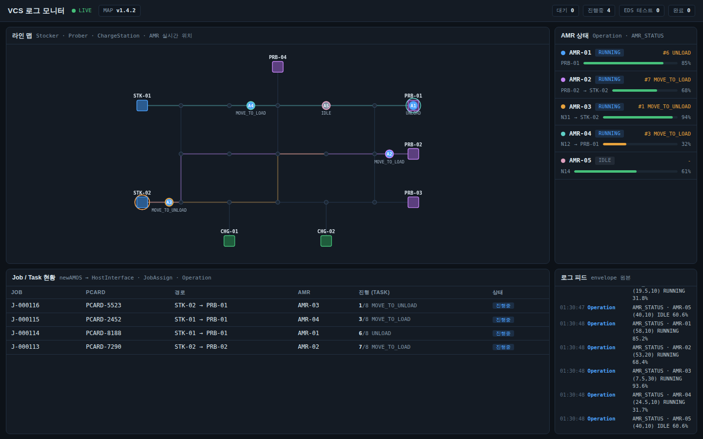

# 스파이크 기록 — VCS 로그 시각화 실시간 모니터 (2026-07-10)

[VCS_LOG_VISUALIZATION_DESIGN.md](../VCS_LOG_VISUALIZATION_DESIGN.md) 9번(향후 진행 순서)의 2~3단계를 압축해서 실제로 진행한 기록. 목적: **표준 envelope 로그만 가지고 실시간 모니터링 화면(맵 + AMR + Job/Task)이 정말 그려지는지**를, 실제 VCS 모듈 없이 더미 시뮬레이터로 확인하는 것.

## 결과 요약

- **성공.** 표준 envelope 포맷(공통 봉투 + correlationIds + payload) 로그만으로 화면 전체(맵/AMR/Job/피드/KPI)를 그리는 데 문제 없음 — "뷰는 로그의 함수"라는 설계 원칙이 실제로 성립함을 확인.
- 코드: [`log-visualizer-spike/`](../log-visualizer-spike/) (실행법은 그 안의 README 참고)



## 아키텍처 (스파이크 버전)

```
[웹 브라우저] ── 0.7초 간격 GET /api/logs?since={seq} 폴링
      │              (최초 1회 GET /api/map)
[Spring Boot :8300 (Java 21)]
      ├─ Simulator     : 5대 AMR + Job 생성/할당/경로탐색/이동을 흉내내며 로그 발행
      ├─ LogBuffer     : 표준 envelope 로그 인메모리 버퍼 (실제로는 Oracle 저장으로 대체)
      └─ ApiController : /api/map, /api/logs
```

정식 설계(디자인 문서 4번)에서 실제 8개 모듈 → REST 수집 → Oracle 저장 → WebSocket 스트림 부분을 전부 뺀 최소 버전. 로그 생산자(시뮬레이터)와 소비자(웹 뷰)가 **오직 표준 envelope 포맷으로만** 만나는 구조는 정식 설계와 동일하게 유지했다 — 나중에 시뮬레이터를 실제 모듈들의 REST 전송으로 갈아끼우면 웹 쪽은 그대로 재사용 가능.

## 시뮬레이터가 흉내내는 것 (모듈별)

| 모듈 | 시뮬레이션 내용 | 발행 로그 |
|---|---|---|
| HostInterface | 8~14초 간격으로 newAMOS Job 생성(Stocker→Prober 랜덤), 할당/완료 시 보고 | `JOB_RECEIVED`, `JOB_REPORTED` |
| JobAssign | 유휴 AMR 중 출발지 최근접 선택 (후보 목록 + 선택 사유 포함) | `TASK_ASSIGNED` |
| PathSearch | 실제 다익스트라로 맵 그래프 위 최단 경로 계산 | `PATH_RESULT` |
| Operation | Job 1건 = 8 Task 순차 실행 (MOVE는 경로 따라 이동, LOAD/UNLOAD는 2.5초 정지 작업, task 4 후 EDS 테스트 8~14초 대기), AMR 상태 1초 주기 보고 | `TASK_UPDATE`, `AMR_STATUS` |
| UnitDevice | 배터리 30% 미만 유휴 AMR이 빈 충전소로 이동해 85%까지 충전 | `CHARGER_STATUS` |
| MapUpdater | 기동 시 맵 버전 1회 발행 | `MAP_UPDATED` |
| ParameterManagement | 기동 시 파라미터 변경 1회 발행 | `PARAM_CHANGED` |
| NATS | (설계대로 자체 로그 없음) | - |

맵: waypoint 15개(3×5 격자) + Stocker 2 + Prober 4 + ChargeStation 2, 링크는 행 방향 전체 + 열 방향은 1/3/5열만 (경로 탐색이 유의미해지도록). 실제로는 `.dat` 파일을 파싱할 부분이라 `MapData` 클래스로 격리해둠.

## 웹 화면이 로그에서 파생하는 방식

프론트는 서버의 시뮬레이터 내부 상태에 접근하지 않는다. 오직 로그 타입별 리듀서로 상태를 만든다:

| 로그 | 화면 반영 |
|---|---|
| `AMR_STATUS` | 맵 위 AMR 위치(보간 이동)/상태색, AMR 카드의 배터리·노드 |
| `TASK_UPDATE` | Job 테이블 진행 단계(n/8), AMR 카드의 현재 Task, task 4 완료 → "EDS 테스트중" 상태 유추 |
| `TASK_ASSIGNED` | Job ↔ AMR 매핑 |
| `PATH_RESULT` | 맵 위 계획 경로 폴리라인 + 목적지 링 하이라이트 |
| `JOB_RECEIVED`/`JOB_REPORTED` | Job 테이블 행 생성/완료 처리, 상단 KPI 집계 |
| `MAP_UPDATED` | 헤더의 맵 버전 |
| `CHARGER_STATUS` | (현재는 로그 피드에만 노출 — 충전소 현황판은 확장 기능 4번) |

## 겪은 문제와 해결

- **캔버스가 3배쯤 확대되어 그려짐**: `<canvas>`의 기본 크기(300×150)가 truthy라 `if (!cv.width) fit()` 가드가 한 번도 리사이즈를 안 했던 것. 매 프레임 컨테이너 크기와 비교해 다르면 리사이즈하도록 수정.
- 이번엔 WebSocket 대신 **0.7초 폴링**으로 갔다 — 스파이크에선 충분히 부드럽고 구현이 단순함. 정식 버전에서 실시간 스트림(WebSocket/SSE)으로 교체 예정 (디자인 문서 4번).

## 다음 단계 (스파이크에서 확인된 것 기준)

1. 시뮬레이터 → 실제 모듈들의 `POST /api/logs` 전송으로 교체 (Log Collector에 수신 엔드포인트 추가)
2. 인메모리 LogBuffer → Oracle 저장 + 시간 범위 조회 API (리플레이 모드의 기반)
3. `.dat` 맵 포맷 전달받으면 `MapData` 하드코딩 → 파서로 교체
4. 폴링 → WebSocket 스트림 전환, 리플레이용 시간 슬라이더 추가
