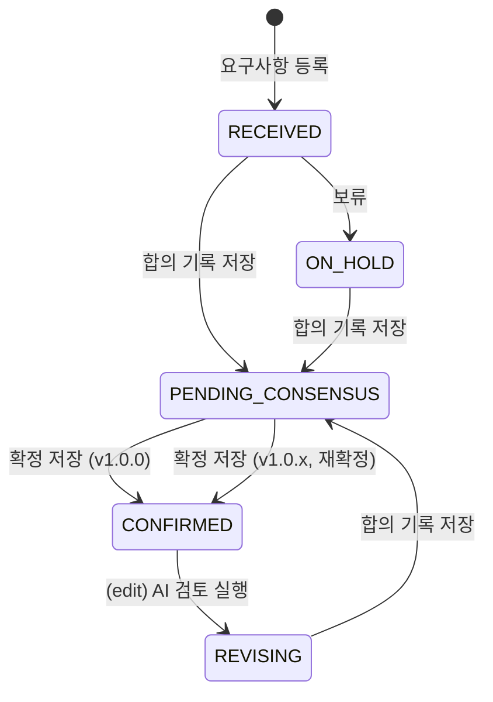

# 요구사항 상태 명세서

요구사항(`REQUIREMENTS.state`) 하나가 등록부터 확정·재확정까지 거치는 상태와,
각 상태로 넘어가는 정확한 트리거를 정리한다. 정의: [`ReqState.java`](../backend/src/main/java/com/semes/reqops/domain/requirement/entity/ReqState.java).

## 한눈에 보기

| 값 | 화면 표시 | 목록 색상 | 어떻게 되나 |
|---|---|---|---|
| `RECEIVED` | 접수 | 회색 `#9aa5b1` | 요구사항 **등록 직후**. AI 초기 검토는 끝났지만 사람이 아직 확정 작업을 시작 안 함 |
| `IN_REVIEW` | 검토중 | 노랑 `#d4a72c` | *(정의만 있고 지금은 실제로 전환되는 코드가 없다 — 아래 "미사용 상태" 참고)* |
| `PENDING_CONSENSUS` | 고객 합의 대기 | 보라 `#8250df` | 수정 화면에서 **"합의 기록 저장"** 직후 — 합의는 했지만 "확정 저장"은 아직 안 누름 |
| `CONFIRMED` | 확정 | 초록 `#1f883d` | **"확정 저장"**을 눌러 버전(v1.0.0 등)이 부여됨 |
| `REVISING` | 변경중 | 파랑 `#0969da` | 이미 확정된 요구사항을 수정 화면에서 **"AI 검토 실행"**을 눌러 수정을 시작한 직후 — 확정 전 요구사항은 이 화면에 들어가도 REVISING으로 바뀌지 않는다(아래 상세 참고) |
| `ON_HOLD` | 보류 | 빨강 `#cf222e` | 수정 화면에서 **"보류"** 버튼을 누름 — 고객 협의가 더 필요해서 대기 |

## 전이 다이어그램

같은 요구사항이 확정 이후에도 계속 돈다 — `CONFIRMED → REVISING → PENDING_CONSENSUS → CONFIRMED`
루프가 재확정마다 반복되고, 그때마다 버전이 하나씩 올라간다(`REQUIREMENT_VERSIONS`에 한 줄씩 쌓임).

## 상태별 상세

### RECEIVED — 접수

- **엔티티**: 생성자에서 무조건 `RECEIVED`로 시작한다 (`Requirement.java:65`).
- **의미**: "아직 아무도 확정 작업을 안 건드렸다."
- **나가는 길**: 합의 기록 저장(→ `PENDING_CONSENSUS`) 또는 보류(→ `ON_HOLD`) 둘 중 하나.

### IN_REVIEW — 검토중 *(미사용)*

- enum 값과 목록 화면 색상은 이미 있지만, **실제로 이 상태로 바꾸는 코드가 없다.**
  `markPendingConsensus()`가 `RECEIVED`뿐 아니라 `IN_REVIEW`에서 넘어오는 것도 허용해두긴
  했지만, 애초에 `IN_REVIEW`로 들어갈 방법이 없어서 죽은 분기다.
- 아마 "담당자가 상세 화면을 처음 열람하면 접수 → 검토중으로 바뀐다" 같은 트리거를
  나중에 붙이려고 미리 자리를 만들어둔 것으로 보인다. 필요하면 상세 화면 진입 시
  `RECEIVED`일 때만 `IN_REVIEW`로 올리는 API 호출을 붙이면 된다.

### PENDING_CONSENSUS — 고객 합의 대기

- **트리거**: `POST .../consensus` (합의 기록 저장) 성공 시 `Requirement.markPendingConsensus()`.
- **의미**: 고객과 합의까지는 마쳤다. 확정 버튼을 누르면 바로 `CONFIRMED`로 갈 수 있는
  상태 — 화면상 "확정 가능" 표시(`canConfirm: true`)와 짝을 이룬다.
- **나가는 길**: 확정 저장 → `CONFIRMED`.

### CONFIRMED — 확정

- **트리거**: `POST .../confirm` 성공 시 `Requirement.confirm()`. 합의 기록이 없거나
  이미 그 합의로 확정한 적이 있으면(재사용 방지) 409로 거부된다.
- **의미**: 버전이 부여되고 본문이 확정본으로 덮어써짐. 기능 3(산출물 도출)의 입력이 될
  상태.
- **나가는 길**: 확정본을 다시 고치기 시작하면 → `REVISING`. 그 전까지는 종착 상태처럼
  보이지만, 언제든 수정이 들어오면 다시 사이클이 돈다.

### REVISING — 변경중

- **트리거**: `POST .../diff-analyze`(수정 화면의 "AI 검토 실행") 성공 시
  `Requirement.startRevision()`. `CONFIRMED`일 때만 실제로 전환되고, 다른 상태에서
  호출되면 조용히 무시된다. 이 화면은 확정 전 요구사항(최초 확정 진행 중)에서도 같은
  API를 쓰지만, 그때는 아직 `CONFIRMED`가 아니므로 상태가 그대로 `RECEIVED` 등으로
  남는다 — "변경중"은 어디까지나 "이미 나가 있는 확정본을 지금 고치고 있다"는 뜻이라,
  아직 확정된 적 없는 요구사항에는 해당하지 않는다.
- **의미**: "지금 누군가 이 확정본을 손대고 있다"를 목록에서 바로 보여주기 위한 상태.
  버전 자체는 아직 그대로다 — 재확정 전까지는 이전 버전이 여전히 유효한 확정본이기
  때문에, 본문(`content`)도 확정 시점까지는 안 바뀐다.
- **나가는 길**: 합의 기록 저장 → `PENDING_CONSENSUS` → 확정 저장 → `CONFIRMED`(버전 +1).

### ON_HOLD — 보류

아래 별도 절에서 자세히.

## "보류"는 언제, 왜 쓰는가

### 왜 있는가

이 프로젝트의 확정 규칙은 **"AI 의견이 아무리 합리적이어도 고객 합의 기록 없이는
확정할 수 없다"**는 것이다(`docs/API명세서.md`). 그런데 현실에서는 요구사항을 등록하고
AI 검토까지 봤는데, **고객이 아직 응답을 안 줘서** 합의 자체를 기록할 수 없는 기간이
꽤 길게 이어질 수 있다 — 회신 대기, 담당자 휴가, 다음 정기 미팅까지 대기 등.

이 기간 동안 상태를 그냥 `RECEIVED`(접수)로 놔두면, 목록 화면만 봐서는 **"등록만 해두고
아무도 손 안 댄 것"**과 **"이미 검토는 끝났고 고객 답변만 기다리는 것"**을 구분할 수
없다. 후자를 방치하면 담당자가 놓치기 쉽다 — 팔로업이 필요한 항목인데 "아직 시작도
안 한 것"처럼 보이기 때문이다.

`ON_HOLD`는 이 둘을 구분하려고 있는 상태다. **"내가 검토는 했고, 확정할 준비(초안)도
됐는데, 고객 쪽 사정으로 지금은 확정을 못 한다"**는 것을 명시적으로 표시한다.

### 쓰는 케이스 (예시)

- 수정 화면에서 AI 제안을 반영해 최종 본문까지 다 다듬었는데, 고객 담당자가
  휴가 중이라 이번 주 안에 합의를 받을 수 없다 → **보류**를 눌러 "확정 초안은 준비됐고
  고객 응답만 기다리는 중"으로 표시.
- 상충 검출(예: 다른 요구사항과 우선순위 기준이 다름)이 나와서, 고객과 함께 다른
  이해관계자(다른 요구사항 담당자)까지 불러 조율해야 하는데 그 미팅이 다음 주로
  잡혀 있다 → 그때까지 **보류**.
- 합의를 봤다가 담당자가 바뀌거나 요구사항 자체가 재검토 대상이 돼서, 확정을 미루고
  싶을 때도 쓸 수 있다 — 코드상 `hold()`는 상태 제약 없이 언제든 호출 가능하다
  (`RECEIVED`, `PENDING_CONSENSUS` 등 어떤 상태에서도 보류로 갈 수 있음).

### 쓰지 않아도 되는 케이스

- 그냥 아직 아무도 안 열어본 요구사항 → 그건 `RECEIVED`(접수)로 충분하다. 보류는
  "한 번은 손을 댔다"는 뉘앙스가 있는 상태다.
- 요구사항 자체가 잘못 등록됐거나 필요 없어진 경우 → 이건 "보류"가 아니라 삭제
  기능이 필요한 케이스인데, 지금 이 프로젝트에는 요구사항 삭제 API가 없다(범위 밖).

### 보류에서 빠져나오는 법

`ON_HOLD`도 `markPendingConsensus()`가 허용하는 출발 상태 중 하나라서, **고객 응답이
와서 합의 기록을 저장하면 바로 `PENDING_CONSENSUS`로 넘어간다** — 보류를 풀거나
취소하는 별도 버튼은 없고, 합의 기록 저장이 곧 "보류 해제"다.

## 화면·API 매핑

최초 확정과 확정본 수정은 이제 화면이 하나(수정 화면, `/requirements/{id}/edit`)다 —
확정 전이든 후든 같은 위저드(AI에게 물어보기 → AI 검토 → 고객 합의 → 확정/보류)를 탄다.

| 상태 변화 | 어느 화면 | 어느 버튼/API |
|---|---|---|
| (없음) → 접수 | 화면2 등록 | `POST /api/projects/{id}/requirements` |
| 접수/보류 → 고객 합의 대기 | 수정 화면 (최초 확정) | `POST .../consensus` "합의 기록 저장" |
| 접수 → 보류 | 수정 화면 (최초 확정) | `POST .../hold` "보류" |
| 고객 합의 대기 → 확정(v1.0.0) | 수정 화면 (최초 확정) | `POST .../confirm` "확정 저장" |
| 확정 → 변경중 | 수정 화면 (재수정) | `POST .../diff-analyze` "AI 검토 실행" |
| 변경중 → 고객 합의 대기 | 수정 화면 (재수정) | `POST .../consensus` "합의 기록 저장" |
| 고객 합의 대기 → 확정(v1.0.x) | 수정 화면 (재수정) | `POST .../confirm` "확정 저장" (재확정) |

## 목록 화면 필터와의 관계

`/projects/{id}/requirements` 목록의 상태 필터는 `ALL` / `OPEN` / `CONFIRMED` 셋뿐이다
(`RequirementListPage`). `OPEN`은 "확정이 아닌 모든 상태"를 뜻해서, `RECEIVED` ·
`PENDING_CONSENSUS` · `REVISING` · `ON_HOLD`가 전부 여기 섞여 보인다 — 보류만 따로
걸러 보는 필터는 지금 없다. 보류 건이 많아지면 이것도 별도 필터로 분리하는 게 좋다.
