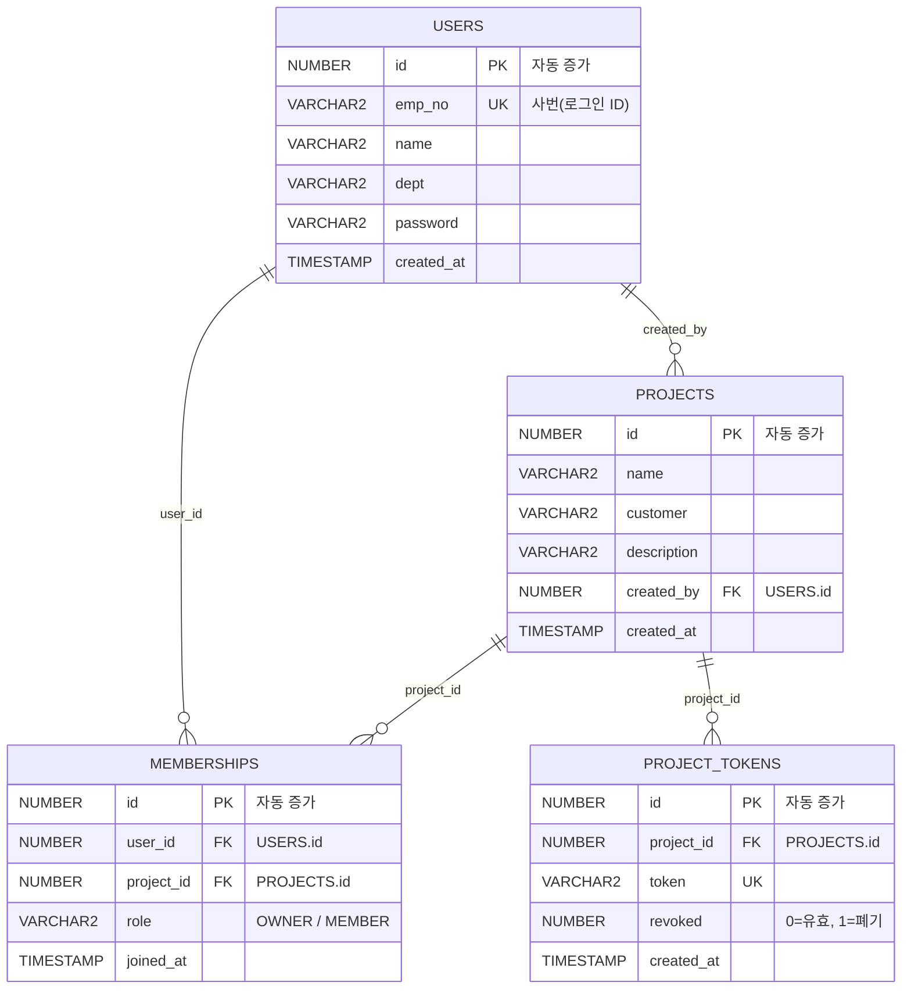

# 테이블 명세서

스키마(사용자): `REQOPS` · DB: Oracle · DDL: [`db/init.sql`](../db/init.sql)
현재 범위: 기능 1 · 회원가입/로그인(`USERS`) + 프로젝트 관리
(`PROJECTS` · `MEMBERSHIPS` · `PROJECT_TOKENS`). 이후 기능에 맞춰 테이블을 추가한다.

## USERS — 사용자(로그인 계정)

| 컬럼 | 타입 | 제약 | 설명 |
|---|---|---|---|
| id | NUMBER (IDENTITY) | PK | 내부 식별자(자동 증가) |
| emp_no | VARCHAR2(20) | NOT NULL, UNIQUE | 사번 — 로그인 아이디 |
| name | VARCHAR2(50) | NOT NULL | 이름 |
| dept | VARCHAR2(100) | NULL | 부서 |
| password | VARCHAR2(200) | NOT NULL | 비밀번호(평문 문자열) |
| created_at | TIMESTAMP | NOT NULL, 기본값 SYSTIMESTAMP | 가입 일시 |

- **로그인**: `emp_no` + 비밀번호 → 저장된 `password`와 그대로 문자열 대조.
- **회원가입**: `emp_no` 중복이면 거부(UNIQUE).

## PROJECTS — 프로젝트

| 컬럼 | 타입 | 제약 | 설명 |
|---|---|---|---|
| id | NUMBER (IDENTITY) | PK | 내부 식별자 |
| name | VARCHAR2(100) | NOT NULL | 프로젝트명 |
| customer | VARCHAR2(100) | NULL | 고객사 |
| description | VARCHAR2(500) | NULL | 설명 |
| created_by | NUMBER | NOT NULL, FK → USERS.id | 생성자(자동으로 Owner) |
| created_at | TIMESTAMP | NOT NULL, 기본값 SYSTIMESTAMP | 생성 일시 |

## MEMBERSHIPS — 프로젝트 멤버십(유저-프로젝트-역할)

| 컬럼 | 타입 | 제약 | 설명 |
|---|---|---|---|
| id | NUMBER (IDENTITY) | PK | 내부 식별자 |
| user_id | NUMBER | NOT NULL, FK → USERS.id | 멤버 |
| project_id | NUMBER | NOT NULL, FK → PROJECTS.id | 프로젝트 |
| role | VARCHAR2(20) | NOT NULL | `OWNER` 또는 `MEMBER` |
| joined_at | TIMESTAMP | NOT NULL, 기본값 SYSTIMESTAMP | 합류 일시 |

- `(user_id, project_id)` UNIQUE — 한 유저는 한 프로젝트에 한 번만 속한다.
- 프로젝트 생성 시 생성자를 `OWNER`로 자동 등록, Open Project(토큰 참여) 시 `MEMBER`로 등록.

## PROJECT_TOKENS — 프로젝트 접근 토큰

| 컬럼 | 타입 | 제약 | 설명 |
|---|---|---|---|
| id | NUMBER (IDENTITY) | PK | 내부 식별자 |
| project_id | NUMBER | NOT NULL, FK → PROJECTS.id | 프로젝트 |
| token | VARCHAR2(64) | NOT NULL, UNIQUE | 접근 토큰 문자열(`req_prj_` + 랜덤 hex) |
| revoked | NUMBER(1) | NOT NULL, 기본값 0 | 0=유효, 1=폐기(재발급 시 이전 토큰) |
| created_at | TIMESTAMP | NOT NULL, 기본값 SYSTIMESTAMP | 발급 일시 |

- Open Project는 `revoked=0`인 토큰만 인정. 재발급 시 기존 유효 토큰을 전부 폐기하고 새로 발급.
- 화면상 "멤버 초대" 버튼은 별도 조회 없이 이미 내려온 토큰을 노출·복사하는 동작이고, "재발급" 버튼을 눌러야 새 토큰이 발급된다.

## ERD

mermaid 소스 (GitHub용)

---

## 기능 2 — 요구사항

### REQUIREMENTS — 요구사항

| 컬럼 | 타입 | 제약 | 설명 |
|---|---|---|---|
| id | NUMBER | PK, IDENTITY | |
| project_id | NUMBER | FK → PROJECTS.id | |
| req_key | VARCHAR2(50) | NOT NULL, UK(project_id, req_key) | 사용자가 직접 입력하는 요구사항 ID (예: req-am-03) |
| content | CLOB | NOT NULL | 등록 원문 — 확정 시 확정본으로 갱신 |
| requester_dept | VARCHAR2(100) | | 요청자 소속 |
| requester_name | VARCHAR2(50) | | 요청자 이름 |
| state | VARCHAR2(20) | NOT NULL | RECEIVED / IN_REVIEW / PENDING_CONSENSUS / CONFIRMED / REVISING / ON_HOLD |
| version | VARCHAR2(20) | | 확정 시 부여되는 Semver. 확정 전에는 NULL |
| assignee_id | NUMBER | | 담당자(USERS.id) — 목록의 담당자 필터 대상 |
| created_by | NUMBER | NOT NULL, FK → USERS.id | |
| created_at / updated_at | TIMESTAMP | NOT NULL | |

### REQUIREMENT_FINDINGS — AI 검토 결과

화면에서 **읽기 전용 참고 자료**로만 쓴다. 사용자가 "적용"하는 대상이 아니다.

| 컬럼 | 타입 | 제약 | 설명 |
|---|---|---|---|
| id | NUMBER | PK, IDENTITY | |
| requirement_id | NUMBER | NOT NULL, FK → REQUIREMENTS.id | |
| finding_type | VARCHAR2(40) | NOT NULL | 정량 기준 부재 / 모호한 정도부사 / … / 기존 요구사항과 상충 |
| target_span | VARCHAR2(500) | | 문제가 된 구절 |
| reason | VARCHAR2(1000) | | 왜 문제인지 |
| suggestion | VARCHAR2(1000) | | 어떻게 바꾸면 좋은지 |
| conflict_req_key | VARCHAR2(50) | | 상충 유형일 때 상대 요구사항 ID |
| created_at | TIMESTAMP | NOT NULL | |

### REQUIREMENT_AI_DRAFTS — AI 제안이 반영된 문장

확정 화면의 "확정될 본문"에 **미리 채워지는 값**. 재분석하면 새 행이 쌓이므로 마지막 것을 쓴다.

| 컬럼 | 타입 | 제약 | 설명 |
|---|---|---|---|
| id | NUMBER | PK, IDENTITY | |
| requirement_id | NUMBER | NOT NULL, FK → REQUIREMENTS.id | |
| draft_content | CLOB | NOT NULL | 검출이 없으면 원문과 같다 |
| engine | VARCHAR2(20) | NOT NULL, DEFAULT 'unavailable' | 판정 경로: `llm-api`(사내 LLM이 응답함) / `unavailable`(사내 LLM 미응답, 규칙 결과만) |
| created_at | TIMESTAMP | NOT NULL | |

> `content`(등록 원문)와 `draft_content`(제안 반영본)를 따로 두는 이유: 화면에서 "등록
> 원문으로 되돌리기"가 가능해야 하고, 확정 전까지는 원문이 그대로 남아 있어야 하기 때문이다.

> `engine`을 저장하는 이유: 검출 0건이 **"AI가 봤는데 문제가 없다"**인지 **"AI가 아예
> 응답을 못 했다"**인지 구분해야 하고(전자는 그대로 진행, 후자는 재분석 필요), 나중에
> 사내 LLM과 규칙 기반의 검출 품질을 비교하려면 어느 경로로 나온 결과인지 남아 있어야
> 하기 때문이다.

### REQUIREMENT_CONSENSUS — 고객 합의 기록

**이 기록 없이는 확정할 수 없다.** AI 의견이 아무리 합리적이어도 그것만으로 확정하지
않는다는 원칙을 데이터로 강제하는 테이블이다. 합의할 때마다 새 행이 쌓이고, 확정은
가장 마지막 행을 근거로 삼는다.

| 컬럼 | 타입 | 제약 | 설명 |
|---|---|---|---|
| id | NUMBER | PK, IDENTITY | |
| requirement_id | NUMBER | NOT NULL, FK → REQUIREMENTS.id | |
| method | VARCHAR2(40) | NOT NULL | 대면 미팅 / 화상회의 / 유선 / 메일 |
| customer_contact | VARCHAR2(100) | NOT NULL | 고객측 담당자 (예: 삼성전자 EDS 김민석 책임) |
| agreed_on | DATE | NOT NULL | 합의일 |
| note | VARCHAR2(2000) | | 합의 내용 요약 |
| agreed_content | CLOB | NOT NULL | 합의 시점의 본문 스냅샷 |
| recorded_by | NUMBER | NOT NULL, FK → USERS.id | 기록한 사람 |
| created_at | TIMESTAMP | NOT NULL | |

> `agreed_content`를 따로 남기는 이유: 합의한 뒤에 본문을 또 고치면 "무엇에 합의한
> 것인지"가 달라진다. 이 값과 현재 본문을 비교해서 화면이 **"합의한 문장과 다른 내용이
> 확정된다"**고 경고할 수 있다.

### REQUIREMENT_VERSIONS — 확정 이력

확정·재확정마다 커밋처럼 한 줄씩 쌓인다. 요구사항 본문은 확정할 때마다 덮어써지므로,
"그때 무엇으로 확정했는지"는 이 테이블에만 남는다.

| 컬럼 | 타입 | 제약 | 설명 |
|---|---|---|---|
| id | NUMBER | PK, IDENTITY | |
| requirement_id | NUMBER | NOT NULL, FK → REQUIREMENTS.id | |
| version | VARCHAR2(20) | NOT NULL, UNIQUE(requirement_id, version) | 1.0.0 / 1.0.1 … |
| title | VARCHAR2(200) | NOT NULL | 최초 확정이면 "최초 확정", 재확정이면 수정 사유 |
| content | CLOB | NOT NULL | 그 버전으로 확정된 본문 |
| consensus_id | NUMBER | FK → REQUIREMENT_CONSENSUS.id | 근거가 된 합의 기록 |
| confirmed_by | NUMBER | NOT NULL, FK → USERS.id | 확정한 사람 |
| created_at | TIMESTAMP | NOT NULL | |

> 확정 이력과 합의 기록을 FK로 이어 두면 "이 버전은 누구와 언제 합의해서 확정한
> 것인가"를 한 번에 되짚을 수 있다. 감사·인수인계 때 필요한 연결이다.
