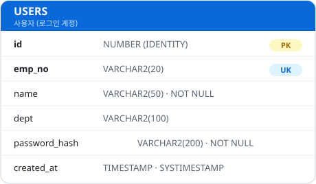
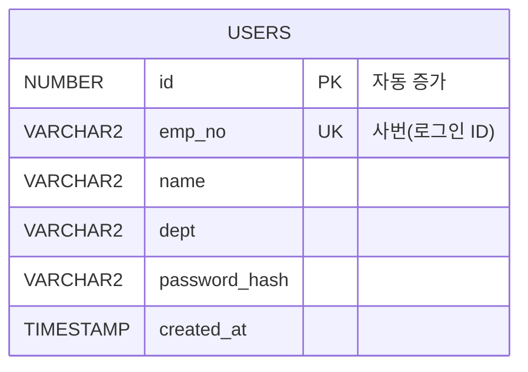

# 테이블 명세서

스키마(사용자): `reqops` · DB: Oracle · DDL: [`db/init.sql`](../db/init.sql)
현재 범위: 기능 1 · 회원가입 / 로그인 (`USERS`). 이후 기능에 맞춰 테이블을 추가한다.

## USERS — 사용자(로그인 계정)

| 컬럼 | 타입 | 제약 | 설명 |
|---|---|---|---|
| id | NUMBER (IDENTITY) | PK | 내부 식별자(자동 증가) |
| emp_no | VARCHAR2(20) | NOT NULL, UNIQUE | 사번 — 로그인 아이디 |
| name | VARCHAR2(50) | NOT NULL | 이름 |
| dept | VARCHAR2(100) | NULL | 부서 |
| password_hash | VARCHAR2(200) | NOT NULL | 비밀번호 해시(BCrypt 등) |
| created_at | TIMESTAMP | NOT NULL, 기본값 SYSTIMESTAMP | 가입 일시 |

- **로그인**: `emp_no` + 비밀번호 → 저장된 `password_hash`와 대조.
- **회원가입**: `emp_no` 중복이면 거부(UNIQUE).

## ERD

mermaid 소스 (GitHub용)

> 다음 단계(프로젝트 기능)에서 `PROJECTS · MEMBERSHIPS · PROJECT_TOKENS · PROJECT_MODULES`가 `USERS`와 연결되어 확장된다.
