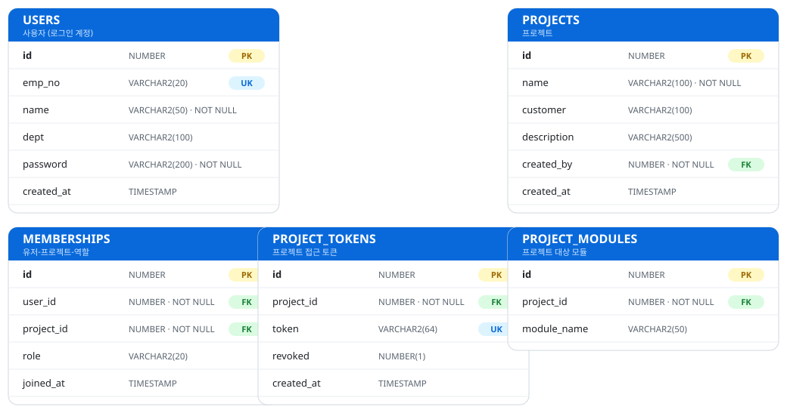
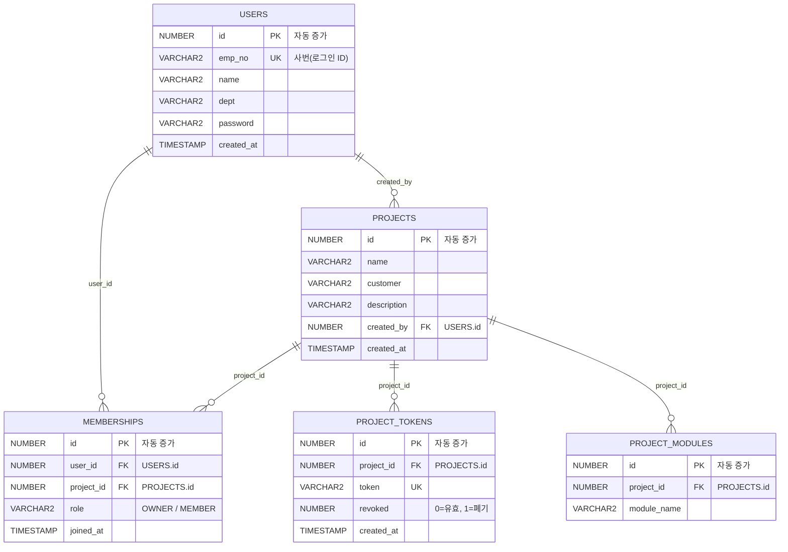

# 테이블 명세서

스키마(사용자): `REQOPS` · DB: Oracle · DDL: [`db/init.sql`](../db/init.sql)
현재 범위: 기능 1 · 회원가입/로그인(`USERS`) + 프로젝트 관리
(`PROJECTS` · `MEMBERSHIPS` · `PROJECT_TOKENS` · `PROJECT_MODULES`). 이후 기능에 맞춰 테이블을 추가한다.

## USERS — 사용자(로그인 계정)

| 컬럼 | 타입 | 제약 | 설명 |
|---|---|---|---|
| id | NUMBER (IDENTITY) | PK | 내부 식별자(자동 증가) |
| emp_no | VARCHAR2(20) | NOT NULL, UNIQUE | 사번 — 로그인 아이디 |
| name | VARCHAR2(50) | NOT NULL | 이름 |
| dept | VARCHAR2(100) | NULL | 부서 |
| password | VARCHAR2(200) | NOT NULL | 비밀번호(평문 문자열) |
| created_at | TIMESTAMP | NOT NULL, 기본값 SYSTIMESTAMP | 가입 일시 |

- **로그인**: `emp_no` + 비밀번호 → 저장된 `password`와 그대로 문자열 대조.
- **회원가입**: `emp_no` 중복이면 거부(UNIQUE).

## PROJECTS — 프로젝트

| 컬럼 | 타입 | 제약 | 설명 |
|---|---|---|---|
| id | NUMBER (IDENTITY) | PK | 내부 식별자 |
| name | VARCHAR2(100) | NOT NULL | 프로젝트명 |
| customer | VARCHAR2(100) | NULL | 고객사 |
| description | VARCHAR2(500) | NULL | 설명 |
| created_by | NUMBER | NOT NULL, FK → USERS.id | 생성자(자동으로 Owner) |
| created_at | TIMESTAMP | NOT NULL, 기본값 SYSTIMESTAMP | 생성 일시 |

## MEMBERSHIPS — 프로젝트 멤버십(유저-프로젝트-역할)

| 컬럼 | 타입 | 제약 | 설명 |
|---|---|---|---|
| id | NUMBER (IDENTITY) | PK | 내부 식별자 |
| user_id | NUMBER | NOT NULL, FK → USERS.id | 멤버 |
| project_id | NUMBER | NOT NULL, FK → PROJECTS.id | 프로젝트 |
| role | VARCHAR2(20) | NOT NULL | `OWNER` 또는 `MEMBER` |
| joined_at | TIMESTAMP | NOT NULL, 기본값 SYSTIMESTAMP | 합류 일시 |

- `(user_id, project_id)` UNIQUE — 한 유저는 한 프로젝트에 한 번만 속한다.
- 프로젝트 생성 시 생성자를 `OWNER`로 자동 등록, Open Project(토큰 참여) 시 `MEMBER`로 등록.

## PROJECT_TOKENS — 프로젝트 접근 토큰

| 컬럼 | 타입 | 제약 | 설명 |
|---|---|---|---|
| id | NUMBER (IDENTITY) | PK | 내부 식별자 |
| project_id | NUMBER | NOT NULL, FK → PROJECTS.id | 프로젝트 |
| token | VARCHAR2(64) | NOT NULL, UNIQUE | 접근 토큰 문자열(`req_prj_` + 랜덤 hex) |
| revoked | NUMBER(1) | NOT NULL, 기본값 0 | 0=유효, 1=폐기(재발급 시 이전 토큰) |
| created_at | TIMESTAMP | NOT NULL, 기본값 SYSTIMESTAMP | 발급 일시 |

- Open Project는 `revoked=0`인 토큰만 인정. 재발급 시 기존 유효 토큰을 전부 폐기하고 새로 발급.

## PROJECT_MODULES — 프로젝트 대상 모듈

| 컬럼 | 타입 | 제약 | 설명 |
|---|---|---|---|
| id | NUMBER (IDENTITY) | PK | 내부 식별자 |
| project_id | NUMBER | NOT NULL, FK → PROJECTS.id | 프로젝트 |
| module_name | VARCHAR2(50) | NOT NULL | VCS 모듈명(예: pathsearch, operation) |

## ERD

mermaid 소스 (GitHub용)

> 다음 단계(기능 2 · 요구사항 검토)에서 `REQUIREMENTS` 등이 `PROJECTS`와 연결되어 확장된다.
