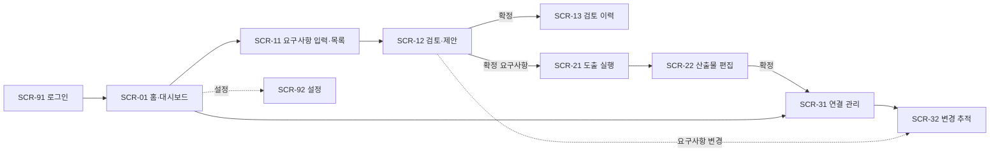

# 화면 정의서 (Screen Specification)

> AI 협업 기반 요구사항 엔지니어링 시스템 — 개발 착수용 화면 설계
> 대상 스택: Next.js(프론트) · Spring Boot(백엔드) · FastAPI(AI 서버) · Oracle
> 상태: 기능1 화면 일부 구현됨 / 기능2·3 신규

---

## 0. 공통 사항

### 0.1 앱 셸 (공통 레이아웃)
모든 화면은 좌측 **사이드바 + 상단 헤더 + 본문** 구조를 공유한다.

```
┌───────────┬────────────────────────────────────────────┐
│  로고      │  [헤더]  화면 제목            [AI 엔진 ▼] [사용자]│
│           ├────────────────────────────────────────────┤
│ ◈ 홈       │                                            │
│ ① 요구사항 검토│                 본문 (화면별)                 │
│ ② 산출물 도출 │                                            │
│ ③ 산출물 관리 │                                            │
│           │                                            │
│ ⚙ 설정     │                                            │
└───────────┴────────────────────────────────────────────┘
```
- **AI 엔진 토글**(헤더 우측): 로컬 Qwen3-8B ↔ 사내 GPT-OSS-120B 선택 (전 화면 공통)
- 사이드바 항목별 **진행 상태 뱃지**(완료/개발중/대기) 표시

### 0.2 화면 ID 규칙
`SCR-{기능번호}{일련번호}` — 0x 공통, 1x 기능1, 2x 기능2, 3x 기능3, 9x 시스템

---

## 1. 화면 목록

| 화면 ID | 화면명 | 소속 | 설명 | 상태 |
|---|---|---|---|---|
| SCR-00 | 앱 셸 (사이드바/헤더) | 공통 | 라우팅·엔진 토글·상태 뱃지 | 구현 |
| SCR-01 | 홈 · 대시보드 | 공통 | 요구사항·산출물 진행 현황 요약 | 신규 |
| SCR-11 | 요구사항 입력 · 목록 | 기능1 | docx/텍스트 입력, REQ 표 편집 | 일부 |
| SCR-12 | 검토 (검출 & AI 제안) | 기능1 | 불명확·상충 검출 → 제안 → 편집·확정 | 일부 |
| SCR-13 | 검토 이력 (Before/After) | 기능1 | 확정 이력·변경 전후 비교 | 신규 |
| SCR-21 | 산출물 도출 실행 | 기능2 | 확정 요구사항 선택 → 도출 | 신규 |
| SCR-22 | 산출물 편집 | 기능2 | 5종 산출물 초안 편집·확정 | 신규 |
| SCR-31 | 연결 관리 (추적성) | 기능3 | 요구사항 ↔ 산출물 양방향 조회 | 신규 |
| SCR-32 | 변경 추적 (영향 분석) | 기능3 | 요구사항 변경 시 영향 산출물 표시 | 신규 |
| SCR-91 | 로그인 | 시스템 | 사용자 인증 | 신규 |
| SCR-92 | 설정 | 시스템 | AI 엔진·양식·계정 설정 | 신규 |

---

## 2. 화면 흐름도



핵심 흐름: **입력 → 검토·확정 → 도출 → 산출물 → 연결·추적**

---

## 3. 화면별 상세

### SCR-01 · 홈 · 대시보드
- **목적**: 요구사항/산출물 진행 현황을 한눈에, 작업 이어가기
- **주요 구성요소**
  - 요약 카드: 요구사항 건수(검토 대기/확정), 산출물 도출 현황, 미해결 검출 건수
  - 최근 작업 목록 / 바로가기(검토 계속·도출하기)
  - 변경 알림: 요구사항 변경으로 재확인 필요한 산출물
- **사용자 액션**: 카드 클릭 → 해당 화면 이동
- **연동 API**: `GET /api/dashboard/summary`
- **다음 화면**: SCR-11 / SCR-21 / SCR-32

### SCR-11 · 요구사항 입력 · 목록  *(일부 구현)*
- **목적**: 고객 요구사항을 시스템에 등록 (docx 또는 텍스트)
- **주요 구성요소**
  - 입력 방식 탭: **docx 업로드** / **텍스트 직접 입력**
  - REQ 표(편집 가능): `ID · 분류 · 내용 · 비고` (표 행 = 1 요구사항)
  - `[검토하기 ▶]` 버튼, 요구사항 목록(상태: 미검토/검토중/확정)
- **사용자 액션**: 표 편집 → 저장 → 검토 실행
- **연동 API**: `POST /api/requirements`, `POST /api/requirements/import-docx`, `GET /api/requirements`
- **이전/다음**: SCR-01 → **SCR-12**

### SCR-12 · 검토 (검출 & AI 제안)  *(일부 구현)*
- **목적**: 불명확한 표현·상충되는 요구를 검출하고, AI 제안 기반으로 수정·확정
- **레이아웃**: 좌 입력(요구사항) — 우 검출 결과
```
┌ 요구사항(req-ta-01) ┐   →   ┌ 검출 N건 (칩) ─────────┐
│ 1. …                │       │ [선택 항목]            │
│ 2. …                │       │  🤖 AI 제안            │
│ [검출하기 ▶]         │       │  ✎ 내 수정 (편집 필드)  │
└─────────────────────┘       │  [확정 ✓]              │
                              └────────────────────────┘
```
- **주요 구성요소**: 검출 칩(정량기준부재·상충 등), AI 제안 박스, 편집 필드, 확정 버튼
- **사용자 액션**: 검출 실행 → 항목 선택 → 제안 반영 편집 → 확정(본문 교체 + 이력 기록)
- **연동 API**: `POST /api/analyze`(BE→AI), `POST /api/requirements/{id}/confirm`
- **이전/다음**: SCR-11 → **SCR-13**(이력) 또는 **SCR-21**(도출)

### SCR-13 · 검토 이력 (Before/After)
- **목적**: 확정 이력·변경 전후 비교(감사 추적)
- **주요 구성요소**: 요구사항별 타임라인, 항목별/전체 Before→After, 확정자·일시·사유
- **연동 API**: `GET /api/requirements/{id}/history`
- **이전**: SCR-12

### SCR-21 · 산출물 도출 실행
- **목적**: 확정된 요구사항에서 산출물 5종 초안을 자동 도출
- **주요 구성요소**
  - 확정 요구사항 선택(목록/체크)
  - 도출 대상 산출물 선택(개발이슈·기능/비기능 요구사항·Detail Design·SWVOC)
  - `[도출하기 ▶]` + 진행 표시
- **사용자 액션**: 요구사항 선택 → 도출 실행 → 결과로 이동
- **연동 API**: `POST /api/derive` (req_id[] → 산출물 초안)
- **이전/다음**: SCR-11/01 → **SCR-22**

### SCR-22 · 산출물 편집
- **목적**: AI 초안 산출물을 사람이 검토·편집·확정
- **주요 구성요소**
  - 산출물 탭(5종) — 각 항목별 **작성 주체 표시**(🤖 AI 초안 / 👤 사람)
  - 편집 폼(양식 필드), 기능/비기능 **동작 정의 표**(기본·변형·예외 × 선행·후행·시나리오)
  - `[확정 저장]` → 추적성 링크 자동 생성
- **연동 API**: `GET /api/artifacts?req={id}`, `PUT /api/artifacts/{id}`, `POST /api/artifacts/{id}/confirm`
- **이전/다음**: SCR-21 → **SCR-31**

### SCR-31 · 연결 관리 (추적성)
- **목적**: 요구사항 ↔ 산출물 연결을 양방향으로 조회
- **주요 구성요소**
  - 좌: 요구사항 카드 / 우: 연결된 티켓 트리(티켓 → SWVOC·Function Requirement·Detail Design)
  - 각 산출물 상태(완료/개발중/대기), 실제 Jira ID 링크
- **사용자 액션**: 요구사항 선택 → 연결 산출물 펼치기, 링크 이동
- **연동 API**: `GET /api/trace/links?req={id}`
- **다음**: SCR-32

### SCR-32 · 변경 추적 (영향 분석)
- **목적**: 요구사항이 수정되면 근거로 만든 산출물을 자동으로 찾아 알림
- **주요 구성요소**: 변경 감지 배너, **영향받는 산출물 / 영향 없음** 구분, 재확인 체크
- **사용자 액션**: 영향 산출물로 이동해 재확인·수정
- **연동 API**: `GET /api/trace/impact?req={id}`
- **이전**: SCR-31 / SCR-12(변경 발생 시)

### SCR-91 · 로그인
- **구성요소**: 사번/비밀번호(사내 인증), 오류 안내
- **연동 API**: `POST /api/auth/login`

### SCR-92 · 설정
- **구성요소**: 기본 AI 엔진 선택, 산출물 양식(템플릿) 관리, 계정
- **연동 API**: `GET/PUT /api/settings`

---

## 4. 공통 UI 규칙
- **작성 주체 색상**: AI 초안 = 파랑 / 사람 = 주황 (전 화면 통일)
- **상태 뱃지**: 완료(초록) · 개발중(파랑) · 대기(회색)
- **편집 가능 영역**: 연필(✎) 아이콘 + 파란 테두리
- **AI 초안 표기**: "AI 초안 · 직접 편집 가능" 라벨 명시(신뢰성)

---

## 5. 다음 단계
이 화면 정의서를 기준으로 → **② ERD(테이블 설계)** → **③ API 명세서**(위 `연동 API` 확정) → 개발 착수.
> ※ API 경로는 가칭. API 명세서 단계에서 요청/응답 스키마와 함께 확정한다.
